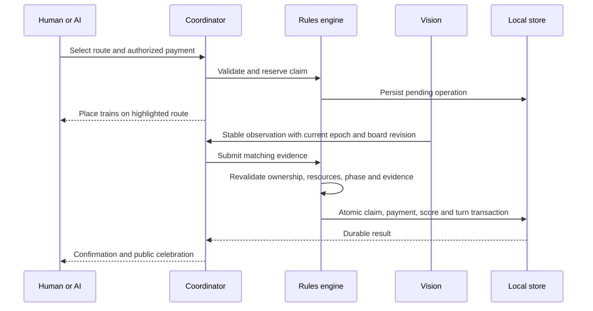
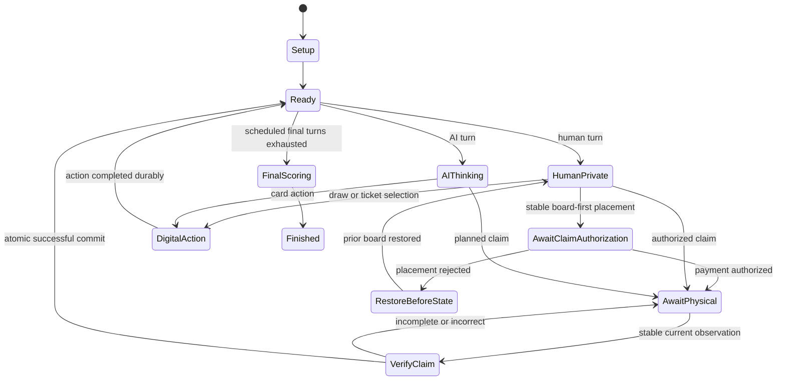
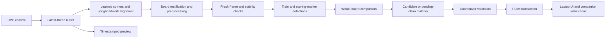
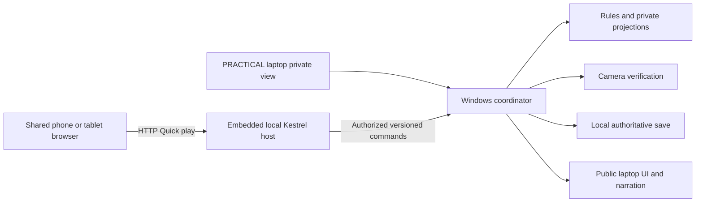

# GoldenTicket: Ticket to Ride Windows Companion

**Status:** Current product design and implementation reference. The Windows game includes digital cards, computer opponents, live camera verification, the LAN browser companion, PRACTICAL laptop sharing, final scoring and photographed save/reload. Physical-board matches with an Android tablet have been played. Section 24 distinguishes existing test evidence, specific checks still to run and future features.

**Design date:** September 11, 2026.  
**Implementation review:** September 21, 2026.

**Working name:** GoldenTicket. This is a project codename, not an approved product name.  
**Target:** Windows 11 x64; the classic English North America Ticket to Ride board shown in the user's photographs, product DO7201 / 7201.  
**Multi-human play:** Recommended **Quick play** uses one shared phone/tablet browser on the local network. Android-tablet play has been exercised in real games; iPhone/iPad testing is still unrecorded. **PRACTICAL** uses the laptop while other players look away during private choices. Neither needs an installed app or certificates. A single human uses the laptop.

**Primary experience:** Physical board and trains, digital cards, human operators, camera verification, and local computer opponents.

Sections marked **Planned** describe future work, not current setup requirements. Verification
tables specify expected results; section 24 records which kinds of checks have actually run.
The [README](README.md) is the current player/setup guide and
[architecture reference](docs/architecture.md) describes the compiled project boundaries.

## Contents

1. [Product contract and decisions](#1-product-contract-and-decisions)
2. [Scope and implementation boundaries](#2-scope-and-implementation-boundaries)
3. [Physical setup and onboarding](#3-physical-setup-and-onboarding)
4. [Player experience and screen design](#4-player-experience-and-screen-design)
5. [Digital cards and private information](#5-digital-cards-and-private-information)
6. [Classic North America rules profile](#6-classic-north-america-rules-profile)
7. [State model and invariants](#7-state-model-and-invariants)
8. [Commands, events, and physical transactions](#8-commands-events-and-physical-transactions)
9. [Turn and recovery state machines](#9-turn-and-recovery-state-machines)
10. [Camera acquisition and image pipeline](#10-camera-acquisition-and-image-pipeline)
11. [Calibration and automatic camera recovery](#11-calibration-and-automatic-camera-recovery)
12. [Train recognition and move verification](#12-train-recognition-and-move-verification)
13. [Wake gesture](#13-wake-gesture)
14. [Developer training and model delivery](#14-developer-training-and-model-delivery)
15. [Computer opponents](#15-computer-opponents)
16. [Story mode and sound](#16-story-mode-and-sound)
17. [Windows implementation and dependencies](#17-windows-implementation-and-dependencies)
18. [Processes, interfaces, and repository layout](#18-processes-interfaces-and-repository-layout)
19. [Persistence, undo, and restoration](#19-persistence-undo-and-restoration)
20. [Performance and resource budgets](#20-performance-and-resource-budgets)
21. [Failure handling and diagnostics](#21-failure-handling-and-diagnostics)
22. [Verification and acceptance criteria](#22-verification-and-acceptance-criteria)
23. [Implementation milestones](#23-implementation-milestones)
24. [Release readiness and remaining evidence](#24-release-readiness-and-remaining-evidence)
25. [Sources](#25-sources)

## 1. Product contract and decisions

### 1.1 What the application does

GoldenTicket supplies missing players for a physical game of Ticket to Ride. A laptop runs the complete game locally. A stationary overhead camera observes the board. The laptop tells the human operator where to place the computer player's trains, checks the resulting physical arrangement, and advances the game only when the action is resolved.

The board and plastic trains remain physical. Train cards, destination tickets, decks, discards, and card selection are digital for every seat. This eliminates routine card scanning, preserves AI secrets, and makes card-only turns observable through application commands.

The Windows laptop stays beside the board as the game display, camera processor, referee, AI host, and save owner. When there is exactly one human, that player's cards and destinations appear directly on the laptop; no phone or pairing is required. With multiple humans, the public game table offers recommended **Quick play: scan QR → join → play** for one shared phone/tablet browser, or **PRACTICAL** to use the laptop while everyone else looks away. Both keep private choices with the active player. Companion devices communicate over a local network without requiring internet access. The laptop retains technical controls for recovery.

The computer is an opponent and a referee. These are separate responsibilities: the referee holds the full game state; each opponent receives only that seat's permitted information.

Ticket to Ride is a route-claiming game. Trains are placed to occupy the spaces of a claimed route. They are not moved along an itinerary from city to city after being placed. The user's preference for final-position verification means that pieces may be placed in any order and the application verifies the completed placement, without requiring a prescribed hand movement or animation-following sequence.

### 1.2 Confirmed requirements

| ID | Requirement | Design consequence |
|---|---|---|
| R01 | Ticket to Ride only; no other board games | No game-plugin platform or generic board-game interpreter. |
| R02 | The classic North America edition pictured by the user | One versioned board and rules profile; no Europe, expansions, or automatic substitution of the 2025 refresh. |
| R03 | Windows 11; automatically use a supported GPU, otherwise CPU, with processor controls in Settings | Validate the active processing path, retain CPU/GPU overrides and CPU fallback, and report the effective backend in settings/diagnostics. The standalone game-screen GPU button has been removed. |
| R04 | Offline operation with no subscriptions or server costs; no companion inputs required from outside the LAN | The Windows app locally hosts the companion, its assets, and game data. QR-assisted connection and initial synchronization use the LAN only; no account, hosted server, internet dependency, or recurring infrastructure cost. |
| R05 | Human places trains while the camera watches | Durable pending actions, visual/audio instructions, and verified physical completion. |
| R06 | Printed alignment markers are acceptable | A printable marker layout beside the board supports orientation and recovery. |
| R07 | Pause after a camera jog; detect return to a suitable position automatically | Preserve state and pending action, reacquire geometry, compare the board, and resume automatically when consistent. |
| R08 | Verify final placement; no required intermediate ordering | Evaluate complete routes and all unaffected board regions. |
| R09 | An open-palm gesture can wake the app | A debounced gesture requests reconciliation; it cannot grant a turn or spend cards. |
| R10 | Developer trains with their pieces and ships the model if ML is needed | No consumer labeling, training, model accounts, or model downloads during setup. |
| R11 | Voice, visual-only, or both | Separate presentation modes with identical underlying game state and accessible controls. |
| R12 | Optional story mode with train and congratulation sounds; Training mode uses the same story without sound effects | One local narrative layer with presentation presets and no changes to rules or hidden information. Voice/story/audio are the final feature work, after photographed save-and-rebuild. |
| R13 | Multiple humans with private choices | Pass one companion phone/tablet between human seats in Quick play, or share the laptop in PRACTICAL while others look away. Keep AI information isolated. |
| R14 | Use the game's box color scheme for the app | Parchment surfaces, burgundy actions, antique-gold accents, dark-brown text, and muted-blue secondary accents as specified in section 4.8. |
| R15 | Quick play first, PRACTICAL second; remove PWA completely (updated September 21, 2026) | Direct HTTP browser game with QR and pairing, or local laptop handoffs. No installed app, certificate flow, service worker or network requirement for PRACTICAL. |
| R16 | Photograph and save the game so the board can be cleared and rebuilt later | Explicit Save and pack away workflow: version-matched board photo, complete digital checkpoint, cleanup-safe pause, and guided physical restoration. |
| R17 | A single human uses the main monitor for their cards without connecting a phone | Count human seats in the current match, hide LAN Game for one human, and present that human's card choices on the laptop. Preserve AI secrecy and physical-placement instructions. |

### 1.3 Explicit design assumptions

These are implementation choices, not additional statements attributed to the user:

- Digital cards apply to **all** seats and both card families. A mixed physical/digital deck is excluded because it would require a second synchronization problem.
- English is the first UI and narration language, matching the supplied edition reference. Text and speech resources remain separable for later translation.
- Matches have 2–5 seats in any human/computer mix, including all-human or all-computer games. A person operates the physical pieces for computer seats. Headless simulations are a separate developer tool.
- The physical board, train molds, and colors must match a validated classic-edition profile. Replacement miniatures and other editions are outside the initial recognition guarantee.
- Voice means spoken guidance. Free-form speech recognition is not required. A single human selects cards on the laptop; multiple humans choose Quick play on a shared touchscreen or PRACTICAL on the laptop.
- Quick play uses one shared companion device. Separate simultaneous devices per human are outside the initial scope. PRACTICAL, single-human play and AI seats need no extra device.
- Offline means no internet connection is required. Companion play does require a working local link to the laptop, normally the same private Wi-Fi network. A disconnected phone cannot take authoritative turns independently. PRACTICAL also works without a LAN.
- Quick play intentionally accepts unencrypted transport on a trusted LAN to minimize setup. PRACTICAL provides laptop-only play. Neither mode uses certificate installation or an installed web app.
- Speech-only **guidance** still needs a screen for private cards and interactive choices. Shared speakers must not read hidden hands aloud. This limitation is explained when selecting the mode.
- Optional sound effects and narration are shipped recordings, synthesized effects, or locally installed Windows speech. No language model or online speech service is required.
- Save/resume, correction history, camera failure recovery, and replay tooling from the original idea remain in scope.
- Numerical vision and performance thresholds below are initial engineering targets. They are not claims of measured reliability.

### 1.4 What supersedes the original idea document

The earlier document is background, not a second set of implementation orders. Its Chinese Checkers recommendation, generic game adapters, private-card scanning roadmap, and publisher-partnership roadmap do not define this product. The present requirements replace those portions. The underlying observe, propose, verify, save, and recover principles remain useful.

## 2. Scope and implementation boundaries

### 2.1 Complete first product

The implementation plan must reach a complete local game, including setup, browser joining/pairing or PRACTICAL laptop handoffs, seat assignment, digital dealing, mobile pass-and-hide and PRACTICAL laptop handoffs, computer decisions, physical route verification, card-only turns, camera recovery, final scoring, story presentation, and photo-assisted save, pack away, and board restoration.

The current build supports complete camera-assisted games. Story/audio, the wake gesture and
installer delivery remain planned; their requirements below are separate from the implemented
gameplay and its remaining hardware checks.

### 2.2 Excluded features

- Other games, other Ticket to Ride maps, expansion rules, or a user-supplied rules engine.
- Physical card recognition, a second camera, or a hybrid shared deck.
- Robot movement, projected instructions, or augmented-reality glasses.
- Native iOS/Android packages, an independently installed LAN server, internet multiplayer, cloud saves, telemetry endpoints, or account systems. The embedded local companion host is in scope.
- Consumer model training, automatic self-training, or silently collected training footage.
- AI access to opponents' secrets, future deck order, or referee-only state.
- Generative dialogue, historical simulation, and story choices that modify the board game's rules.
- Mandatory storefront integration, online activation, or automatic updates.

### 2.3 Three different kinds of truth

| Kind | Meaning | Owner |
|---|---|---|
| Rules state | Cards, turn, route ownership, scores, remaining trains, and pending operations | Deterministic domain engine |
| Observation | What a frame suggests about physical train occupancy and visibility | Vision pipeline |
| Presentation | What a screen, narrator, or animation currently shows | UI and presentation services |

Neither a convincing image nor an animation completion changes rules state by itself. The coordinator submits an explicit validated command. Likewise, a camera problem does not erase cards, re-deal tickets, or pick a new starting player.

## 3. Physical setup and onboarding

### 3.1 Table layout

Use a rigid overhead mount, a UVC USB camera, and even lighting. Show a live preview and negotiated capture format rather than assuming the camera is delivering its advertised resolution. Fit the complete board and its scoring track into the image while retaining enough pixels per train. Current registration uses learned board corners and printed artwork; no printed marker sheet or gesture area is required.

The laptop sits within the operator's reach. Spare trains remain outside the mapped board area. Physical scoring markers are part of current setup and turn verification; the app's computed score is authoritative. The recognizer distinguishes score markers from trains and reads their printed track positions separately.

Place the shared phone/tablet outside the mapped board area. Keep both devices on the same private network; the router does not need a WAN connection. Validate any optional Windows hotspot mode on the actual adapter and OS, rather than assuming it works without an upstream connection. Guest-network client isolation may prevent the two devices from communicating.

The physical card decks stay in the box during an application-managed match. Setup explicitly states this, preventing players from drawing from two different sources of cards.

### 3.2 Printable registration layout

**Planned optional registration approach.** No ArUco print asset is required by the current
learned-corner/artwork registration path. The fixture requirements below apply if this alternative
is implemented and tested.

Ship a locally generated vector/PDF print asset containing distinct ArUco markers, orientation labels, a print-scale check, board placement guides, and a palm area. Implementation must use an approved fixed dictionary and reserved IDs; do not accept any four arbitrary squares as a valid board fixture.

Use four primary markers near different board corners and two optional redundant markers where framing allows. Do not rely on a ruler-perfect print scale for a planar warp: relative correspondences establish the transform. Scale still matters for setup guidance and quality checks.

Prefer a mat or corner guides that fix the board's relationship to the markers. Markers lying independently on a table do not prove the board has stayed in place. The application always cross-checks marker geometry against visible board borders and printed landmarks.

### 3.3 First-run sequence

1. Choose **Start a new game**. Settings provides display, camera quality and processor choices;
   narration and story modes are not part of current onboarding.
2. Select 2–5 portraits as human, computer or unselected. Each portrait has its matching physical
   train color; computer badges select Standard or Aggressive play.
3. Choose **SET-UP BOARD**, select the camera if necessary, and frame all four outer corners and
   the scoring track. The app detects corners with the bundled model and checks the board image.
4. Leave routes empty and place each selected color's scoring marker near the printed **1**.
   **PLAY!** requires fresh corners, no detected trains and the required scoring markers.
   No empty-board reference capture, printed registration sheet or consumer training is required.
5. Keep each player's starting train stock beside the board. The camera does not count an
   overlapping off-board pile.
6. Choose **PLAY!**. The live table establishes an upright crop and begins digital setup.
7. With one human, make card choices on the laptop. With multiple humans, choose recommended
   **Quick play** or **PRACTICAL**. Quick play explicitly starts hosting on a selected Private LAN,
   then shows the address/QR and pairing code; approve the shared device on the laptop.
8. Each human keeps at least two opening destination tickets using the selected private view.
   Return to the table and follow the current turn instruction.

Both bundled models are required for the normal camera-assisted startup. Missing models or an
unusable camera leave PLAY disabled with guidance. Explicit manual verification remains a technical
workflow; it is not an automatic bypass of the new-game camera checks.

### 3.4 Camera quality screen

**Planned expanded guidance.** Current setup reports camera availability, supported capture
resolution, board corners, empty routes and selected scoring markers. The per-region quality
categories below describe additional guidance, not a completed glare/occlusion classifier.

Report actionable categories rather than a single unexplained confidence number:

| Check | Example guidance |
|---|---|
| Coverage | “Move the camera slightly higher to include the lower board edge.” |
| Detail | “The trains appear too small. Move closer while keeping all markers visible.” |
| Stability | “Tighten the mount or remove tension from the camera cable.” |
| Glare | “A reflection covers this route. Adjust the light shown here.” |
| Orientation | “Move the board into the printed corner guides.” |
| Occlusion | “Clear the highlighted area before continuing.” |

Show the affected region on the preview. A format that is nominally 4K but blurred is less useful than a crisp lower-resolution format. Compatibility is determined by actual image evidence and acceptance tests.

## 4. Player experience and screen design

### 4.1 Public table screen

The public screen contains:

- A persistent guidance panel above the board: the current phase, the acting seat, and a concise
  instruction telling the humans what is happening or what they need to do next.
- Active player name, color, symbol, and turn status.
- A latest-action line at the foot of every player's tile, derived only from allowlisted public
  events. Consecutive train-card draws are summarized together without exposing blind card kinds.
  Seats alternate between the left and right sides of the board, starting on the left; five
  players form a column of three on the left and two on the right, centered vertically together.
  Private card previews use a free gap in their owner's side column. Each tile aligns the player
  name, train cards, and destinations on one row with score and
  counts beneath; remaining trains are text above the stacks, and the action line is centered.
  With two to five players, the draw piles and face-up train market sit centered along the
  bottom after setup; no player tile occupies this area.
  For one human, the T pile and face-up market submit legal train-card draws directly from the
  table; after the first draw, the hand preview can show the new card without leaving the board.
  The D pile opens an in-game destination choice below the board, with endpoint rings and lines
  on the board. The human must keep the rule's minimum before play continues. Draw controls are
  available only during that human's applicable turn phase and are disabled for the computer.
- Live board view with transforms synchronized to its displayed frame.
- Current route instruction or a short explanation of the current card action.
- Public card market, public scores, and remaining-train indicators. Public destination stacks include
  the count of a pending offer, including all three opening tickets, while ticket identities remain
  confined to the owning seat's private view.
- A public action summary on each player tile. Full event history is available in the technical layer.
- Escape opens Save Game, Quit to Menu and Return to Game when no action/write is running.
  Recheck, repeated spoken guidance and sound controls belong to technical or planned workflows,
  not the current public table's button set.
- Camera/readiness guidance; processor controls and backend details remain in Settings/diagnostics.

Never place a hidden hand in the public screen's visual tree merely with zero opacity. Construct public and private view models from different data projections.

### 4.2 Human card turn

With one human, the T and D stacks show compact previews and the table's draw controls perform
card actions directly. With multiple humans, Quick play keeps the laptop public while the active
player reveals the shared browser; PRACTICAL uses private laptop controls while others look away.
Selecting a face-up card or blind draw submits a command, shows its authoritative result privately
and updates the market before a subsequent choice is permitted. Destination draws open their
private offer directly. Disable duplicate submissions while a result is unknown; do not locally
invent a successful draw. The browser stays open through the first draw and a camera-rejected
choice, preserving the current turn and displaying the result beside the picker.

The game completes these actions through the rules engine. It does not wait for a nonexistent physical board change to decide that the turn ended. It returns to the privacy curtain before another human's information becomes available.

### 4.3 Human route claim: planned placement

This route-first sequence remains available through technical/manual controls. Normal
camera-assisted human play uses the board-first flow in section 4.4; the browser shows the route
actually detected rather than asking the player to select an unrelated route from a list.

1. The human selects a route through the map or an accessible city/route list.
2. If parallel routes exist, identify the specific lane using endpoint labels and a lane marker.
3. The private view offers legal payments and clearly shows the proposed expenditure. A player chooses among alternatives rather than having the app silently spend valuable wild cards.
4. Confirming the payment creates a pending claim and reserves the resources. It does not yet deduct them or award points.
5. The screen returns to public view and highlights every physical space to fill with that player's trains.
6. The human places the trains in any order. Temporary partial placement remains a pending action.
7. After hands leave, the camera verifies the full target route and the unchanged remainder of the board.
8. One atomic commit spends the cards, records ownership, updates derived values, and ends the turn.

### 4.4 Human route claim: board-first placement

A human may begin placing trains without preselecting a route. When the board stabilizes, the app proposes a matching route for the active seat. It then asks that human to authorize the digital payment privately. A visual observation cannot silently choose between legal payment combinations.

The candidate remains provisional until both payment authorization and current physical evidence are available. Enter `AwaitClaimAuthorization`, bind the proposal to its seat, state version and proposal ID, retain the initial board/camera revisions for diagnostics, and block unrelated card actions. Allow only authorization, rejection with physical restoration, pause, or recovery. A route suggestion alone cannot commit the claim.

The single-human desktop and multi-human Quick play flows confirm the new route and whole board before opening payment:
two distinct fresh observations must identify every new train in the correct lane and color,
retain the occupied spaces of committed routes, and find no extra trains. Once payment is offered,
keep the route and selected cards stable while the player chooses. Camera changes, missing frames,
and alignment updates do not disable payment. Authorization still validates the proposal's
session, seat, state version and legal cards, then persists `PlanClaim` to reserve that payment.
Close the payment chooser and verify the board using two distinct fresh captures after payment
was accepted, at least one second apart. Queued prepayment captures cannot satisfy this check.
The same player's turn remains pending until all previously claimed spaces and the new route
match, with no extra trains. Then commit cards, trains and points once and complete the existing
scoring-marker step before the next player can act. A **Cancel** action dismisses an unpaid
proposal; its trains must be removed before another proposal or card action becomes available.
A durable preauthorization substate remains broader verification work.

Quick play publishes only the camera route's proposal ID, route identity and readiness in its
public snapshot. Existing private legal actions supply the payment choices for the revealed
human. Same-turn camera updates refresh the browser's action area without hiding the hand or
resetting destination choices; they never reveal a covered hand. In camera play, replace manual
route selection with the detected route and an explicit **Pay** action. Bind that command to
the proposal ID as well as seat/session/state. The browser keeps payment choices available until
authorization or cancellation, then mirrors the post-payment board check. The public laptop
shows route guidance, never the phone's payment cards. Cancelled, replaced or unverified proposals
cannot authorize a payment. Camera-free technical
play retains manual selection.

During physical placement and score-marker steps, the desktop also publishes the public game
guidance title and instruction. The covered browser mirrors that text on each SSE update, including
corrections and scoring transitions that do not change the game-state version. The laptop keeps
its existing instructions. This projection carries no hand or payment data, grants no actions,
and clears when the physical step ends or gameplay is suspended.

During a computer turn, the companion also displays the accepted upright camera crop and the
same public `Game.PlacementTargets` used by the laptop. The map replaces the unavailable reveal
button, stays through that computer's physical scoring step, and gives way to the human's card
controls at handoff. A suspended/unavailable game clears the map. Camera loss clears the old
image and shows a waiting state.
SSE carries image IDs and dot coordinates in the laptop's 960-by-600 board coordinate system.
Approved clients fetch JPEGs through `/api/board-image/{id}`; no private card or destination
overlays are captured. Encoding runs off the UI thread, is limited to one frame per second and
one concurrent encode, and retains only the current and previous frames. Images are bounded,
not cached by HTTP, and cannot authorize or verify a move.

The same raw board preview is available during an active human turn. Its public metadata includes
every mapped city, aligned against the same frozen camera frame with the single-player city-dot
locator. It contains no destination selections. Revealed held-ticket data carries endpoint city
IDs; the browser uses only that private data to draw the player's city rings and dashed connections.
Tapping any held ticket swaps the ticket row for a map of all held destinations. The row fades out
as its container grows, moving the action controls below smoothly; Back reverses the transition.
Reduced-motion preferences suppress the animation. Camera updates and a first train-card draw
preserve the open map; Hide, backgrounding, lost connection and turn handoff clear the private
overlay immediately. These destination connections are never added to the public laptop view.

If the player started a route during an already selected card action, explain the conflict and guide them to restore the physical board. Do not reinterpret the card action as a claim or discard an already revealed card to make the history fit.

The desktop camera flow checks committed train inventory during `TurnStart`,
`AwaitingSecondTrainCard`, and `AwaitingTicketKeep`. Before submitting a local or Quick play human card
action, it requires two distinct fresh captures taken after the click, at least one second
apart, matching the complete committed board's occupancy. During normal gameplay, committed
routes retain their recorded owner and physical color; their sampled color is not reclassified
as a condition of drawing cards or confirming another route. Current distinct ML train detections,
correct positions, parallel-lane assignment and absence of extras remain mandatory. Cached or
already-processing pre-click frames cannot authorize a draw. Unclaimed trains cancel the card request without spending cards or
advancing the turn; at `TurnStart`, the existing board-first detector can then offer the route's
payment dialog. Later in a draw action, the user must remove those trains. The check times out
after five seconds without a command submission and is canceled on focus loss. Explicitly
camera-free technical play retains its manual workflow; a game using the camera cannot silently
fall back to that path after the camera stops. Quick play uses the same gate before remote
card actions.

Temporary board warnings clear automatically on the first fresh analysis that matches all
committed train positions with no extras. Any obsolete invalid-placement markers clear too,
and Quick play receives the correction through SSE. Missing, stale or repeated captures do
not count as correction. Clearing a warning neither retries a rejected action nor advances
the turn; a subsequent card choice still requires the two fresh post-click captures above.

### 4.5 AI turn

AI card actions run digitally and produce a brief public summary. Keep enough pacing for humans to follow the game, with a user-controlled speed and Skip narration button. Consecutive AI card turns may continue automatically, but never run past an unresolved physical claim.

For an AI claim, reserve its chosen legal payment and show:

- The acting seat, physical color, and a redundant symbol.
- Both endpoint cities and the exact lane for a parallel route.
- The number of trains to place and all required locations.
- A plain-language instruction such as “Place Blue's trains on the highlighted route.”

The app should display the actual board image with a contrasting outline and numbered segment labels. A schematic inset supports users who find the camera view difficult to read. Claim verification checks the final arrangement; it does not require following the numbered order.

### 4.6 Presentation modes

**Planned audio/presentation settings.** Current gameplay provides visual instructions. Voice,
Story and Training presets below remain future work described in section 16.

| Mode | Public move guidance | Private cards and interaction | Story behavior |
|---|---|---|---|
| Visual only | Text, shapes, and board overlays | Screen and accessible controls | Silent story captions; no automatic audio |
| Voice guidance | Spoken instructions; persistent status and controls remain available | Private screen; secrets never read over shared speakers | Spoken story and optional effects |
| Both | Synchronized text/overlays and speech | Private screen | Captions, narration, and optional effects |

Voice guidance is not a promise that a hidden-card game can be played entirely without looking at a screen. Private choices use the companion display or the laptop fallback. Offer accessible touch controls and keyboard navigation where available. A user-selected private headphone output could later provide screen-reader access to secrets, but headphones must not be assumed from the presence of an audio device.

Select the experience separately from voice/visual output: **Standard** uses essential game guidance; **Story** adds the railway narrative and optional sound effects; **Training** follows the same narrative with effects and ambience disabled. In Training, narration follows the existing Voice/Visual/Both selection. Visual-only Training is silent. Section 16 defines the shared presentation behavior.

### 4.7 Pass-and-hide

During later solo play, opening the human's D stack circles the endpoint cities of all held
destinations on the upright live board. Shared cities get one ring; visible printed city dots
refine the ring positions. Closing the panel or switching to T removes the rings. The public
laptop does not show a multi-human player's private destinations. The tablet's revealed hand
can show all that player's held destinations on its own live-board overlay.

For exactly one human, show the three opening destination tickets in a compact **Your Cards** row below the live board. Shift the board upward so it partially underlays the persistent game-table guidance, and hide the draw piles and face-up market during this opening choice. In the board's rectified canonical coordinates, draw thick rings around both endpoint cities of every offered destination, with a thin line connecting each card's pair of rings. Start from calibrated city-dot coordinates and refine each ring against the printed orange dot in the live crop when the dot is identifiable; retain the calibrated coordinate when detection is uncertain. Keep the rings in register as the window scales. On a confirmed drop, hide the rejected card and its line and rings together, retaining a ring for any endpoint shared with another kept card. Then slide the remaining **Your Cards** panel vertically down and off-screen before the existing ticket-selection command durably records the two kept destinations. A canceled drop changes nothing. Keep the live table guidance visible above the board. The unresolved opening choice has no **Back to table** action, and plain Escape does not dismiss it; the player must keep all three or confirm one drop to continue normal play. After either choice, retain the public board rather than automatically covering it with the solo private view; clicking the human's T or D stack opens a compact card preview in a free gap in their tile's side column. Animate the draw piles and face-up market from the outer bottom edges to centered positions for two to five players; all player tiles remain on the left and right sides of the board. Use **Your cards** on the laptop and **Back to table** instead of pass-the-device wording for later private actions. A deliberate Back to table or Escape remains respected for later private views; ordinary focus loss and idle time do not cover the solo opening choice. Shift+Escape and system privacy or recovery paths remain available, and refreshing the public state must not reopen a deliberately hidden hand. Normal board-check, pack-away and rebuild gates still apply before card actions. Derive the mode from the actual match roster, including resumed matches; setup edits affect only a future match. Hide **LAN Game** and prevent starting companion gameplay in single-human mode.

The compact solo T/D preview is available only on the human's turn. During a computer turn, its stack targets cannot be clicked, and a preview closes as play advances.

With multiple humans, offer Quick play and PRACTICAL on the public table. In Quick play, show a
QR only after the local host has a reachable address on the selected Private LAN interface. A
neutral curtain names the active human. Reveal that seat's cards after an explicit action and a
fresh laptop-issued grant; Hide covers them before passing the device. There is no browser idle
timeout. The laptop stays on the public board, with technical recovery through Shift+Escape.
PRACTICAL keeps the themed board visible: **Take my turn** opens that player's controls in place
while other players look away. The next turn requires a fresh handoff. Shared Android
tablet play has been exercised in physical matches; the remaining device-specific checks are in
section 24. Hold-to-peek is a future option, not a current control.

The unresolved solo opening destination choice stays visible through ordinary laptop focus changes and idle time. Other laptop private views hide on deactivation and idle timeout; the browser has no inactivity timeout. Always hide on seat changes, device lock, sleep, connection loss, recovery dialogs that leave the private workflow, and entry into public mode. Clear private DOM/view models, tooltips, search results, accessible labels, and pending narration at the same transition. The public scoreboard cannot acquire focus behind an unhidden private window. Mobile lifecycle and operating-system snapshot limitations are addressed in section 4.9.

This is social privacy on a shared device, not protection against another person watching over a shoulder, screen-recording software, or a local administrator. The app must make the handoff easy without pretending to solve those physical limitations.

### 4.8 Box-derived color scheme

Use the supplied artwork and classic box palette as the visual reference. The current game layer
and browser use dark navy/charcoal panels, warm cream text and gold borders over the railway
artwork. Parchment, burgundy, brown and muted blue remain supporting tokens and technical-screen
colors; they are not a requirement to turn the current dark game UI into a light theme.

These sRGB values are implementation choices visually matched to the supplied photographs, not publisher-issued brand specifications. They establish a consistent starting palette rather than sampling shadows, paper texture, or lighting variation differently on each screen.

| Palette token | Hex | Reference and role |
|---|---|---|
| `Parchment` | `#F1E7D2` | Cream box background; main window and page surfaces |
| `Paper` | `#FBF6EA` | Light paper highlights; raised cards, dialogs, and text on dark surfaces |
| `AgedPaper` | `#E4D3AF` | Warm map tones; grouped panels and selected-row background |
| `Burgundy` | `#7A241C` | Red title lettering; primary actions and prominent headings |
| `BurgundyHover` | `#621B17` | Deeper title shading; primary-action hover/pressed treatment |
| `AntiqueGold` | `#B28A48` | Title edging and decorative details; dividers, ornaments, and restrained story accents |
| `Ink` | `#33271F` | Dark illustration outlines; primary text and strong boundaries |
| `SecondaryInk` | `#6B5845` | Sepia map lettering; secondary text and meaningful input borders |
| `RailBlue` | `#254B63` | Blue clothing and box accents; links, secondary actions, and keyboard focus |
| `RailCharcoal` | `#252729` | Locomotive metal; camera surround and opaque privacy curtain |
| `Forest` | `#3E5842` | Green illustration details; optional success icon paired with explicit text |

#### Component application

- Game and companion screens retain their dark panels with cream text and gold framing. Light technical surfaces use `Parchment`, `Paper` and `Ink`. Keep reading areas flat and uncluttered.
- Preserve existing game control shapes, sizing and placement when making a local UI change. Hosting uses regal green for Start and regal red for Stop; state and labels remain clear without relying only on color.
- Use `AntiqueGold` sparingly for ornament and story presentation. It must not be the sole indicator of focus, route selection, a required boundary, or small text on parchment. A gold-filled badge uses `Ink` text.
- The privacy curtain and camera surround use `RailCharcoal` with `Paper` text. Keep the curtain fully opaque. Recovery, success, and error states include clear words and icons, rather than relying on a theme color alone.
- Maintain the shared theme tokens, WPF palette and browser CSS consistently. Automatic generation of every style from tokens is a maintenance target, not the current build pipeline.

#### Gameplay colors and readability

Physical player colors, train-card colors, and printed route colors remain distinct gameplay encodings. Their tokens are separate from the decorative palette: a burgundy app button is not the red player's identity, and a forest-colored success icon is not the green player's turn. Keep gameplay colors recognizable and pair them with seat names, symbols, labels, or patterns. Pale cards need a contrasting boundary.

Keep camera imagery and recognition input color-accurate; apply the box theme to the surrounding interface. On-camera route indicators use a light/dark double outline, endpoint labels, and segment numbers so they remain visible over varied board artwork. Honor Windows high-contrast settings and use system colors when needed.

Calculated contrast for the proposed opaque sRGB pairs is 11.79:1 for `Ink` on `Parchment`, 5.50:1 for `SecondaryInk` on `Parchment`, 9.29:1 for `Paper` on `Burgundy`, and 7.55:1 for `RailBlue` on `Parchment`. `AntiqueGold` on `Parchment` is only 2.58:1 and is decorative. `Ink` on an opaque gold badge is 4.56:1; avoid opacity or gradients that reduce that margin.

Use project targets of at least 4.5:1 for normal text and 3:1 for essential boundaries/focus indicators, checking every actual foreground/background pair and interactive state. These calculations validate the listed pairs, not an unbuilt interface. M6 must verify the rendered controls, camera overlays, high-contrast behavior, and color-independent player identification.

### 4.9 Mobile companion screens and behavior

The browser companion is a private controller for the existing Windows game, not a second game engine. Its screens are:

1. **Connect:** Laptop identity, local connection status, connection help, and pairing controls.
2. **Pass:** Opaque curtain identifying the next human; no hidden cards loaded in advance.
3. **Private turn:** This human's hand, tickets, legal choices, visible market, and payment selection.
4. **Placement/computer turn:** The laptop's actual instruction plus its upright live board and matching gold placement dots. No unavailable Reveal button is shown during computer turns.
5. **Destination map:** Tap any held ticket to animate the horizontal ticket row into the live board with dashed connections for all held destinations. Back restores the row; lower controls move smoothly.
6. **Reconnect:** Opaque, read-only connection guidance; no private hand, queued card purchases, or independent turn advancement.
7. **Results:** Completed-game guidance without Hide/Reveal controls or handoff help. A published final-standings image can be previewed and saved.

Use a responsive layout for phones and tablets in portrait and landscape, with a single-column phone view, grouped card counts, large ticket-selection controls, and a sticky Hide action. Initial usability targets are 48 CSS-pixel touch targets and operation at 360 CSS pixels of width. Honor safe-area insets, dynamic viewport height, text enlargement, reduced motion, and device/browser contrast settings. Interaction must not depend on hover, dragging precisely, or a physical keyboard.

On `visibilitychange` to hidden, `pagehide`, a dropped connection, or a revoked private-view grant, synchronously cover the view and remove private data from application memory/DOM. On `pageshow`, foregrounding, reload, or restored history, start covered and request a new grant only after an explicit reveal action. The current tap-to-reveal view stays open through ordinary focus changes, outside-control touches and scrolling, including `pointercancel`; these are not page departures. A future held-to-peek view would hide on release or pointer cancellation.

The browser has no inactivity timer, and private-view grants have no separate time limit. Cards and destination selections stay visible while the foreground page remains connected. The grant must still match the current controller, seat, session, state version and handoff generation. Hide, page backgrounding, turn changes, controller replacement and connection loss clear the hand and invalidate its authorization; elapsed idle time alone does neither. The six-second connection watchdog and controller-session lifetime remain in force.

Maintain a client-local `revealGeneration`, incremented on every Hide, background event, peek release/cancellation, handoff, and disconnect. Every asynchronous private request captures it. Apply a private response only if its generation still matches, the document is visible, the reveal/peek state is still active, and the server grant/controller/handoff remain valid. Discard stale responses even when they concern the same human seat; a delayed response must never uncover a hidden hand.

These events are best-effort browser signals. The browser companion cannot guarantee that iOS/Android never takes a task-switcher snapshot before its handlers run, prevent screenshots, or securely erase browser process memory. Encourage Hide before passing the device; never claim operating-system-level screenshot protection. Do not put private data into page titles, notification text, URLs, browser history state, application icons, or shared-device audio.

The current companion is silent. Planned narration and train sounds belong on the laptop by
default to avoid duplicate audio. No push service or notification permission is needed.

### 4.10 Save and pack away

The current action is **Escape → Save Game** on the laptop. It checks the live board, writes and
reads back the checkpoint, captures its matching photo from the accepted game-table crop, validates
the attachment and checks fresh camera frames again before returning to the menu. It does not
require a separate technical crop or empty-board reference. The companion has no Save action.

The following expanded save/rebuild presentation remains a **planned extension**, including a
companion save request and a separate clean reconstruction diagram. The existing camera-checked
Save Game and reload flow is described in sections 4.11 and 19.8.

The normal flow is:

1. Pause gameplay and cover private screens. Keep the exact current turn and any unfinished action.
2. Ask everyone to clear their hands from the board while the app checks alignment and takes a sharp, unobstructed board photo.
3. Save the photo together with every claimed route, seat assignment, remaining train count, score, digital hand, destination ticket, deck order, and pending action.
4. Verify that the checkpoint and its photo are readable from local storage.
5. Show the board thumbnail, save name/time, and **“Saved. You can pack the game away.”** The game remains suspended as the pieces are removed.

Later, select the saved game and choose **Rebuild the board**. Display the saved photograph beside a clean placement diagram, with routes grouped by player color and labeled by endpoint cities and train count. Players may restore one color at a time or work in any order. The live camera marks missing, incorrect, or extra trains until the entire target is restored. Then **Resume game** returns to the saved turn and private-card workflow.

The photo is a visual reference paired with the full saved game. A standalone photo cannot recover hidden cards, ticket choices, deck order, or an exact interrupted turn. All digital state stays on the laptop and survives packing the physical cards and trains into the box.

The board photo is required for a completed user save. If capture or validation fails, preserve the digital state, report that saving is incomplete, and keep the board in place for recovery. Do not offer a photo-free completed save or present an old or obstructed image as a verified picture of the saved position. Automatic journal recovery preserves digital actions independently; it does not grant permission to clear the board. Technical handling of pending moves and capture failures is specified in section 19.8.

**Exit confirmation.** Closing an unfinished match without a verified pack-away checkpoint asks
whether to exit, with **No** as the default. Explain that completed digital actions are saved
automatically and that **Save and pack away** is required before clearing the physical board;
do not claim that confirmed digital progress will be lost. Apply this from every screen, including
Camera and LAN Game. No confirmation is needed before a match starts, after final scoring,
or while a completed save with a validated matching photo is packed or being rebuilt. A missing
or invalid required photo leaves the logical checkpoint intact but prevents completed-save status.
If storage is faulted, warn that the latest action may
not have been saved. Refuse closing while a game action or photo operation is still in progress
and ask the user to retry afterward. Cover private views and reject new game/companion inputs
while the confirmation is open. Cancel keeps the application and tools available without
revealing a private hand. Confirm disposes local tools and defers the final window close until
the original canceled WPF closing event has returned. Never capture a photo or create a
pack-away checkpoint as a side effect of the exit prompt.

### 4.11 Game and technical layers

**First game-screen layer implemented September 14, 2026.** The application opens onto the
snowy-twilight artwork and player-facing setup. The existing interface remains the technical
workflow underneath. The game layer covers 100% of the application content area, including the
technical header and navigation. The welcome screen's text-only Settings button opens display and
camera preferences; a bottom-right OK applies a changed processor choice and returns to the menu.
Settings offers a resizable window by default or borderless full screen, with the original window
size and position restored when switching back. The normal window dimensions in WPF logical units,
last non-minimized windowed state and display-mode choice persist in local presentation settings.
Launch applies the saved size and maximized state before showing the window; a saved full-screen
choice takes precedence while preserving that underlying windowed state. Saved dimensions are
clamped to the current work area and app minimum size. Resize writes are debounced and an approved
close flushes the latest values. Exclusive operating-system fullscreen is not required.

With no saved match, the opening choice is **Start a new game**. When at least one match exists,
**Reload the previous game** resumes the most recently updated save, preserving its verification
and rebuild gates. New-game setup shows all five character portraits at once, alternating female,
male, female, male, female. Unselected faces and scenery are grayscale while only the jackets
retain their colors. Each portrait cycles from unselected to a full-color human **Player X**, to
its matched robot **Computer X**, then back to unselected. Humans and computers are numbered
separately in screen order, and their numbers close gaps when a choice changes. The five
coat/physical train colors are red, blue, green, black and yellow in screen order; skipping a
character does not reassign another's color. Choosing 2–5 portraits determines the seat count;
there is no separate player-count step. Keyboard arrows move the selection and Enter cycles it;
hover moves the
selection and click cycles it with the mouse. The instruction sits beneath the portraits. The
back control is a thin brass arrow outline at the left of the title, filled only while hovered;
**SET-UP BOARD** likewise fills only while hovered. It becomes available with at least two
selected characters and opens a separate **Before we begin** camera screen, hiding the roster.
This screen asks the operator to position the board and camera so the entire board is visible,
automatically starts the shared camera when possible, and shows its live preview with a retry
control when unavailable. The local corner model checks the current full-camera image repeatedly.
Small white plus signs mark its four accepted outer corners. No click is required. The shared
piece model checks all four rotations of the rectified board for trains and physical scoring
markers, then compares detected marker colors with the selected roster and their proximity to
the printed **1** area. **PLAY!** is enabled only with recent accepted corners, no detected trains,
and one marker for each selected color near **1**. An on-board notice names missing colors or asks
the operator to remove trains; it disappears when all checks pass. Board-position guidance appears
after two missed corner detections at least one second apart.
A stale or restarted camera view clears readiness and disables **PLAY!**. **CANCEL** returns to
the roster; **PLAY!** confirms setup and creates the selected seats in the shared match setup.
Every placement still requires manual whole-board verification. All-human and all-computer
rosters are allowed; an operator still places and verifies any computer player's physical trains.

Shift+Escape slides the game screen to the right to reveal the technical interface. Plain
Escape opens a modal dialog with **Save Game** and **Quit to Menu** while a game is in progress
and no foreground action or computer work is running. Waiting for a computer's authorized train
placement is a save point. Do not open the dialog during a write or computer turn continuation;
closing it must not leave that continuation stranded. Saving remains blocked while a scoring-marker
move or cancelled-placement restoration is unfinished.
Save Game requires a fresh accepted board crop, checks train positions and player colors against
the committed routes plus any subset of an authorized pending placement, reads back the digital
checkpoint and an unprocessed board photo with observed color totals and the pending slot mask,
then returns to the main menu. The exact mask must remain stable and match after photo capture.
A failed check leaves the game open. The save dialog shows the exact failed camera frame with
numbered detection boxes and their colors, confidence and route or board region, during checking
and after either verification timeout. Missing trains use their expected route spaces. Unmatched,
overlapping and ambiguous detections retain their image coordinates even when no route can be
named confidently. The image and boxes update together; they never overlay an older detection
on a newer preview. A fresh matching observation clears the warning and image. After a timeout,
this recovery does not save automatically: the player selects Save Game again. An unpaid
board-first proposal is named explicitly and requires payment or cancellation/removal before saving.
Save observations include detection coordinates in the local board-decision log, without camera
images or private-card data.
Completion requires the matching durable photo attachment as well as logical checkpoint validation;
an in-memory failure marker alone is insufficient across restart. Quit to Menu discards later
auto-journaled play while retaining the latest earlier completed save with a validated photo,
or removes a match with no completed save. Dismissing the dialog preserves an unresolved solo opening
destination choice. Held-key repeats do not reopen the dialog or repeat the reveal.
On reload, verify saved scoring markers, confirmed routes, and the saved pending slots before
showing a game-themed dialog naming the player whose saved turn resumes. Its styled **OK** button
releases AI work and human input; restoring the board alone does not advance play.
Blocking train detections appear as the existing pulsing yellow spheres directly on the live
board, including extras outside known routes. The centers come from the detector's image
coordinates, not a guessed route. Missing trains use expected route slots. Reload, card-action,
placement and save checks own their cues independently, so another check cannot erase them.
A fresh matching inventory removes the correction spheres immediately; repeated or stale
frames do not establish correction. Stable verification remains required before resuming play.
The whole-board inventory resolves a train/score-marker duplicate only when both compact
boxes strongly overlap with nearly identical centers, the marker has a confident detection
and a clear same-frame score/color reading, and the train's sampled color agrees. Raw model
outputs remain unchanged. Nearby trains, uncertain markers and missing claimed trains remain
blocking; marker score correctness is still checked independently during reload. Unexpected-train
reload diagnostics include marker readings and outlines from that same camera frame.
Marker verification scopes uncertainty to the requested player's marker: an unrelated unknown-color
detection elsewhere does not veto a clear reading. Duplicate detections of that player's color,
uncertain target positions and unknown objects overlapping or immediately beside that marker still
hold the check. The same rule applies to previously verified markers and ordinary scoring moves.
Reload describes the actual marker failure, highlights relevant detected objects with yellow spheres,
and logs the marker readings and outlines at this stage as well as during train conflicts.
During a saved-board check, **Check board myself** exposes the existing manual rebuild workflow for
matches using manual verification. The player reviews the saved photo, routes, pending placement and
expected scoring-marker values and explicitly attests to the whole board before resuming. Entering
this workflow alone does not confirm the board, change cards or complete an unfinished claim;
required-photo checks and the saved-turn acknowledgment remain enforced. Camera verification is not
claimed for this operator confirmation.
The game-table seat heading reads **Checking...** during reload verification and while this dialog
is open. Acknowledging **OK** restores the active player's name.

**Final standings and turn timing (implemented September 19, 2026).** When the final scoring
marker has been verified, the game displays horizontally scrolling portrait panels over the board.
Each panel preserves total points, route points, destination gains/losses and completed/missed
counts, longest-route bonus, longest-trail length and its full scrollable witness trail. Player
colors, portraits and winner highlights follow the game theme; navigation arrows supplement the
horizontal scrollbar only when the panels overflow, with unavailable directions hidden.
Standings follow the existing points, completed-ticket and longest-bonus
tie breakers.
The title reads **The journey has come to an end**. A bottom-right footer puts **Share to phone**
(multi-human games only) beside **Back to Menu**. Returning from the completed standings closes
the camera and phone connection and shows the welcome menu without deleting or rewinding the
finished game. Neither footer action appears in the exported image.

For matches with two or more human seats, **Share to phone** prepares a public standings PNG
from a detached copy of the themed board/results view. The export includes every player and full
route descriptions, regardless of the live horizontal scroll position, without window chrome,
private cards or pairing overlays. Missing phone approval opens the existing shared-phone setup.
The capture is held in memory for the current completed session and revision; an approved controller
fetches it through a no-store, tab-authenticated endpoint. The phone previews the image and offers
**Save image**. Players share the downloaded PNG through Files/Photos. No offline browser cache
is maintained. Single-human and unfinished games cannot expose the image. Desktop/browser checks
cover the flow; actual Android/iOS saving and subsequent sharing remain real-device checks.

A monotonic counter records each player's full turn, including decisions, physical train placement
and scoring-marker movement. A committed route advances the digital turn before its marker moves;
timing remains assigned to the claiming player until that marker is verified. Per-player timing
appears only in the final panels, which show recorded total time and the average of fully timed
turns. Menus, reload/rebuild verification, technical tools, window inactivity, system sleep and faults
continue to pause these player statistics. An interrupted active turn or a turn first observed in an
older save is partial and excluded from the average; the UI identifies partial timing coverage.

The game-table header instead shows `Turn N · h:mm:ss`, starting at `0:00:00`.
This separate total game counter runs continuously while a match is open, including menus, focus
loss, technical screens, saved-board reconciliation and the final scoring-marker move. Those
conditions do not pause the total. It stops when the match is completed, the player actually leaves
it or the app shuts down. Reopening a saved match resumes its accumulated total without counting
the time spent outside the match or with the app closed. Older saves with per-turn metadata seed
the total from those recorded turn times; historical pauses cannot be reconstructed. Saves without
timing history start the total at zero and retain unavailable historical player statistics.

Timing data is supplementary versioned SQLite metadata, written with accepted commands and flushed
after marker verification, completed saves and clean shutdown; it does not alter the game journal
or state fingerprint. Rewinding a save removes later timing snapshots. Old saves remain readable.

A **Return to game** button at the top of the technical interface reverses the transition and
brings the game layer back over the entire content area. Both layers bind to the same game
coordinator, camera service and companion state; changing the presentation does not recreate
the match, reset camera settings or discard technical work. Private views follow the hiding
rules in section 4.7 when leaving their workflow.

The engineering **Game table** history includes the colors of computer blind train-card draws,
resolved from committed events and rebuilt when a saved journal is restored. This local history
has a separate projection from public history and update events. Human blind draws remain
redacted, and normal player summaries and companion projections remain public.

The transition lasts 260 ms when Windows client-area animations are enabled and is immediate
when they are disabled. Only the active layer accepts input, focus moves to it, and the game
layer fills the resized or maximized content area. After new-game **PLAY!**, the player-facing
table shows a live 8:5 crop of the accepted board from the same camera stream. The setup check's
selected rotation orients the crop.

During play, compare the current crop with the accepted upright board reference. A moved or
rotated board invalidates the old registration and its piece readings. Redetect the four corners,
apply the narrow outward crop margin once, and compare all four rotations before presenting new
frames. Only a uniquely verified upright match can resume the live crop and automatic actions;
the board waits when orientation is uncertain. A saved upright board photo provides the reference
after resuming a saved game. The canonical display keeps Miami at the lower right. When a newly
verified upright crop replaces another verified crop, retain the last upright image for no more
than 1.5 seconds while rendering its replacement, then show black until the new image is ready.
Uncertain orientation still blanks the board immediately and pauses piece readings.

Two to five selected seats occupy the left and right sides of the board,
with their portraits, physical train colors, remaining train counts and face-down card/destination
stacks labeled only with public counts. The public five-card market sits below the board. The whole
scene scales uniformly when the window changes size or is maximized. The game-table view has no
top-left card or control buttons and no on-screen Shift+Escape hint. Shift+Escape opens the
technical layer, whose **Game table** screen provides the private-card reveal, turn actions,
manual placement checks and saving. A stale or changed camera frame hides the crop rather than presenting an old image
as live. A resumed game uses the same seat layout and verifies the live crop against its saved
upright board photo. Reload validates that required photo before gameplay and reports missing,
corrupt, or mismatched images instead of entering a board check that cannot finish. Automatic
recovery of an active journal without a user checkpoint remains distinct from reloading a completed
save. Rebuild and final-score views retain their existing presentation. This UI
step does not complete the separate voice, story and audio work.

## 5. Digital cards and private information

### 5.1 Single source of card state

The referee owns both shuffled decks and all hands. Each physical card type has a digital definition and each card instance has a unique internal ID. Identical train cards still need distinct instance IDs for conservation checks, replay, and deduplication.

Do not generate an independent deck for each AI. All seats participate in the same match supply. Do not retain a physical draw pile alongside the digital one.

### 5.2 Information projections

| Projection | May contain | Must exclude |
|---|---|---|
| Referee state | Complete ordered decks, all hands, ticket selections, random state, pending operations | Nothing required by the engine |
| Public state | Claimed routes, public scores, turn/phase, visible market, public action history, publicly permitted counts | Blind-card identities, unplayed tickets, ordered future cards, private previews |
| Seat view | Public state plus this seat's cards and current private choices | Other seats' secrets and referee random/deck state |
| Narration event | Allowlisted public facts and presentation parameters | Hidden ticket completion, private draw identity, AI intention inferred from tickets |
| Diagnostic summary | Timing, quality codes, version IDs, errors | Default inclusion of card faces, raw state dumps, speech containing secrets |

The product policy is to show card and ticket counts, but not identities, as public counts. Document this visibility choice; AI and humans receive the same published public information. Do not give the AI a detailed discard-history advantage unless that history is equally available to humans in the UI.

### 5.3 Fair AI access

Construct a fresh immutable `SeatView` before each decision. The AI API accepts that value and an action interface; it has no reference to `GameState`, persistence, the deck service, or another seat's view.

Computer opponents may infer likely plans from public behavior. They may not read secret tickets to make those inferences accurate. Separate per-seat search state and random streams prevent accidental sharing of private knowledge between AI seats.

### 5.4 Randomness and replay

Use a versioned, unbiased shuffle implementation and record either the resulting permutations or the deterministic generator state in referee-only storage. Production seeds originate from the operating system random source; simulation seeds are explicitly set for reproducible tests.

Public saves, logs, and AI payloads must not expose a seed that reconstructs future cards. A resumed match preserves the exact remaining order. Closing and reopening must not reroll a draw or an AI decision already committed to the journal.

## 6. Classic North America rules profile

### 6.1 Profile identity and rule summary

Pin `ttr-us-classic-en-v1` to the publisher's [classic English rulebook](https://ncdn0.daysofwonder.com/tickettoride/en/img/tt_rules_2015_en.pdf), matching the photographs.

Classic USA: 2–5 players; each starts with 45 trains, four train cards, three tickets (keep ≥2). Decks: 110 train cards (12×8 colors, 14 locomotives), 30 tickets; five-card market. Turns proceed clockwise, choosing one action: draw train cards, claim one route, or draw tickets. Normally draw two train cards sequentially; refill/resolve market after each face-up pick. A face-up locomotive consumes the turn and cannot be the second pick; blind locomotives count normally. A ≥3-locomotive market is discarded/refilled; exhausted train deck reshuffles discards. Payments equal route length: required color or one color for gray, with wild substitutions. Claims need available trains; score lengths 1–6 as 1,2,4,7,10,15. No player owns both parallel routes; with 2–3 players either claim closes its twin. Draw up to three tickets, keep ≥1; rejections go underneath. After someone finishes with ≤2 trains, everyone—including trigger—gets one additional turn. Score route points ±tickets; longest edge-unrepeated continuous train trail earns 10 (all tied). Victory ties: completed-ticket count, then longest-path bonus holder.

Implementation must use the edition's complete rulebook and reviewed fixtures; this compact profile summary is not a replacement instruction booklet. The [2025 rulebook](https://cdn.svc.asmodee.net/production-daysofwonder/uploads/2025/07/7201N_TICKET2RIDEV2_RULES_EN_20250425_WEB.pdf) describes different components and setup and must not silently replace this profile.

### 6.2 Rules implementation responsibilities

Keep the rule engine independent of images, speech, UI, model confidences, and wall-clock delays. Its responsibilities are legal actions, private/public views, exact resource accounting, phase transitions, and scoring.

Use explicit action subphases. A draw is not a single UI animation: an intermediate draw changes information available to the acting player, and that result must be persisted before the next choice. Return legal-action descriptors tied to the current state version, so a stale market-slot click cannot draw its replacement.

Payment candidates are vectors indexed by train-card kind. Validate nonnegative counts, ownership, exact expenditure, route compatibility, and remaining physical stock. Distinguish physical player colors from card/route colors in both types and UI; Blue's trains can occupy routes of several printed colors.

For parallel tracks, store a distinct route ID per lane and a shared parallel-group ID. A pair of city IDs is not sufficient to identify a claim.

### 6.3 Board and card data package

Ship a versioned data manifest, separate from executable code:

```text
ClassicUsManifest
  profileId, schemaVersion, rulesPolicyVersion, dataHash
  cities[]: stableId, displayName, normalizedAnchor
  routes[]: routeId, cityA, cityB, length, requiredCardKind?, parallelGroupId?
            centerline[], segmentPolygons[], displayLaneLabel
  tickets[]: ticketId, cityA, cityB, points
  trainCardDefinitions[]: cardKind, multiplicity, localAssetId
  geometryProfile: orientationLandmarks, boardBoundary, markerFixture
  rulesConstants: setup, draw, stock, scoring, endgame values
  compatibility: supportedBoardArt, pieceProfile, modelContractVersion
```

Digitize the actual supported board's geometry from a controlled developer capture. Independently verify every city connection, printed color, lane, segment count, and ticket value against the physical edition. Store a reviewed source-data checksum. The photographed box establishes edition identity; its small board illustration is not accurate enough to derive production coordinate polygons.

The current rules manifest contains 36 cities, 100 routes, 30 tickets and 110 train cards, with
schema/version/checksum validation. Production geometry is stored separately in
`ClassicUsRouteGeometry`: measured centers and directions for all 309 route spaces, plus city
anchors and artwork calibration. The schema above describes the broader target data contract.
Physical-board playtesting is established. The manifest's `dataAudit.status = unaudited` instead
means a named, exhaustive per-route and per-ticket review has not been recorded; it must not be
described as proof that nobody has played or checked the app with a physical board.

### 6.4 Rare cases and explicit software policies

Some pathological supply states require an explicit software policy beyond ordinary gameplay. Keep these separate from the official rules, version them, and describe them in local help.

| Situation | Implemented policy |
|---|---|
| Several setup ticket returns | Collect all initial offers before recycling returns; append rejected cards in deterministic seat order. |
| Several tickets returned together | Let the acting seat choose their order; preserve it in the journal. |
| No selectable second draw | Preserve the first awarded card; offer an explicit end-turn-with-one-card continuation. |
| Partial market supply | Preserve every revealed result; offer play with the smaller available market. |
| Market reset cannot stabilize or is impossible | Bound reset work and pause; offer disabling locomotive resets for the rest of this match. |
| No legal action under the selected profile | Offer an explicit pass; consecutive passes by all seats lead to final scoring. |
| Official final tie-break still leaves multiple winners | Treat as shared victory, recording this as a product clarification. |

These continuations are implemented and tested. The operator must accept the exact offered
policy; its ID/version and resumed phase are journaled for deterministic replay. They are
disclosed house policies, not attributed to a publisher ruling. See the supply-policy table in
[rules policies](docs/rules-policies.md); publisher clarification remains separate research.

### 6.5 Graph algorithms

Ticket connectivity uses the acting seat's claimed-route graph. A disjoint-set structure or BFS is sufficient; recompute from claimed edges after undo rather than patching an irreversible union structure incorrectly.

The final longest route calculation is a **maximum weighted edge-simple trail**. Cities may be revisited; a route edge cannot be reused. A shortest-path algorithm or a visited-city-only DFS is incorrect.

Assign local bit positions to that seat's claimed routes. Evaluate:

```text
Best(city, usedEdges) = max(
    0,
    length(edge) + Best(otherEndpoint(edge, city), usedEdges | bit(edge))
    for each incident edge not already used
)
answer = max(Best(startCity, emptySet) for every incident city)
```

The implementation searches each connected component, memoizes exact `(city, used-edge bitmask)`
states and reconstructs the best witness trail. Its 20,000,000-expansion guard throws rather than
substituting an approximate winner. Reachable-edge upper-bound pruning is a possible optimization,
not current behavior; a future pruned result must never be cached as exact. Heuristic versions
used inside AI evaluation must never supply official results.

## 7. State model and invariants

### 7.1 Domain entities

```text
GameSession
  sessionId, profileId, manifestHash, rulesPolicyVersion
  stateVersion, journalSequence, boardRevision
  lifecycle, verificationMode, seats[], activeSeatId, turnNumber, turnPhase
  routeOwners: routeId -> seatId?
  trainStockBySeat, routeScoresBySeat
  trainDeck, trainDiscard, faceUpSlots[], trainHandsBySeat
  ticketDeck, ticketHandsBySeat, setupOffersBySeat, ticketOffer?
  provisionalPhysicalChange?, pendingClaim?, finalRound?, randomState, createdAt, updatedAt
  packAwayCheckpointId?, packAwayRequestId?, suspendedTurnPhase?

PendingClaim
  operationId, seatId, routeId, payment, origin
  baseBoardRevision, createdAtStateVersion
  expectedBeforeBoardHash, expectedAfterBoardHash
  status, authorization, lastVerifiedEvidence?

ObservationEnvelope
  sessionId, frameId, capturedAtMonotonic
  cameraEpoch, calibrationRevision, modelVersion
  operationId?, requestedStateVersion, baseBoardRevision
  visibilityMask, cellObservations[]
  markerFit, boardFit, stability, unknownForeground

FinalRound
  triggeringSeatId, triggeringTurnNumber
  finalTurnsRemainingBySeat, completionOrder

PackAwayCheckpoint
  checkpointId, sessionId, name, createdAt, formatVersion
  sourceSnapshotId, sourceStateVersion, boardRevision, sourceJournalSequence
  profileId, manifestHash, logicalStateHash, suspendedTurnPhase
  pendingOperationId?, physicalTarget, physicalTargetHash, targetProvenance
  pendingPlacementMask?, photoHash?, photoCaptureContext?, status
```

`stateVersion` advances on every authoritative transaction, including pending-operation changes. `boardRevision` advances when expected physical ownership changes. `journalSequence` orders durable events. `cameraEpoch` advances whenever old image geometry becomes unsafe; it is not a substitute for any domain version.

### 7.2 Non-negotiable invariants

1. Card instances exist in exactly one legal location, including temporary offers. Supply is conserved.
2. A claim cannot spend resources or award points more than once.
3. Only one foreground game operation is active. Two AI seats cannot instruct the operator simultaneously.
4. A route owner changes only through a domain transaction or an explicitly recorded correction branch.
5. A final-board observation must match the pending operation's seat, lane, and complete occupancy pattern.
6. Unrelated trains must remain consistent and visible enough to establish agreement.
7. A gesture, timer, speech completion, or camera reconnect never ends a turn by itself.
8. Stale inference, stale UI selections, and stale AI results are rejected by version checks.
9. Private information cannot enter public projection or narration payloads.
10. Camera failure cannot alter deck order, restart a turn, or discard a pending claim.
11. Declaring victory requires exact final scoring from confirmed domain state.
12. Replay reaches the same state and hashes without rerunning vision or making new random choices.
13. Each seat's remaining stock plus the total length of its owned routes equals its starting stock.
14. Each public route score equals a fresh scoring calculation from that seat's owned routes.
15. Packing away or rebuilding never changes card ownership, route ownership, scores, or turn order. A photographed pending placement remains uncommitted until the normal claim protocol succeeds after resume.

## 8. Commands, events, and physical transactions

### 8.1 Command envelope

Every mutating command carries `sessionId`, `commandId`, `actorSeatId` when applicable, `expectedStateVersion`, and a typed payload. Persist the command ID/result association for deduplication. Repeated clicks, camera retries, or a post-crash resend must return the previous outcome instead of applying it again.

Commands include `SelectTrainCard`, `RequestTicketOffer`, `KeepTickets`, `PlanClaim`, `AuthorizeObservedClaim`, `SubmitClaimEvidence`, `CancelPendingClaim`, `RequestRecheck`, `PauseSession`, `SaveAndPackAway`, `BeginBoardRebuild`, `ResumePackedGame`, and `BeginCorrection`.

Do not accept arbitrary “set turn to AI” or “replace full state from camera” operations from the interaction layer.

### 8.2 Durable events

Use small typed events with a schema version and visibility classification:

```text
SessionCreated, SetupOfferCreated, TicketSelectionCommitted
TrainCardDrawn, MarketRefilled, MarketReset, DeckReshuffled
ClaimPlanned, ClaimPaymentAuthorized, ClaimVerified, ClaimCommitted
TurnCompleted, FinalRoundStarted, FinalScoringCompleted
ObservationRejected, CameraRecoveryStarted, CameraRecovered
ClaimCancellationRequested, ClaimCancelled
CorrectionBranchCreated, ManualVerificationRecorded
PackAwayRequested, PackAwayCheckpointCommitted, PackAwayCheckpointVerified
BoardRebuildStarted, PackedGameResumed
```

Not every frame belongs in the game journal. Persist actionable failures and recovery boundaries; retain per-frame metrics in a bounded diagnostic ring only when needed.

### 8.3 Route claim commit protocol



The reserved payment remains in the owning hand with a reservation flag until commit, and cannot be used by another action. The UI may display it as committed to the pending action, but card conservation still treats it as one location.

The logical database transaction cannot move physical objects. Recovery therefore reconciles the durable before/after expectations with the table rather than assuming an atomic transaction spans the camera and the world.

### 8.4 Cancellation and misplaced pieces

If no physical placement occurred, cancellation releases the reservation immediately after a current observation verifies the before-state. If trains were placed, cancellation enters `RestoreBeforeState`; the operator removes only the highlighted new trains. Release the reservation and allow the next action only after restoration or an explicit manual reconciliation.

A wrong-color train, wrong lane, extra train, or missing segment keeps the same operation pending. Display an exact correction instead of deducting cards and asking the user to fix the board afterward.

### 8.5 Digital action transactions

Each card selection commits its own informational result durably. Market refresh and any required shuffle complete atomically with that selection in the normal path. Only then generate the subsequent legal choices.

If bounded market resolution cannot finish, atomically persist the selected card, the intermediate market/pool, the exact random continuation, and `RulesDecisionRequired` before revealing the result. The incomplete operation remains resumable. Do not throw away the selection, reroll the shuffle on retry, or permit a different action after private information has been exposed.

If the process crashes after a revealed first card, restoration returns to the remaining selection with that card still owned. There is no automatic rollback that allows a player to sample a different result. Ticket offers similarly remain fixed across crashes, privacy handoffs, and pauses.

## 9. Turn and recovery state machines

### 9.1 Game operation states



Board-first observations enter an authorization substate of `HumanPrivate`, then reuse the same
pending-claim and commit protocol. In desktop and Quick play flows, full-board stability is
established before payment choices appear. Choices remain stable through camera changes;
after reservation, `AwaitPhysical` requires fresh post-payment whole-board verification.

### 9.2 Orthogonal readiness gates

Track camera readiness separately from the game operation:

```text
Camera: NoDevice -> Acquiring -> Calibrating -> Tracking
Tracking -> Occluded | Unstable | Reorienting | Disconnected
Recovery -> GeometryVerified -> BoardReconciliation -> Tracking

Privacy: Public | Curtain | Private(seatId)
Audio: Ready | Muted | Unavailable
Storage: Writable | Faulted
Session: Active | PreparingPackAway | PackedAway | Rebuilding | Finished
```

The session lifecycle gates the operation state machine without replacing its saved turn phase. `PreparingPackAway`, `PackedAway`, and `Rebuilding` disable gameplay commands, AI submissions, and ordinary move inference. They allow only the appropriate save, camera, rebuild, and recovery controls. Cleaning up a packed game and placing trains during reconstruction cannot enter `AwaitClaimAuthorization` or `VerifyClaim`. Section 19.8 defines these transitions and their durable boundaries.

During an ordinary digital action, no camera change is required. In `CameraVerified` mode, a detected camera-loss or reorientation event freezes new gameplay commands to honor the pause-and-recover requirement and to avoid compounding an unknown physical change. Already committed digital substeps remain saved. Read-only private review and recovery controls may remain available.

The deliberate `Manual` verification mode replaces camera readiness with an explicit whole-board operator attestation. Selecting it requires a visible mode-change action and reconciliation of the current table, changes the state version, and cancels old image callbacks. It permits continued play with a disconnected camera and stays visibly labeled until the user re-enables camera verification. A generic confirmation button cannot accidentally change this mode.

### 9.3 Resume conditions

Automatic resume of an active game after camera recovery requires all of the following: valid mapping, supported quality, stable unobscured board evidence, agreement with a permitted before/after/pending state, writable persistence, and a current operation context. A packed game instead requires the explicit rebuild/resume workflow in section 19.8; camera agreement alone cannot leave `PackedAway` or `Rebuilding`.

If nothing physical changed, continue the same phase. If the exact fully authorized pending claim was completed while the view was unavailable, fresh full-board verification may finish it. If the table differs in another way, ask for reconciliation; never guess through multiple unobserved turns.

For an interrupted unauthorized board-first placement, reacquire the complete board and reconstruct a provisional candidate from fresh evidence. If it uniquely fits the same seat's otherwise unstarted turn, re-enter `AwaitClaimAuthorization` and permit that private authorization while ordinary actions remain blocked. Otherwise require restoration to the committed board. No pre-jog proposal gains authority merely because it was saved.

Final-round bookkeeping is attached to completed domain turns, not camera frames. Recovery cannot consume a final turn twice.

## 10. Camera acquisition and image pipeline

### 10.1 Capture contract

Use one camera selected by stable device identity, with graceful re-enumeration after reconnect. Request video only. Enumerate actual formats and display the negotiated resolution and rate. Prefer a high-resolution mode that passes the quality test; lower-resolution operation remains available when evidence supports it.

Preview and analysis have different rate requirements. Provide a responsive preview while submitting a smaller number of current frames for vision. Do not accumulate a backlog of high-resolution frames.

Each frame carries a sequence number, monotonic timestamp, negotiated format, device generation, and mapping epoch. Retain these through rectification and rendering. Dispose native frame resources promptly.

### 10.2 Pipeline



Use a capacity-one or capacity-two latest-frame channel and drop superseded work. Expensive inference is cancellable. An old frame arriving after a jog is discarded even if its prediction is very confident.

### 10.3 Coordinate spaces

Keep these spaces explicit:

1. Sensor pixels, including negotiated rotation or mirroring metadata.
2. Corrected camera pixels if an approved lens-distortion correction is used.
3. Normalized board coordinates defined by the data manifest.
4. Analysis image pixels produced by rectification.
5. Display pixels after preview scaling, letterboxing, and panel transforms.

Store the transform chain with each displayed frame. Overlay rendering consumes that chain, not the latest global transform. This prevents route instructions from jumping to incorrect locations when preview and inference run asynchronously.

Perspective rectification assumes a plane; plastic trains extend above it. Account for expected parallax in segment tolerances and restrict accepted camera tilt. A homography does not correct arbitrary lens distortion or severe three-dimensional occlusion.

### 10.4 Exposure and lighting

After stable setup, attempt to lock supported exposure and white-balance controls. Unsupported controls are normal and should produce guidance, not failure. A substantial automatic exposure or lighting change invalidates the appearance baseline until the board is re-evaluated.

Do not use an old empty-board subtraction image as the sole detector after lighting changes. Preserve geometric calibration separately from appearance quality.

## 11. Calibration and automatic camera recovery

**Current implementation:** learned corners, upright artwork matching, periodic game-board
framing checks and bounded alignment/refocus recovery. The marker-fixture and full per-region
quality protocol below is the broader **planned** recovery design; it is not a requirement to
print markers for current play. Physical recovery timings are listed as unmeasured in section 24.

### 11.1 Initial registration

Detect the configured marker IDs and their corners, estimate a robust board-plane transform, and compare it with board borders and several printed landmarks distributed across the map. Reject implausible scale, handedness, or orientation. Normalize orientation to the edition profile so a rotated board cannot silently swap city identities.

Use all usable correspondences and evaluate held-out landmark residuals. Four corner points alone can fit a wrong quadrilateral perfectly. Require spatial coverage: a cluster of visible markers on one side gives poor confidence at the opposite edge.

Persist fixture identity, transform, residual statistics, visible landmark IDs, camera format, and a calibration revision. A saved transform is a starting hint, never proof that the current camera placement matches it.

### 11.2 Detecting a jog

Trigger `Reorienting` on inconsistent marker displacement, board-border motion, landmark disagreement, framing loss, abrupt perspective change, or incompatible capture metadata. A tiny vibration can first enter `Unstable`; use hysteresis so a normal hand entering the scene does not repeatedly announce camera failure.

Immediately stop accepting physical evidence, advance `cameraEpoch`, cancel in-flight inference, retain the pending game operation, clear misleading placement overlays, and show/say: “Camera moved. Put it back so the board and markers are visible.”

### 11.3 Automatic recovery sequence

1. Continue low-cost preview and marker search while gameplay is paused.
2. Detect the known fixture and candidate board pose. Exact pixel-for-pixel return is unnecessary.
3. Confirm markers and printed board landmarks still agree. If only the board moved, derive a new board transform instead of trusting stationary markers.
4. Check framing, orientation, scale, glare, sharpness, and occlusion.
5. Require agreement over a stable window using fresh frames in the new epoch.
6. Rebuild the mapping and discard appearance data that no longer applies.
7. Compare the entire physical board with the saved logical state and any authorized pending placement.
8. For an `Active` session, resume automatically when a permitted match is verified; emit one recovery event and one brief notification. For a pack-away/rebuild lifecycle, return only camera readiness to that workflow and retain its gameplay gate.

A “similar position” means any pose within the validated camera-angle, image-detail, and coverage envelope, not a fixed number of centimeters. Thresholds are expressed in projected train dimensions and registration error so they remain meaningful across resolutions.

### 11.4 Recovery outcomes

These gameplay outcomes apply only to an `Active` session. During save preparation or reconstruction, use the frozen checkpoint target and controls in section 19.8; restoring camera geometry cannot resume play or complete a claim.

| Observed board | Action |
|---|---|
| Matches committed state | Resume the saved phase. |
| Matches the full authorized pending claim | Submit fresh evidence through the normal claim commit path. |
| Matches a partial pending placement | Keep that claim open and highlight remaining segments. |
| Has unrelated changes | Enter guided correction; preserve all digital state. |
| Is ambiguous or partially hidden | Remain paused with specific framing/visibility guidance. |
| Geometry differs from marker fixture | Reacquire from board evidence or request reseating within guides. |

Do not estimate a series of unseen actions from a plausible final arrangement. Do not use the expected state as evidence that the image really contains those trains.

## 12. Train recognition and move verification

### 12.1 Observation representation

The current runtime produces independent piece detections and maps them to measured route slots
for inventory/color checks. The per-region visibility/unknown-foreground representation below is
an expanded **planned** observation contract; a general hand/foreign-object segmentation model
is not implemented.

The board is a known set of route-segment regions. For each segment, estimate `Empty`, one supported physical player color, or `Unknown`, with separate visibility and quality values. Preserve the unthresholded evidence for matching and diagnostics.

Unknown is an intentional outcome, not a sixth player color or an empty cell. Include evidence for foreign objects and unassigned foreground in board areas outside normal segments. Otherwise a misplaced train between routes could disappear from the occupancy-only model.

### 12.2 Historical comparison baseline

The original non-trained difference detector used an empty-board reference, shape/color cues and
temporal comparison. It remains a developer comparison tool; the current game uses independent
learned detection. Printed route colors are not player ownership, and a colored empty track must
remain empty regardless of hue.

Recorded baseline failures helped motivate the learned detector. Dark trains, printed colors,
shadows, glare and crowded parallel routes remain useful regression cases.

### 12.3 Implemented model and board geometry

The current tiled ONNX detector independently finds trains and scoring markers without an
empty-board reference. The game maps its detections to the measured 100-route/309-space geometry,
samples physical piece colors and checks current whole-board inventory. Inputs, tile geometry,
output classes and model hashes are versioned. A patch classifier or segmentation head would be
a future alternative requiring its own comparison evidence.

Developer tools provide annotation, training, ONNX export and CPU/DirectML evaluation. Reviewed
piece and board-corner models and manifests are committed under `assets/models/` and copied into
build/publish output. Training photos and intermediate checkpoints remain local in `artifacts/`.
Piece outlines and local review ZIPs expose detections for diagnosis. Physical color is read from
the analyzed image by a separate color sampler, not predicted by the two-class model or inferred
from route ownership. See [model details](docs/piece-recognition-ml.md) and section 24 for the
photo regressions already run and independent-session coverage still to collect.

Do not select an architecture solely because it achieves a high frame-level accuracy number. Evaluate complete claimed routes, previously occupied routes, and unknown-foreground detection. A model that confidently mistakes one black train for a shadow can corrupt a whole match.

The classic-US game-table implementation aligns the upright camera crop to a compact embedded
grayscale reference from the photo used to measure route spaces. Saved photos establish orientation
and provide an alignment fallback when the fixed reference cannot match reliably. Alignment runs
off the UI thread and publishes one registration shared by preview, placement cues and inference;
newly adopted crops wait for alignment before producing piece evidence. Corrections remain bounded,
and neither expected route ownership nor detected train positions steer the crop. The original
calibration photo and training captures remain local; the embedded 64 KB reference is runtime data.
Weak initial matches get a coarse translation search within the same one-percent correction budget.
Periodic and refocus recovery checks compare the proposed and previous registrations against the
fresh artwork, keeping the better match. Prior piece detections never substitute for fresh evidence.
See [canonical alignment validation](docs/evidence/canonical-alignment-2026-09-19/validation.md)
for measured cases and remaining limits.

### 12.4 Occlusion and stability

**Current boundary:** fresh distinct observations, crop/model validity and train-inventory checks
gate acceptance. The explicit visibility masks and hand classification below are planned
improvements and require separate adversarial-occlusion evaluation.

First determine whether relevant regions are visible, then estimate occupancy. Use scene motion, foreground masks, and available hand evidence to wait until placement is finished. A motionless hand still occludes the board; low motion is not proof of visibility.

Initial timing targets are a roughly 0.6–1.0 second stable interval with observations from multiple distinct frames, followed by verification. Tune using recorded human sessions rather than increasing delays until errors seem to disappear.

Successive frames are correlated. Requiring five identical predictions is useful debounce, not statistical proof of five independent observations. Acceptance confidence must be calibrated on separate recording sessions and conditions.

### 12.5 Match against expected changes

For a pending claim, generate the expected after-state from the legal operation. Compare all target segments, both lanes of any parallel group, and all other occupied/empty route regions. Require complete placement and correct physical color on the new route, no unexplained occupancy change elsewhere, and acceptable coverage. Each relevant segment must pass its visibility and confidence floor; a high route-average score cannot compensate for one unknown or wrong segment on the new route.

The desktop's ordinary-play inventory checks retain committed route colors from game state.
They still require a separate current ML-detected train in each claimed space, reject duplicate
assignments and ambiguous parallel lanes, and reject missing or extra pieces. This prevents a
temporary color-reading change on an already accepted train from blocking later card actions.
New pending routes always require current color evidence and stable frames. Save and reload
audits use the strict default policy and verify the current colors of every committed and
pending train as well as their positions. An occupancy-only gameplay check must never provide
the color evidence for a save or reload.

For board-first human placement, enumerate legal route claims for the current seat and rank observation agreement. A unique candidate proceeds to whole-board confirmation before payment approval. Multiple candidates or insufficient visibility produce a specific question or a highlighted correction, not an automatic best guess.

Never renormalize probabilities over legal moves and then treat the winning legal move as high-confidence physical evidence. A camera error can make every legal candidate implausible. Preserve a reject/unknown hypothesis with an absolute quality floor.

### 12.6 Confidence policy

Separate three decisions:

- **Automatic accept:** Independently calibrated image evidence, current geometry, complete coverage, legal authorized operation, and unchanged remainder agree.
- **Ask or correct:** A plausible operation is visible but evidence or authorization is incomplete.
- **Pause:** Geometry, visibility, device health, or state consistency is unsafe for interpretation.

Do not advertise a raw network softmax as “99% certain.” Thresholds must map to measured outcomes, especially the rate at which wrong physical boards are accepted.

### 12.7 Human correction

Highlight missing, extra, wrong-color, and displaced trains separately. Use symbols and text in addition to color. If the camera remains unable to decide, allow an explicit manual attestation after displaying the complete expected board, including the pending route and all unrelated mismatches or unknown areas. The operator must resolve or attest each highlighted area; confirming only the new route cannot waive another discrepancy. Record the operator, time, route, full-board attestation, reason, and `Manual` provenance through a distinct evidence type.

A manual confirmation is not counted as an automatic vision success. Persistent trouble can switch the session to manual physical verification, with a visible status that tracking is reduced.

## 13. Wake gesture

**Planned, not implemented.** Current camera checks run without a palm gesture.

The gesture area is beside the board and inside the camera image. An open palm held there for an initial target of about one second requests `RequestRecheck`. Require presence in the gesture region, a stable gesture classification, release before rearming, and a cooldown to avoid repeated commands.

Use a non-learned bounded hand/foreground heuristic if measured reliability is sufficient; otherwise train and ship a small gesture model under the same local delivery constraints as train recognition. Do not assume the train classifier also recognizes hands.

The action wakes the coordinator, refreshes current evidence, and repeats the appropriate instruction. If it is a human's digital selection phase, the response is “Finish your card choice on the shared device,” or the laptop equivalent in fallback mode. If an AI result is ready and the board is consistent, continue it. If the camera is displaced, continue recovery.

It never increments the active seat, approves a hidden-card spend, dismisses a mismatch, or overrides a rules violation. A Recheck button and keyboard shortcut provide the identical command when the camera cannot see the gesture. Gesture activity cannot reveal a private hand.

## 14. Developer training and model delivery

### 14.1 Training is a development task

This section concerns developer ML model training. The user-facing **Training mode** in section 16 is a gameplay presentation preset; it does not collect labels, train a model, or require the player to teach the camera their pieces.

The developer captures their supported board and pieces, labels ground truth, trains offline on their workstation, evaluates the model, exports it, and ships a fixed bundle. Consumer setup performs geometric alignment and automatic quality assessment only.

The initial dataset may use the developer's own set. Shipping claims must be limited to conditions tested independently; a successful fit to one recording is not proof that every classic box, worn train, camera, or lighting condition will work.

### 14.2 Dataset plan

Collect controlled empty boards and partial/full games with:

- Every supported physical train color on varied printed route colors.
- All map regions, parallel lanes, neighboring trains, and dense late-game layouts.
- Correct claims, partial claims, wrong-color pieces, wrong lanes, and stray trains.
- Hands, sleeves, resting hands, shadows, reflections, blur, and cable-induced movement.
- Several supported resolutions, exposure settings, camera heights, tilts, and illumination arrangements.
- Jog/recovery sequences, moved markers, shifted board, sleep/reconnect, and resumed matches.
- Score-marker movement and train stock outside the board.

Store session ID, capture hardware, format, calibration, edition, piece set, lighting tags, ground-truth board state, occlusion masks, timestamps, and labeling provenance. Human corrections become training labels only after explicit review; do not infer labels solely from the AI's intended move.

### 14.3 Splits and evaluation

Split by physical recording session and setup, not adjacent video frames. Hold out camera/lighting combinations; where possible hold out another physical copy of the same edition. Keep a locked release test set separate from tuning data.

Report per-color and per-region error rates, unknown detection, full-claim false acceptance, whole-board mismatch detection, correction frequency, recovery success, and CPU/GPU latency. Evaluate gesture models separately so successful train recognition cannot hide poor gesture behavior.

### 14.4 Reproducible training

Use a local Python environment with pinned packages, a versioned training configuration, deterministic seeds where supported, dataset manifests, and recorded tool versions. Start with a small network trained from the developer's data or an explicitly approved checkpoint. An open-source training framework does not automatically establish the license of downloaded weights or datasets.

Export ONNX with a tested opset, supported operators, explicit tensor shapes, preprocessing, channel order, normalization, and label mapping. Validate the exported output against training-framework output on fixed samples, then evaluate both deployed inference backends on the same replay set.

Quantization is optional and must earn its place through accuracy and latency measurements. Keep an unquantized CPU reference model for comparison if an optimized variant ships.

### 14.5 Model bundle contract

Current bundles are `assets/models/pieces/piece-detector.onnx` and
`assets/models/board-corners/board-corners.onnx`, each with a checked `manifest.json`. The app
validates hashes and tensor/model contracts before use. The expanded multi-file contract below
is a **planned** release metadata format; it is not the current directory layout.

```text
model.json
  modelId, semanticVersion, fileHashes
  profileId, geometryVersion, inputContract, outputContract
  opset, supportedBackends, precision
  preprocessingVersion, confidencePolicyVersion
  trainingDatasetManifestHash, evaluationReportHash
  frameworkVersions, licenseProvenance, buildId
model.onnx
labels.json
evaluation-summary.json
THIRD-PARTY-NOTICES.txt
```

The application rejects incompatible or corrupted bundles and explains the problem. No executable code loads from a user-provided model manifest. Updates are shipped through a complete installer or an explicitly selected local update package; no automatic model fetch occurs on launch.

### 14.6 Generalization policy

If a user has a supported board but poor lighting, guide physical setup adjustments. If the shipped model is inadequate, preserve the match with manual verification and optionally offer local diagnostic recording. The consumer is never asked to train a replacement model. Improving support is a developer release task with a new evaluated bundle.

## 15. Computer opponents

### 15.1 Local strategy

Implement local strategy over the known graph and permitted information. No remote LLM, subscription, or learned gameplay model is required. Keep gameplay AI independent from computer-vision ML.

Begin with a deterministic heuristic opponent that evaluates ticket connectivity, missing path cost, scarce route risk, usable card sets, route points, remaining trains, and game tempo. It must choose complete legal actions and understand that a second card choice depends on the updated market.

### 15.2 Candidate evaluation

For each private ticket, estimate useful paths through owned, unclaimed, and opponent-blocked edges. Account for route overlap between tickets and alternative corridors. Value cards by marginal utility to plausible near-term claims, avoiding a strategy that endlessly collects cards without building.

Evaluate claims using immediate public value, private network improvement, resource cost, alternative-route loss, competition inferred from public play, and final-round risk. AI may block an opponent based on public evidence; it must not consult that opponent's real ticket list.

The implemented policy compares the required destination bundles and keeps extra tickets only
when their shared route plan is a cheap, feasible extension. The planner uses owned links for free
and estimates each new link's claim turn plus missing-card draw cost. A bounded set of shared
network construction orders competes with independent paths; the union charges each route once
and allocates the current colored cards and locomotives once. The separate human-facing
`EstimateCost` remains a minimum-train calculation.

During play, one reachable destination drives claims and card collection, with compatible tickets
sharing its infrastructure. Public train stocks and hand sizes give an estimated remaining-turn
budget; the actual final round overrides it. If a ticket becomes infeasible, another reachable
ticket can take priority. Off-plan claims cannot consume its reserved train stock or increase the
remaining plan's card-draw cost, and must leave a time margin. Payment choices protect useful
color sets. On the last turn, an affordable scoring claim takes precedence over drawing unused
cards. These are bounded heuristics, not exact future-turn or draw-probability predictions.

### 15.3 Difficulty

| Level | Initial behavior | Target decision budget |
|---|---|---|
| Standard | Better route alternatives, resource planning, and public opponent signals | About 1–2 seconds |
| Aggressive | Destination planning with opportunistic public human-network blocking | About 1–2 seconds |

These are initial latency targets, not strength claims. Difficulty changes computation and decision policy, never private-information access or deck order. Personality changes wording and optional strategic preferences, but cannot grant illegal actions.

Both setup screens offer only Standard and Aggressive. Relaxed and Challenging are retired from
selection; their stored values remain readable for compatibility with existing matches.
The character-selection screen offers Standard (smiling face) and Aggressive (purple devil) through
a separate badge at the bottom-right of each computer portrait. Clicking the badge spins it and
changes only that computer's style; keyboard activation works too, and reduced-motion preferences
skip the animation. Human and unselected characters have no badge. New games and changing a
computer back to an unselected character reset to Standard. The existing per-seat difficulty field
persists this choice; older difficulty values remain compatible. All styles share the improved
destination planner; Aggressive adds public human-network blocking preferences.

Aggressive evaluation uses only public human-owned routes to reward adjacent short claims,
connections between human networks, and opportunities to obstruct continuous-route extensions.
Blocking can break ties between useful destination links. Unrelated sabotage must satisfy the
destination resource and time reserves; it cannot divert card collection from the current objective.
After feasible destination commitments are complete or no longer possible, public blocking targets
can influence which scoring routes to fund.
A spare parallel lane in a four- or five-player game prevents a claim being treated as a block.
Search is bounded and cancellable. This is a heuristic preference, not knowledge of human
destinations or a guarantee of stronger play or denying the longest-route bonus.

### 15.4 Search without hidden-state leakage

**Optional search research.** Standard and Aggressive retain their current heuristic policies;
neither runs sampled hidden-world rollouts. A separate Challenging mode is no longer planned.

Any future search experiment must sample plausible unknown hands/decks consistent with public information and the AI's own cards. Use those synthetic worlds only inside search. Do not take samples from the actual hidden referee state or reveal its future order through a shared RNG.

Avoid building an opponent policy inside rollouts that acts on secrets it would not have. Use information-set-aware action selection or bounded public-information opponent models. Document the limitations of determinization before claiming strong play.

### 15.5 Cancellation and validation

Every request contains a state version, seat ID, deadline, and cancellation token. The coordinator discards late results after a turn change, correction, or changed information. Validate the selected action again through the rules engine.

On timeout, use the best already validated candidate. On an exception, fall back to a simple legal policy and record diagnostics. Do not stall a match because a more sophisticated search failed.

### 15.6 Evaluation

Run reproducible simulated matches with seat and color permutations. Compare completion rate, illegal-action rate, time per decision, strength against baseline, and diverse play patterns. Inspect held-out seeds rather than tuning repeatedly on a small set of wins. An AI that finishes games reliably is required before cosmetic personalities.

`benchmark-ai` loads a frozen old AI assembly and changes only the focal policy in paired games,
rotating every seat in three- and five-player matches. Rivals remain fixed old Standard policies.
Their public labels are projected as human to exercise Aggressive behavior; ordinary all-computer
simulations do not test that behavior. An old-versus-old self-check verifies identical fingerprints.
Reports include ticket completion, score, penalties, wins, decision latency, rejected commands,
fallbacks, invariants and replay equality. See the [benchmark guide](tools/GoldenTicket.Simulator/README.md)
for the command and the limits of synthetic-opponent comparisons.

The final policy completed 640 paired screening/held-out games, including 320 untouched held-out
games, with no invalid decisions or replay mismatches. The held-out Aggressive mean score improved
from 13.80 to 75.13 at three seats and 12.08 to 80.62 at five seats. These are measured synthetic
comparisons, not a human skill rating. See [strategy validation](docs/ai-strategy-evidence.md);
a complete physical human match with the updated policy remains to be recorded.

## 16. Story mode and sound

**Planned, not implemented.** Current gameplay uses visual instructions. Story, Training,
narration, effects and the audio behavior below belong to the final presentation feature pass.

### 16.1 Purpose

Story mode carries players through the match as a railway journey. It adds atmosphere and acknowledgment while preserving ordinary rules and accurate instructions. The default story pack is authored locally, replayable, and independent of internet access.

Use an original conductor voice and original wording rather than copying the box's introductory story. A pack contains a departure introduction, short route acknowledgments, occasional public progress remarks, a final-call transition, and a closing sequence for the actual result.

**Training mode** uses this same story sequence and guidance with all train sounds, whistles, congratulations effects, music, and ambience suppressed. Spoken narration remains governed by the Voice/Visual/Both setting; disabling sound effects does not silently change that preference. Use the same public events, story pack, repetition controls, and privacy filters rather than creating a second game or narrative engine. Training does not change rules, difficulty, card information, or scoring and does not perform ML training.

### 16.2 Narrative state

```text
StoryState
  experienceMode: Standard | Training | Story
  packId, packVersion, verbosity
  stage: Departure | OnTheRails | FinalCall | Arrival
  lastPresentedEventId, recentLineIds, cooldowns
  presentationSeed, narrationVolume, effectsVolume, ambienceVolume
```

The presentation seed is separate from card shuffling and AI decisions. Toggling story mode cannot alter gameplay randomness. Store stage and repetition history so resume does not restart a long introduction.

Persist experience mode with presentation settings. Switching between Training and Story preserves narrative progress; entering Training stops queued/current effects and ambience immediately. Keep the player's Story volume preferences for a later return, but suppress effect playback at dispatch while Training is active. Captions and permitted speech continue according to the selected output mode.

### 16.3 Allowed triggers

| Event | Example response | Constraint |
|---|---|---|
| Game begins | Brief departure whistle and welcome | After setup and privacy handoffs finish |
| Verified claim | Short wheel/rail sound and “Blue's new line is open.” | After durable claim commit, not during partial placement |
| Public score milestone | A brief congratulatory chime | Based only on already public score |
| Final round begins | “Final call. Make this last journey count.” | From the rules event, not a narrator estimate |
| Camera recovery completes | Short neutral acknowledgment | Recovery guidance takes priority over celebration |
| Final scores revealed | Closing narration and winner/tie acknowledgment | After all final information is legitimately public |

Do not announce destination completion during normal public play, congratulate a seat for an undisclosed ticket, or use a distinctive sound whose occurrence leaks the same secret. “No card name spoken” is insufficient if the trigger itself exposes private progress.

### 16.4 Audio engine

Provide separate narration, effects, and ambience volume controls. Keep ambience off by default or very quiet. Support mute, skip, repeat essential instruction, and reduced effects. Duck effects while speech runs and stop long narration immediately for a correction or camera problem.

Use a priority queue: recovery/correction, required turn instruction, optional acknowledgment, ambience. Stamp every queued item with operation/state context and discard stale lines. If an AI claim is cancelled, its queued placement instruction must not play later during another player's turn.

Sound playback is not a dependency for state transitions. A missing file or failed audio device results in visible guidance and an unobtrusive status. Do not delay the next player until a celebratory sound finishes.

### 16.5 Offline assets

Ship short original or approved reusable audio clips with documented provenance. Train effects can be recorded by the developer, synthesized, or sourced under suitable redistribution terms. All used assets must be included in the application package; no streaming audio URLs.

Use Windows local speech for dynamic city and player instructions when available, and ship core prerecorded prompts so basic guidance does not depend on downloading a language pack. Arbitrary player names may be displayed but spoken as seat/color if pronunciation is unreliable. Maintain a local pronunciation dictionary for city names.

### 16.6 Story acceptance

Story mode must pass the same complete-game and privacy tests as plain mode. Turning it on or off during a pending claim, private ticket selection, camera recovery, or final scoring cannot change the game state or expose new information.

Run the same public event sequence in Training and Story: narrative progression and game-state results must match, while Training dispatches zero effects/ambience clips. Cover all voice/visual settings, switching during an active effect, save/resume of the experience setting, and rejected private-information triggers. Training in Visual-only mode must produce no automatic audio.

## 17. Windows implementation and dependencies

### 17.1 Implemented baseline

The application uses C#/.NET 10 and WPF/MVVM, with an embedded ASP.NET Core/Kestrel host calling
its existing coordinator. The companion is plain JavaScript, HTML and CSS bundled under
`src/GoldenTicket.CompanionHost/wwwroot/`. There is no TypeScript/Vite build, runtime Node process,
Electron shell or separate user-managed web server.

The desktop targets `net10.0-windows10.0.26100.0`, `win-x64`, with a technical Windows floor of
`10.0.22000.0`. The SDK is pinned in `global.json`. The normal Visual Studio/CLI build is
framework-dependent; a separate packaging workflow produces a self-contained x64 directory/ZIP.
Trimming, Native AOT and single-file extraction are disabled. Clean-machine validation of the
current distribution and an installer remain separate work.

### 17.2 Current dependencies and planned additions

[Directory.Packages.props](Directory.Packages.props) and per-project `packages.lock.json` files
pin the current dependency graph. Builds and integration tests exercise these packages; they are
not merely researched candidates. Self-contained packaging selects separate
`packages.win-x64.lock.json` files.

| Purpose | Current implementation | Validation/status |
|---|---|---|
| Runtime and desktop | .NET 10, WPF, SDK 10.0.401 | Full solution builds, core/integration tests and WPF rendering checks |
| MVVM helpers | CommunityToolkit.Mvvm 8.4.2 | Compiled desktop workflows and view-model tests |
| Browser host | ASP.NET Core/Kestrel from the .NET framework | Local HTTP/SSE transport and ordinary-HTTP browser tests |
| Browser UI | Bundled JavaScript/HTML/CSS | Node behavior tests and Chromium workflows; real Android tablet play |
| Camera | Windows MediaCapture / MediaFrameReader | Direct WinRT capture; selected-camera format inventory and physical gameplay |
| Image processing | Vortice.Direct3D11 and Vortice.D3DCompiler 3.8.3, plus C# CPU processing | Actual GPU/CPU output comparison and fallback tests |
| Learned inference | Microsoft.ML.OnnxRuntime.DirectML 1.24.4, including CPU fallback | Bundled-model CPU/DirectML photo fixtures, warm-up and contract validation |
| Storage | Microsoft.Data.Sqlite 10.0.12 and its locked SQLite native dependencies | Transaction, deduplication, replay, checkpoint/photo and fault tests |
| Developer model tools | Local pinned Python/PyTorch/ONNX environments | Annotation, export and model evaluation tools; no consumer Python requirement |
| Distribution | Framework-dependent development output; optional self-contained ZIP tooling | Historical package/component checks exist; current clean-machine run remains unrecorded |

OpenCvSharp and Microsoft.Windows.AI.MachineLearning were investigated earlier but are not
current runtime dependencies. System.Speech, NAudio and an NSIS installer remain planned options,
not shipped features. Switching provider or adding these packages requires an explicit dependency
change and fresh validation; the original investigation is not a requirement to replace the
working ONNX Runtime path.

Node and browser tooling are development dependencies only. Installed play uses bundled assets
and local processing without accounts, subscriptions or hosted services. Keep notices and model/
asset provenance aligned with the exact distributed files; packaging details live in the
[build guide](docs/build-and-ci.md) and [offline packaging guide](docs/offline-package.md).

### 17.3 Camera implementation

Use WinRT directly from C#. Initialize `MediaCapture` from WPF's UI/STA context for the first consent-sensitive initialization; request `StreamingCaptureMode.Video` so the app does not unnecessarily request microphone access. Process subsequent frame events off the UI thread. [Initialization requirements](https://learn.microsoft.com/en-us/uwp/api/windows.media.capture.mediacapture.initializeasync?view=winrt-26100)

Acquire the latest frame, copy required pixel data into a reusable bounded buffer, and release the frame and bitmap/surface resources. Update a WPF `WriteableBitmap` preview through the dispatcher at a capped rate. Avoid pinning capture-owned objects across lengthy model execution.

Use the camera's negotiated orientation and mirror metadata consistently. Device removal creates a new device generation. Reopening starts a new camera epoch and requires registration and board verification.

Image analysis, rectification and color sampling use the current C# implementation, with
Vortice compute for GPU preprocessing and ONNX Runtime for learned inference. No OpenCvSharp
native runtime is currently required. Capture remains direct WinRT video-only acquisition.

#### Implemented capture and output policy, September 19, 2026

The current direct WinRT implementation defaults to **1080p preferred · best available**. It
prefers an exact native 1920 × 1080 mode and proximity to 30 fps, then falls back through native
modes up to that pixel budget, with a minimum of 1280 × 720. Selected-device discovery checks
advertised formats without starting a frame reader. **4K · best available** appears only when
the selected webcam advertises a usable native 3840 × 2160 format;
it ranks native modes by pixel area up to 3840 × 2160, then proximity to 15 fps within the
supported 5–60 fps range. A rejected mode or reader startup falls through to another advertised
candidate within the startup budget. Shared current mode never changes another camera owner's format. The reader
does not request an artificial output size. Its actual delivered bitmap dimensions are reported
separately from negotiated source metadata and subsequent enhancement dimensions.

1080p is recommended for gameplay. A usable 720p camera is permitted with a persistent warning
that gameplay and train detection may be less reliable in poor lighting, visible in Settings,
board setup/reconnect, the Camera utility, and the game table. Below-720p cameras are rejected;
the same minimum applies to the current shared mode and actual delivered frame dimensions.
An unsuccessful capability query does not assume 4K support: the option stays hidden and the
user is told to start preview to check the current format. Preview enhancement is not offered in
main Settings. The technical Camera screen retains **Enhanced preview** for raw-versus-filtered
comparison; this does not imply native capture resolution or alter the gameplay board display.

The processing target preserves aspect ratio inside 3840 × 2160. It does not stretch the 8:5 board:
an exported board crop is 3456 × 2160. A lower-resolution source is explicitly identified as
upscaled; interpolation cannot recover missing captured detail. Manual exports use deterministic
enhancement. Checkpoint photos retain the unsharpened source-derived crop, its camera/crop
identity and existing evidence checks. Changing the preview toggle does not change the evidence
source or grant any route-verification authority.

Read-only inspection of the connected Pixel's `Android Webcam` found a current 1920 × 1080,
15 fps NV12 source and no advertised resolution above 1080p. This describes that UVC connection,
not the phone's recording sensor. Vendors configure UVC advertised modes independently;
[Android's webcam documentation](https://source.android.com/docs/core/camera/webcam?hl=en)
describes those configurations. Native-4K physical input remains untested. Reproduce the format
inventory using `tools/GoldenTicket.CameraDiagnostics`; it uses SharedReadOnly initialization,
without setting formats or starting a frame reader. See [camera setup and evidence](docs/camera-processing.md).

### 17.4 CPU/GPU processing and model inference

#### 17.4.1 Implemented preprocessing

The current build includes actual hardware Direct3D 11 compute for image enhancement/resizing and
a C# CPU implementation of the same operations. At launch, Auto tests local hardware adapters,
preferring dedicated video memory and excluding software adapters. A small shader execution must
match the CPU reference within the accepted two-level channel tolerance before GPU status is
reported. The ten-second probe budget is cooperative; an individual operating-system driver call
cannot be forcibly interrupted. GPU execution checks completion and falls back to CPU on supported
initialization, execution or device-loss failures.

**Auto · prefer GPU**, **CPU only**, and **GPU · CPU fallback** are explicit choices. **Apply
processor** activates and locally persists the requested mode. The displayed CPU/chip or GPU/lightning
badge reflects the actual resizing/enhancement backend, with adapter and fallback details in its
tooltip. Rules, AI and the historical piece comparison use CPU. A GPU enhancement badge
therefore means real image-processing shader execution; it does not claim learned inference.

The enhancement is deterministic and nongenerative: a small luminance adjustment smooths weak
noise and sharpens stronger edges with a bounded correction, followed by bicubic resizing clamped
to local source-channel limits to avoid ringing. This is ordinary image filtering and interpolation;
the app does not integrate NVIDIA RTX Video Super Resolution or the RTX Video SDK. Raw and enhanced
previews can be compared through **Enhanced preview** in the technical Camera screen; analysis
continues on the enhanced path. Frame work is serialized and
superseded work is dropped. Camera epoch, crop, processor and reference revisions reject stale
results; changes of crop/camera/processor clear the empty-board reference and candidate overlays.

The historical empty-board difference detector remains available for comparison. Current gameplay
and live piece outlines use independent ONNX detection; they do not require an empty-board reference.
Current camera/crop/model revisions and source freshness gate publication of inference results.
The original [camera report](docs/camera-processing.md) records preprocessing measurements;
[current registration evidence](docs/evidence/canonical-alignment-2026-09-19/validation.md) covers
the later learned-recognition/alignment integration.

#### 17.4.2 Implemented learned-model inference

`LearnedPieceDetector` uses the pinned `Microsoft.ML.OnnxRuntime.DirectML` 1.24.4 package,
including CPU fallback, for current gameplay and diagnostics. Both runtime models ship locally;
the earlier Windows ML investigation is not the active dependency choice.
The model contract is fixed FP32 opset 17, 640-pixel tiles with stride 512 on a 1920 × 1200 board,
BGR 0–255 input, two decoded classes, midpoint ownership of overlap regions, and classwise NMS.
Model hash/graph/tensor validation and a real warm-up precede inference. Hardware adapter
selection prefers dedicated memory and excludes software adapters; provider diagnostics record
actual operator assignment. One frame worker preserves source age and checks camera, crop,
processing and model revisions before publishing. Results older than two seconds expire.
The camera is rectified and enhanced in the same order as training exports. Review ZIPs contain
that exact unpainted crop and unreviewed predictions, not a later frame. The separate enhancement
badge does not imply ML GPU execution. See [current evidence](docs/evidence/ml-preview-2026-09-13/validation.md).

The Piece outlines panel also reads detected score markers through `ScoreMarkerReader`.
This separate local color/position estimate uses the exact analyzed crop and the upright
USA board's perimeter geometry; it does not add detections or infer train ownership.
Aligned markers may share a printed row/column value. Missing, uncertain or duplicate-color
readings do not become numeric scores. The cards expire and invalidate with their source
outlines, including immediately when stopping capture. Printed 1–100 positions do not infer
completed laps and never write to authoritative game scores.

Dated retraining records describe the models and photos evaluated at that revision. They are
regression evidence, not the version selector for the current app: the committed ONNX files and
matching manifests under `assets/models/` define what ships. Reviewed photo checks have run on
CPU and DirectML, including crowded markers, dark parallel trains and changed lighting. Section 24
separates those measured checks from independent-session recognition rates still to collect.

After ML detection and NMS, `TrainOutlineFitter` uses the analyzed pixels within each train box
to estimate a rotated display rectangle. Original model boxes, confidences and class counts stay
unchanged. Ambiguous or clipped fits fall back to the original geometry; score markers stay square.
The optional normalized-board polygon is projected through the crop into the sensor preview and
recorded separately in review ZIPs as an unreviewed local image fit. The fitted rectangle also
bounds a conservative physical-color retry when the original samples lack sufficient color
support. That retry must retain the same leading color and satisfy the unchanged support/margin
thresholds. It never moves the detection center or changes model confidence, and is not a learned
angle, segmentation mask, board-route lookup or empty-board comparison.

The separate locally trained U-Net heatmap model finds corners on the complete raw camera frame.
The technical Camera screen uses it initially and through **Detect board corners**, preserving
manual edits. The game layer also performs periodic fresh-frame corner/framing checks and bounded
artwork alignment during play and refocus recovery. The fixed contract is RGB 0–1, centered 384-pixel letterbox,
four 192-pixel sigmoid heatmaps, and local peak-centroid decoding. Confidence and quadrilateral
validation precede crop replacement; rejected proposals leave the existing crop untouched.
One weak corner can trigger a single learned retry on a 3%-padded bounding box in the same
camera frame. Three original corners must pass the normal confidence threshold; the fourth must
be at least 0.30 for the shipped model. The retry requires four normally confident corners,
agreement within 2% of the original board spans, full-sensor geometry validation, and classic-US
artwork agreement in one orientation. It preserves frame age and never accepts the weak proposal
itself. Spare-piece clutter can therefore receive a closer inspection without reducing the final
confidence threshold. Each check uses the current frame; it does not retain stale corners or
extend readiness expiry. [Retry evidence](docs/evidence/board-corner-retry-2026-09-19/validation.md)
records the live confidence drop, screenshot comparison and remaining occlusion limitation.
The UI checks cancellation, camera identity, source age and crop-edit revisions before publishing.
Before setting the crop handles, the accepted quadrilateral expands by 0.5% about its center
(0.25% per side for a rectangle), leaving a thin border outside the board edge.
Corner movement is limited by the image bounds; convexity and containment of the original board
are checked. The resulting visible outline is used for preview, export and piece inference.
Padding is applied once per model proposal, with no hidden expansion of manually edited handles.
Both detectors share the pinned local DirectML loader and retain CPU fallback. The corner model
uses synthetic projective training from manually cropped board photos, with real screenshot
diagnostics. Together with artwork matching it supports current board framing; broader arbitrary-pose
recovery and independent-camera coverage still need the measurements in section 24.
See [corner model scope](docs/board-corners-ml.md).

Current automatic route verification uses the learned detections, measured route spaces, separate
color sampling and fresh whole-board checks. It is implemented, with physical gameplay and targeted
frame-replay evidence. A full supported-hardware matrix and measured false-acceptance/recovery
rates remain the concrete validation work in section 24.

Keep compute preference separate from the effective backend. Both detectors use the pinned local
CPU/DirectML runtime, validate their model contract and warm up before publishing results. Diagnostics
report the actual provider/adapter; the preprocessing backend is reported separately. Settings
provides the processor controls. The standalone game-screen GPU button was removed at the user's
request and should not be restored as part of this design.

Any future Windows ML migration must preserve local/offline deployment, explicit provider selection,
CPU fallback, bounded work and rejection of stale observations. It is not a prerequisite for using
the current runtime. Test actual adapter/device loss, integrated-only machines and additional GPU
families before adding them to the measured compatibility list. A unit test of fallback policy
and a successful probe on one adapter are separate evidence from those physical cases.

### 17.5 Audio and packaging

**Planned audio and installer work.** Current development output is framework-dependent; optional
self-contained ZIP tooling already exists. The audio and installer requirements below describe
the future distribution, not prerequisites for running the current game from Visual Studio.

Enumerate enabled local speech voices. If an appropriate voice is absent or fails, use the packaged English prompt/city/color/number recordings. Story and essential instructions must remain available on a clean offline machine without extra voice installation.

Place native libraries, models, story packs, help, print assets, and the complete companion browser assets inside the application distribution. Include the ASP.NET Core runtime needed by the embedded host in the self-contained publish. Inspect whether the selected native binaries need a Microsoft VC runtime and include permitted app-local redistributables or an offline prerequisite installer if necessary. A development machine's installed runtimes do not prove self-contained delivery.

Begin with a per-user installer and a ZIP artifact. Storefronts, paid code-signing services, and publisher agreements are separate distribution choices, not implementation/runtime dependencies. The app must be usable locally without them.

## 18. Processes, interfaces, and repository layout

The implemented dependency graph and ownership rules are documented in
[architecture.md](docs/architecture.md). Executable architecture tests protect platform independence
and prohibit production dependencies on tests/tools. Section 18.2 retains schematic design
interfaces; section 18.3 lists the actual projects.

### 18.1 Process model

Use one desktop process, with the embedded companion host calling the application coordinator through typed contracts. Only the device-to-laptop boundary is a network API; internal rules, vision, AI, and storage do not become microservices. Camera callbacks, inference, AI search, persistence and HTTP/SSE handling use bounded asynchronous work; planned audio must follow the same boundary. Only WPF view updates run on the dispatcher.

Serialize authoritative commands through a single coordinator queue. That queue performs version checks and database transactions; do not hold it while waiting for a human, GPU execution, speech, or a search result. Workers return results tied to the state/operation that requested them.

Native process crashes remain a risk when capture and CV share a process. Durable operation journaling limits recovery loss. Move a demonstrably unstable component into a local helper process only if measured failures justify the complexity. The browser companion enters reconnect mode if the Windows process exits; it never becomes the referee. Any future helper remains local and does not require a hosted endpoint.

### 18.2 Service interfaces

The following contracts are schematic design interfaces, not compiled source:

```csharp
interface IGameRules {
    LegalActions GetLegalActions(SeatView view);
    Transition ValidateAndApply(GameState state, GameCommand command);
    PublicView ProjectPublic(GameState state);
    SeatView ProjectSeat(GameState state, SeatId seat);
}

interface IBoardVision {
    ValueTask<BoardObservation> ObserveAsync(
        FrameLease frame, Calibration calibration, ModelContract model,
        CancellationToken cancellationToken);
}

interface IPhysicalMatcher {
    MatchResult Compare(ExpectedBoard before, PendingClaim? pending,
        BoardObservation observation, VerificationPolicy policy);
}

interface IAiPolicy {
    ValueTask<AiDecision> ChooseAsync(SeatView view, DecisionBudget budget,
        AiRandomStream random, CancellationToken cancellationToken);
}

interface ISessionStore {
    CommitResult Commit(Version expected, CommandId id, Transition transition);
    RestoredSession Restore(SessionId session);
}

interface IStoryDirector {
    IReadOnlyList<PresentationCue> OnPublicEvent(
        PublicEvent gameEvent, StoryState story);
}
```

`FrameLease` has explicit ownership and disposal rules. `MatchResult` includes discrepancies and rejected-evidence reasons, not just a Boolean. `Transition` contains domain effects and journal events to commit together. None of these interfaces should leak a WPF control, raw database connection, or global mutable state.

### 18.3 Implemented repository layout

```text
src/GoldenTicket.Domain/          rules, cards, events, projections and scoring
src/GoldenTicket.Application/     coordinator, command validation and computer turns
src/GoldenTicket.AI/              heuristic strategy and shared destination planning
src/GoldenTicket.Vision/          WinRT capture, geometry, CPU/GPU processing and models
src/GoldenTicket.Persistence/     SQLite journal, checkpoint photos and restoration
src/GoldenTicket.Desktop/         WPF views/view models and composition root
src/GoldenTicket.CompanionHost/   embedded Kestrel, HTTP/SSE and wwwroot browser assets
shared/theme/                    shared palette tokens
tools/                           simulations, UI/vision probes and developer model tools
data/classic-us/                 rules, route and ticket manifest
assets/models/                   reviewed ONNX models and manifests
assets/artwork/                  committed game artwork
tests/                           portable core and Windows integration/browser tests
docs/                            architecture, setup and evidence records
```

Camera/native integration is in Vision; there is no separate `GoldenTicket.Windows` project or
`companion/` TypeScript application. Training captures and intermediate checkpoints stay outside
source control in `artifacts/`. Build output receives the committed models under `models/`.
See [architecture](docs/architecture.md) for compiled dependencies and enforced boundaries.

### 18.4 Test toolchain

`GoldenTicket.Core.Tests` targets portable .NET and tests rules, AI, application/storage contracts
and architecture. `GoldenTicket.Domain.Tests` retains its historical name for Windows desktop,
vision and host integration tests. Fixture helpers are source-linked; each test case has one owning
suite. CI includes a portable-core Ubuntu job and full Windows validation. Capture fixtures use
`ICameraCapture` rather than modifying native-service private fields.

Use `dotnet test` with a pinned free test framework, such as xUnit, and a small seeded property/fault generator. WPF UI integration may use a pinned Windows UI Automation wrapper after its license is verified; do not make a commercial UI-test runner mandatory.

Test runners execute on the developer's machine and CI. Current evidence includes CPU/DirectML
hardware probes, synthetic browser workflows and real Android-tablet play. Additional adapters,
iPhone/iPad and specific physical lifecycle/failure scenarios remain listed in section 24.

### 18.5 Multi-human play and local browser transport

#### Responsibility and network boundary



The September 21 product decision removes installed-app and certificate setup completely.
Multi-human games offer **Quick play** first and **PRACTICAL** second. Quick play uses a normal
phone/tablet browser; PRACTICAL uses the laptop and asks other players to look away during private
choices. Both call the same rules and durable command path. PRACTICAL needs no networking UI,
phone host or extra device.

Quick play serves its bundled browser client and API from the selected trusted Private LAN IP on
HTTP port 8080. The user explicitly starts hosting. Bind only that interface and loopback, check
the actual Windows network profile and local subnet, and validate request Host and Origin. The
network is intentionally unencrypted to avoid setup barriers; pairing and private-view grants
control application access but do not protect traffic from a network observer. No TLS authority,
certificate profile, bootstrap host, installed PWA, manifest, service-worker cache or mDNS is
required or offered. Native browser sharing is replaced by saving the result image and using the
device's Files/Photos sharing controls.

All phone assets, public definitions, help and QR generation ship with the Windows app. First
connection and subsequent play need no account, external website, CDN, hosted server, cloud
signaling, Internet DNS or runtime download. The host pushes public snapshots when game or camera
presentation changes through one same-origin HTTP SSE connection. This boundary does not control unrelated
operating-system or browser background traffic.

Configure only a narrowly scoped Windows Firewall rule for the selected Private interface, local
subnet and TCP port 8080 with normal OS consent. Do not disable the firewall, expose a public
interface, open a router port or use UPnP. Explain Public/unknown profile blocks and show the
appropriate Windows settings. A private-range address alone is insufficient. Ethernet on the
laptop and Wi-Fi on the phone may share the same LAN; isolated guest networks may prevent access.
See [phone setup](docs/phone-setup.md).

#### Joining and handoff

1. Join the laptop and shared phone/tablet to the same trusted Private LAN.
2. Choose **Quick play**, select the connection and explicitly start hosting.
3. Scan the QR to open `/companion/`, or type the displayed address.
4. Enter the pairing code and approve the matching device identity on the laptop.
5. Synchronize the public match view and keep private cards covered until the active human
   explicitly reveals their authorized hand.
6. Hide cards before passing the device to the next human.

The QR contains only the local address, never reusable credentials, card hands, deck order or a
game save. The pairing code stays valid throughout the hosting session and remains reusable
after a successful pairing or an incorrect entry. Only host restart or an explicit **New pairing code**
changes it. Pairing requests remain rate-limited and every replacement needs laptop approval.
Phone reload currently requires fresh pairing. Host restart or switching to PRACTICAL revokes
the controller; the same authoritative match remains on the laptop. A changed IP needs a new
address and pairing, not save migration. No device-installation or cache-readiness gate precedes
play.

In PRACTICAL, the active human selects **Take my turn** after the existing turn warning while
other players look away. Opening destinations and later card, ticket and route-payment controls
remain on the themed game board, using the same presentation as single-human play. Local access
lasts for that player's turn, including both train-card draws, and is cleared on handoff, focus
loss, leaving the game view or changing modes. The next player must select **Take my turn** again.
This is an explicit social convention, not
authentication of the person at the keyboard. AI hands remain hidden. The public board and
physical-placement/recovery rules are shared with Quick play.

#### Initial synchronization and browser data

The host sends a current public session envelope when an approved stream connects and pushes
changed snapshots thereafter. API/asset versions are envelope fields. Same-version camera and
instruction changes also trigger updates. Reconnect starts with a current snapshot and a covered
hand; there is no event cursor, event replay or browser-side reconstruction of game state.

Private hands, offers, pending private command bodies and grants live only in active browser
memory. Do not put them in Cache Storage, IndexedDB, localStorage, URLs or persisted browser
history. Responses use `Cache-Control: no-store`. The HTTP controller cookie is `HttpOnly` and
`SameSite=Strict`, with POST Origin/CSRF checks; it cannot use HTTPS-only cookie flags. Clear
private state on Hide, page backgrounding, turn changes, disconnect and controller changes. No service worker
is registered and no offline app shell is maintained. If the laptop is unavailable, cover/disable
the loaded view; a fresh page load needs the laptop again.

#### Device, controller, and private-view authorization

Permit one active controlling companion tab/device for the match. Track `deviceSessionId`, `controllerLeaseId`, `controllerGeneration`, `handoffGeneration`, and a `privateViewGrant` for the active human seat that remains valid until the private view or controller is invalidated. A second tab or replacement phone cannot concurrently spend cards; taking control requires a deliberate laptop action and revokes the previous lease. The SSE stream sends a heartbeat every two seconds without rereading the game; the browser hides/disables after six seconds without a valid update. Validate grants only while the correct controller and turn are current; reconnecting does not automatically reveal a hand.

`GET /api/events` carries `session` events using the public session envelope and small `heartbeat`
events. Streaming Fetch retains the existing tab header and controller cookie; no token is placed
in a URL. Private hands still require an explicit reveal or an authorized same-turn command reply.
Desktop notifications compare public presentation values, including same-version camera and
guidance changes. Per-connection bounded signals coalesce bursts; unchanged payloads are suppressed.
Each reconnect obtains a current snapshot with cards covered, so there is no replay history or
offline command queue. The browser uses bounded retry backoff and suspends the stream in the
background. The host cancels superseded/disconnected streams, bounds writes, and rechecks the
selected Private network while streaming. `/api/session` remains a diagnostic endpoint only.

Before handoff, blank and clear the current private view locally, revoke its grant, and acknowledge handoff to the laptop. The next reveal obtains a fresh grant for the expected seat. The host projects and sends only that seat's allowed data. It never broadcasts all hands and relies on the UI to hide them. Reject cross-seat requests, expired grants, late messages from a prior handoff, and old controller generations.

An accepted companion command within the same human's active turn may return a refreshed private
view and a replacement grant for the new state version. The host checks the session, seat, turn
number and current revision before rotating the still-valid original grant. The browser keeps
the first train draw visible and updates its hand and market in place; commands remain disabled
while awaiting the receipt. A Hide, turn change, revocation or lost connection prevents a late
response from uncovering the view. Duplicate receipts contain no private continuation.

A camera-blocked card choice may renew the existing reveal at the unchanged revision only
while the same human's turn and original grant remain valid. The tablet keeps the hand open,
shows that no card was drawn and the turn is still theirs, and displays the camera's reason
beside the picker. A successful draw adds its exact card before any turn-completion event;
both are saved in the same transaction before the next player's turn is published.

Pairing and pass-and-hide do not authenticate the human holding the shared device. Players still follow the social handoff convention. No online account, per-person password, or remote identity service is introduced.

All remote commands go through the same validation and durable transaction path as local commands. The companion cannot directly replace state, mark a camera claim verified, alter an AI's cards, or bypass the laptop's recovery gates. Administrative correction and switching to manual verification remain laptop controls in the first release.

#### Protocol and reconnect behavior

| Implemented endpoint | Purpose | Important constraint |
|---|---|---|
| `GET /api/events` | Public snapshots and heartbeat events | Current controller/tab; no private hands |
| `GET /api/session` | Diagnostic public snapshot | Browser does not poll it |
| `POST /api/pair` | Request approval using the pairing code | Laptop approval, tab identity and attempt limits |
| `POST /api/reveal` | Obtain the active human's private view/grant | Current controller, seat, revision and handoff |
| `POST /api/hide` | Revoke private authorization | Browser covers locally before waiting for a reply |
| `POST /api/command` | Draw train cards/tickets, keep tickets or authorize a route/payment | Permitted action, state/grant validation and duplicate-command handling |
| `GET /api/board-image/{id}` | Current board JPEG for computer/destination maps | Approved controller; bounded current image |
| `GET /api/result-image/{id}` | Published final-standings PNG | Approved controller; current shared image |

Command and snapshot envelopes carry version/controller context. The laptop rejects stale card
choices and unauthorized actions. Same-turn receipts may refresh a valid revealed hand; duplicate
receipts do not contain private continuation. Secrets stay out of URLs and diagnostics.

There is no `/api/v1` endpoint family or command-result query endpoint in the current host. After
an uncertain request or disconnect, the browser covers, reconnects and obtains current authoritative
state. It does not automatically retry a private command or replay an offline queue. A later reveal
must obtain fresh authorization. Page reload requires pairing again.

Phone disconnection does not cancel an already authorized physical claim. The laptop keeps the
operation and its camera checks; normal game rules determine completion. The phone cannot act
while disconnected and reconnects covered. Do not promise a separate desktop next-turn pause that
is not implemented.

**Planned extensions:** a durable command-result query, persistent approved-device registration,
browser Recheck and a companion Save Game request. None is exposed by today's browser. If remote
saving is added, the laptop must own capture/checkpoint durability and publish completion only after
validating the matching photo and current packed lifecycle; a request acknowledgment cannot mean
it is safe to clear the board.

#### Updates and compatibility

Version the browser assets, API protocol and data contract independently. Bundle compatible versions in each Windows release. Do not force-reload a private card choice or pending action; reject incompatible clients with reconnect/update guidance. A reload obtains the current assets from the laptop and requires fresh authorization.

Apply a restrictive content security policy with same-origin scripts/styles/connections, no third-party embeds, no inline private data in bootstrap HTML, and no external fonts. Serve untrusted player names as text. Keep the LAN API limited to game-controller operations, never arbitrary file access or execution.

## 19. Persistence, undo, and restoration

### 19.1 Local storage layout

Use `%LOCALAPPDATA%\GoldenTicket\` for settings and match storage, independent of the installation directory:

```text
settings.json
companion-host/                 local endpoint settings; future approved-device registry
sessions/<session-id>/session.db
sessions/<session-id>/checkpoint-photos/<checkpoint-id>.gtphoto
sessions/<session-id>/backups/
diagnostics/                    bounded, user-clearable
```

Game images are board-only references, not desktop screenshots containing private cards. Explain saved board photographs in setup privacy controls. Raw video recording is off by default. A completed Save Game requires a stored board image matched to its digital checkpoint. Disabling or failing image capture cannot produce a completed photo-free save. The automatic journal can still preserve digital actions for recovery without a user checkpoint; do not describe that recovery data as permission to clear the board.

### 19.2 SQLite schema outline

| Table | Key fields | Purpose |
|---|---|---|
| `Session` | ID, schema/profile/policy versions, manifest hash, lifecycle | Match identity and compatibility |
| `Event` | session, sequence, command ID, type/version, visibility, payload, prior hash | Append-only authoritative history with plaintext payloads |
| `Snapshot` | sequence, state version, board revision, state hash | Restore and replay validation metadata |
| `Operation` | operation ID, type, status, base revision, payload | Pending physical/digital operation recovery |
| `CommandResult` | command ID, result/version | Idempotency across retries and crashes |
| `Calibration` | camera identity, epoch/revision, fixture/profile, fit metadata | Saved starting hints and diagnostics |
| `ImageReference` | hash, capture context, relative filename, retention owner | Board-only image; required and validated for every completed user save |
| `PackAwayCheckpoint` | ID, source snapshot/version/sequence, state/target hashes, pending mask, photo reference, status | Immutable named reconstruction checkpoint linked to the complete game state |
| `PresentationCheckpoint` | story version, last event, repetitions, settings | Resume without replaying stale narration |
| `MigrationHistory` | version, timestamp, completion | Controlled save upgrades |

Keep any future persisted paired-device credentials in a separate protected host registry, not in portable match exports. Current controller grants are ephemeral and revoked on restart. All match snapshots, deck state and pending operations stay on Windows; the phone has no offline cache.

Local saves store event and checkpoint payloads in plaintext. Preserve the journal hash chain,
state fingerprints, replay checks, checkpoint binding and readback validation for integrity. Current
checkpoint-photo sidecars use plaintext format v2 with a SHA-256 checksum over the stored metadata
and PNG. A checksum detects accidental or unsophisticated modification; it does not authenticate
against a person who can rewrite the save. Keep private hands out of the public UI and companion
cache, and rely on normal Windows file permissions for local access. Do not describe local saves as
encrypted or promise secrecy from someone who can read the files.

The former encrypted game-save and format-v1 photo formats are unsupported; users may delete those
old saved matches. Creating and reading a current save must not require DPAPI. The HTTP companion
does not create certificate keys; its application authorization remains separate from local save
integrity checks.

### 19.3 Transaction discipline

Use SQLite WAL with a single writer and a durability setting appropriate for power-loss recovery, initially `synchronous=FULL`. Commit domain events, operation status, command deduplication result, and current snapshot/version in one transaction. Profile the actual storage cost before weakening durability.

At this game's scale, writing a compact authoritative snapshot on every command is acceptable and simplifies crash recovery. Keep periodic historical snapshots for replay and branches. Derived scores are checked against recomputation at restore.

Write images before committing their reference using temporary-file plus atomic rename and flush the file before reporting durability. An absent image must not invalidate an otherwise intact logical match, but it prevents a completed user save until recovered. There is no downgrade to a photo-free completed save. The pack-away protocol additionally reads back the snapshot and photo before its success message. Completed-save discovery and rollback must validate the durable attachment again rather than trusting only a process-local success or failure flag. A database backup uses SQLite's backup API or a properly checkpointed closed database; copying a live database file while ignoring its WAL is not a valid backup plan.

### 19.4 Restore procedure

The saved-match picker shows a visible checkmark for the selected session. Automatically select
the sole saved match; with several matches, require one selection and preserve it by session ID
when refreshing the list. Keep **Resume selected match** disabled while no match is selected or
another game action is in progress. Explain selection beside the list, and show restore failures
beside the Resume button so an unsuccessful attempt never appears to do nothing. Loading a
match never bypasses physical reconciliation or reveals private cards on its own.

Offer **Delete selected match** beside Resume. Show the selected match's description in an
inline confirmation with Cancel and **Delete match**, explaining that its saved board photos
are also removed. Cancel receives focus when the confirmation opens. Delete only the confirmed
session, refresh the list afterwards, and show storage failures beside the actions. Disable
deletion for the loaded session and during another operation; changing selection, refreshing,
starting/resuming a match, navigating away or exiting clears the pending confirmation.

Display the most recently committed checkpoint name first, followed by the updated date, turn,
readable lifecycle status (for example, **Packed away**) and player names. Read the name from existing
checkpoint metadata without loading private cards or requiring a resave. Choose the latest
checkpoint by source state version, retain its name when play resumes, and replace it on the next
committed named save. A listed name or status does not replace checkpoint integrity and readback
verification.

1. Open a selected session without displaying private state.
2. Validate schema, manifest, model compatibility, checksums, and the latest durable command.
3. Load the snapshot and verify it against journal replay where required.
4. For a user checkpoint, validate its required photo's integrity, decoding, and exact checkpoint association before entering gameplay. Report missing, corrupt, or mismatched attachments and keep gameplay blocked; do not start an orientation check without its required reference. An active auto-journaled match can use the separate digital-recovery path, including without a user checkpoint. A photo attached to an earlier checkpoint remains bound to that frozen state, not to later journaled actions.
5. Restore pending card offers, partial digital actions, reservations, and final-turn schedule exactly.
6. Show the desired public board diagram and acquire the current camera mapping.
7. Highlight missing, extra, displaced, or wrong-color trains.
8. Resume the saved operation only after the physical board agrees or a recorded manual reconciliation is completed.

When the latest user save is incomplete or has a damaged required photo, offer
**Restore earlier completed save (discard newer actions)** only if an earlier checkpoint in the
same session has a validated matching attachment. The error must warn that restoring it discards
all actions after that save. On the explicit recovery click, revalidate that checkpoint and photo
before rewinding the journal, then use the normal reload and camera-verification workflow.
Never silently replace the latest state with an older save.

The checkpoint table is part of the required save structure. Restore only supported current-format
saves after schema, journal replay, snapshot and invariant checks. An unsupported former encrypted
save must not be admitted for play; the user may delete it and start a new match.

If the durable lifecycle is `PreparingPackAway`, `PackedAway`, or `Rebuilding`, recover that paused workflow first. Do not perform ordinary auto-resume or launch AI thinking. A packed checkpoint uses its saved physical target and section 19.8's explicit Resume gate, including any separately identified pending placement.

Because all cards are digital, exact card-order restoration does not depend on preserving a physical shuffled deck. A restored board may be rebuilt from scratch using the public diagram while hidden hands stay concealed.

### 19.5 Crash boundaries

| Last durable point | Expected restore behavior |
|---|---|
| Claim planned, no placement | Re-show the same placement request. |
| Claim planned, partial/full physical placement in an active game | Re-register and verify; continue or commit the same operation once. Packed/rebuilding sessions first restore their lifecycle gate. |
| Claim committed, confirmation not displayed | Show the committed result without spending or scoring again. |
| Card revealed, next choice incomplete | Restore the remaining choice with the revealed result preserved. |
| Ticket offer displayed, choice incomplete | Reopen that exact offer behind the privacy curtain. |
| Final round partially played | Restore the saved remaining-turn queue. |
| Story sound interrupted | Restore public state; skip obsolete audio rather than replaying a move request. |
| Pack-away preparation interrupted | Remain paused; verify or retry capture against the preserved source state. No safe-to-pack success was issued. |
| Logical checkpoint committed, required photo absent or invalid | Preserve the digital state but report an incomplete user save, including after restart; no permission to clear the board. Quit may retain only an earlier completed save with a validated photo. |
| Checkpoint and required photo validated, success acknowledgment lost | Return the same completed-save result after readback of both; remain packed even if trains have already been removed. |
| Board partially rebuilt | Reopen the same target with fresh calibration; reconstruction has not spent cards or advanced turns. |

### 19.6 Undo and corrections

Distinguish correction of an uncommitted placement, manual verification, and rollback of a committed game event.

Before commitment, use the pending-operation restoration protocol. After commitment, preserve the original history and create a correction branch from a selected checkpoint. Show all affected public turns and ask for a deliberate local rollback action. Guided physical restoration must complete before play continues on the branch.

Undo cannot erase information someone already saw. If rollback crosses private draws or ticket offers, mark the branch as a casual corrected game and preserve deterministic future order; do not offer repeated re-deals for a better outcome. Never silently claim competitive fairness was restored.

### 19.7 Portability and retention

Same-machine resume is required. Optional manual export may create a portable archive, with
user-supplied passphrase protection only if that feature is explicitly offered; ordinary local
saves are unencrypted. Include the compatible data manifest, selected checkpoints and their
photographs, and preserve original package hashes; importing must not execute content. A copied
board photograph alone is not a portable game save.

Offer delete-session and clear-diagnostics controls. Apply explicit size limits to recordings, retaining no raw video by default. Uninstall preserves saves unless the user explicitly selects their removal.

Pin a named pack-away checkpoint's source snapshot, required journal history, and image until that checkpoint/session is explicitly deleted. Diagnostic cleanup and automatic image quotas must not evict them. Later play creates newer state without changing the old checkpoint's target or rebinding its photo to a newer turn. Historical corrections follow the correction-branch and information-exposure policy in section 19.6. Explicit recovery to an earlier completed save instead discards newer actions with the warning and revalidation described in section 19.4.

### 19.8 Save, pack away, and rebuild protocol

**Current behavior:** laptop Save Game checks live train positions/colors before and after its
photo capture, validates the digital checkpoint and matching attachment on readback, and retains
the occupied-slot mask of an unfinished computer placement. Reload checks markers and saved train
slots before the OK acknowledgment. Saving waits for score-marker moves and cancellation restoration
to finish.

**Planned extensions:** the full durable camera-photo evidence chain, remote save/result queries,
photographed cancellation progress, narrative state and separate reconstruction diagram. The
detailed protocol below specifies that complete target; the implemented continuation paragraphs
identify today's narrower storage contract.

#### Capture one consistent checkpoint

`SaveAndPackAway` is a coordinator operation around the existing foreground game action, not another gameplay action. It may suspend a partial digital draw, an offered ticket choice, or an authorized physical placement without forcing the player to finish the turn.

1. Serialize the request on the referee writer queue. Finish any transaction already executing, then durably enter `PreparingPackAway`, record the request ID and suspended phase, and advance `stateVersion`. Revoke private-view grants, cover both interfaces, stop move narration, cancel AI work, and reject gameplay callbacks from the earlier version. Keep the existing operation ID and reservations. A client retry resolves the same request instead of opening a second save operation.
2. Freeze the resulting source state. Record its snapshot ID, state version, board revision, journal sequence, manifest hash, pending operation ID, and state hash. Save all deck permutations, hands, temporary offers, selected first draws, random state, final-round progress, and narrative checkpoint with the local persistence scheme and its integrity checks. No game command may mutate that state while capture is underway; camera readiness may still change.
3. Acquire a fresh full-board observation and its source frame. Require valid geometry, adequate sharpness/exposure, no occlusion, and the normal temporal stability checks. Bind both observation and image to the save request, frozen source version, board revision, pending operation, camera epoch, and calibration revision. Recheck those values on the coordinator before accepting the capture. A jog, stale frame, or changed operation invalidates the attempt.
4. Compare the entire board with the committed ownership map. An authorized pending claim may add a verified subset of its own cells in the correct lane and color. Store that subset as `pendingPlacementMask`, distinct from committed route ownership. Any missing old train, unexplained extra train, uncertain cell, or unauthorized board-first placement blocks saving. Guide correction and preserve the digital continuation; do not bypass the required image with a photo-free completed save.
5. Encode the actual accepted camera frame as a board-only PNG, retaining enough detail to identify individual trains. A normalized preview is optional; retain capture metadata that maps it to the stored route diagram. Hash, flush, atomically finalize, decode, and validate the stored image before referencing it. Never substitute a renderer screenshot or a last-known preview and label it a new board photograph.
6. In one database transaction, create the checkpoint referencing the frozen source snapshot with status `CommittedAwaitingReadback`, append `PackAwayCheckpointCommitted`, and set lifecycle to `PackedAway` with its checkpoint ID. Keep the command result pending. This transaction advances the current state version; the photo remains explicitly tied to the earlier frozen source version. Only lifecycle/checkpoint bookkeeping changes between these versions. Read back and validate the referenced snapshot, hashes, and photo. In a subsequent durable transaction, mark the checkpoint `Verified`, append `PackAwayCheckpointVerified`, and complete the command result. The checkpoint's source state, target, and image references are immutable throughout; only validation status changes. Command-result queries must never return safe-to-pack success from `CommittedAwaitingReadback`; restart/retry repeats validation before completing it.
7. After the verification/result transaction commits, show the successful save name, timestamp, and thumbnail on the laptop and send the non-private completion receipt to the companion. Persisting `PackedAway` before this message ensures that removals during cleanup cannot become game changes, even after a crash. The camera may stop or show a passive preview; ordinary board interpretation remains disabled.

If storage fails, retain the last valid state, remain paused, and show an actionable retry result. A committed checkpoint whose post-commit readback fails stays packed and faulted until resolved; do not resume play or report success. If failure occurs after the image is finalized but before the database commit, the unreferenced file may be reclaimed later. Never delete a referenced checkpoint as part of that cleanup. Cancellation of preparation returns to the suspended operation only after fresh board reconciliation, not by accepting an old image result.

#### Pending placements and logical recovery

The saved physical target is the committed board plus any verified `pendingPlacementMask`. Public reconstruction instructions mark those pending trains as **uncommitted placement**, followed by either completion or cancellation guidance for the saved subphase. Their resources remain reserved and their route has no owner or score yet. Preserve remaining off-board stock separately from this placement guidance: temporarily placed reserved trains must not be counted as already spent trains.

The low-level logical checkpoint and automatic journal retain the exact digital continuation even if a board-photo operation fails. Keep `targetProvenance` as `LogicalStateOnly` for operator-attested reference attachments: a valid image checksum and checkpoint association do not automatically prove its physical contents. Missing or invalid required images prevent completed user-save status and checkpoint reload until recovery; they do not erase valid digital state.

**Implemented desktop continuation.** The journal already retains the active seat, turn number,
phase, pending operation and reserved payment. The checkpoint's authoritative `PhysicalTarget`
continues to contain confirmed routes only. Its required photo sidecar can additionally carry
`PendingPlacement`: operation, route, seat, player color, route length and occupied-slot mask,
including an explicit zero mask. Photo readback validates that metadata against the checkpoint;
reload also checks it against the restored public pending operation. Older attachments without
this field have no saved pending physical progress. The photographed inventory is confirmed-route
trains plus the saved pending slots; these extra trains spend no stock or cards and score no points.
The desktop supports saving a forward placement, but still requires scoring-marker moves and
cancelled-placement restoration to finish first. The broader protocol above remains the target
for photographed cancellation recovery and the complete evidence lifecycle.

For recovery of an active journal without a user checkpoint, use committed routes as the physical target. Pending claim authorization and payment reservations survive, but unverified physical progress is omitted. A forward claim needs its trains placed again; a cancellation verifies the restored before-state and finishes its removal/reconciliation workflow. An unresolved board-first proposal remains non-authoritative and may be initiated again after reconciliation. Preserve revealed draws, ticket choices, and completed digital actions. This recovery path is not a substitute for the required photograph in Save Game and cannot produce permission to clear the board.

#### Guided reconstruction

Selecting **Rebuild the board** loads the immutable checkpoint and durably enters `Rebuilding`, retaining its suspended phase and pending operation. Start a fresh camera epoch, invalidate old evidence/grants, and register the same supported board in its current location. A similar usable camera pose is sufficient; the original pixel coordinates are not required. Do not use new-match setup, redeal cards, or demand an empty-board reference to restore an already partly rebuilt board.

Validate and display the required saved photograph beside the canonical target diagram. List routes by seat/color, endpoint cities, lane, train count, and completion status. Show committed and pending placements with distinct labels and patterns, and provide remaining stock guidance. The camera computes missing, extra, wrong-color, and wrong-lane cells against the full immutable target. Players can reconstruct in any order; temporary discrepancies update guidance without producing move proposals, ownership changes, scoring, or repeated congratulations. Keep private hands and tickets covered throughout.

Enable **Resume game** only after fresh stable full-board agreement with that target, or a deliberate laptop manual-mode selection and whole-target attestation under the existing manual-verification policy. Clicking Resume runs the same current-evidence/version checks again. A moved train or jog after the button was enabled must block stale confirmation. Persist `PackedGameResumed` and return to the saved operation exactly once, with a new state version and private grants obtained only on a subsequent reveal.

The implemented game table verifies scoring markers, confirmed routes and the exact pending-slot
mask, then announces the saved active player and turn. Keep AI computation, automatic placement
completion and human actions paused until the player presses the styled **OK** button. The manual
resume and active-journal reconciliation paths use the same acknowledgment before continuing.

Resume does not itself commit a pending route. Restore its existing operation and exact subphase, invalidate old claim evidence, and run the appropriate ordinary protocol against a new observation. For a forward placement, a completely restored authorized route may then commit once; a partially restored placement continues with the missing trains. For an operation already being canceled or restored to its before-state, resume removal/reconciliation and release reservations only at the normal cancellation boundary; it must never become a forward claim. Active-journal recovery likewise returns to the saved placement or cancellation instructions. Resume a partial card draw or ticket offer with the original outcomes and remaining choices, and restart interrupted AI computation only from its permitted current view.

If the photo becomes corrupt or is missing later, preserve the valid digital state, show the problem before gameplay, and require attachment recovery or a different completed save. The stored target remains available for diagnosis, but it does not waive the required photo or authorize a board check without an orientation reference. Do not infer hidden state or replace ownership by recognizing the damaged image. Board/profile incompatibility or an unrecoverable state checksum failure must also stop restoration and offer a valid backup, without inventing missing state.

## 20. Performance and resource budgets

These are end-to-end targets, not a claim that every row has been measured. Existing evidence
includes CPU/GPU preprocessing and model-frame comparisons, plus AI decision latency. The final
held-out AI groups measured p95 decisions of 8.38–12.64 ms; the separate rich-hand probe measured
a 1.10 s cold maximum. See [strategy measurements](docs/ai-strategy-evidence.md) and
[camera measurements](docs/camera-processing.md). Full claim/recovery/save latency and four-hour
resource stability still need recorded runs on named hardware.

| Area | Initial target | Measurement boundary |
|---|---|---|
| CPU reference system | Contemporary four-core x64 CPU, 8 GB RAM, Windows 11 | Record exact CPU, camera, OS build, and drivers |
| Recommended development system | 16 GB RAM; optional supported DirectX GPU | Training and capture workload may need more than runtime |
| Preview | At least 15 fps in the supported reference setup | Displayed timestamps; do not count repeated frames |
| Board analysis | Approximately 2–5 fresh observations/second on CPU | Full preprocessing, visibility, model, and comparison |
| UI interaction | Typical feedback within 100 ms | Dispatcher latency under simultaneous capture/search |
| Correct claim acknowledgment | Median ≤2.5 s; 95th percentile ≤4 s after hands leave | Includes stability interval and durable commit |
| Camera recovery | 95th percentile ≤5 s after a valid stable view returns | Includes board agreement, excludes time spent repositioning |
| Setup calibration | Typically ≤3 min after mounting/framing | Includes markers and automatic quality checks |
| Runtime memory | Initial target ≤1.5 GB sustained | Include native buffers, model sessions, and replay caches |
| Save transaction | Typical ≤100 ms on reference storage | Includes required durability; UI remains responsive |
| Save with board photo | Initial target ≤5 s after a clear stable board is available | Full capture, image encoding/flush, checkpoint commit, and readback; excludes player correction time |
| Extended session | Four hours without unbounded memory/resource growth | Includes camera reconnects and repeated private handoffs |

Benchmark CPU and GPU independently. A tiny patch model may not benefit from GPU transfer overhead; offer honest measurements and do not imply every GPU will be faster. Use one reusable inference session per active provider, pool pixel/tensor buffers, cap AI parallelism, and leave resources for UI and capture.

Throttle recognition during long digital decisions while retaining pose monitoring. Resume the normal analysis rate before accepting physical evidence. Battery-saving settings must not weaken acceptance thresholds.

Use measured train pixel dimensions and geometric residuals to define compatibility. Initial tuning values can use marker/landmark error below a small fraction of a segment's width, but the exact threshold must come from known-good and known-bad recordings. A universal fixed pixel threshold across 1080p and 4K is inappropriate.

## 21. Failure handling and diagnostics

### 21.1 Failure response matrix

This matrix includes target responses for planned visibility/audio/recovery features. Current
camera-assisted startup requires working capture and both bundled models; technical manual mode
is explicit, not an automatic substitute when normal setup cannot pass.

| Failure | User-visible response | State behavior |
|---|---|---|
| Camera permission denied | Explain how to enable camera access; offer manual mode | No false claim of tracking |
| Camera busy or absent | Preview unavailable, Retry/Select camera | Preserve game and pending operation |
| Camera jog or board displacement | Reorientation guidance | Reject old evidence; automatically reacquire |
| Hands, sleeves, or glare | Highlight obscured region and wait | No assumption that hidden trains are unchanged |
| Wrong route or wrong trains | Exact correction overlay | Keep payment reserved, score unchanged |
| Ordinary draw misunderstood as no action | Show the current digital phase | Turn follows commands, not camera silence |
| Recognition below confidence threshold | Ask for correction or explicit manual verification | Record provenance; no forced classification |
| GPU device loss | “Using CPU while graphics processing is unavailable” | Cancel old results and re-establish stable evidence |
| Model missing/incompatible | Explain and offer manual verification | Never download automatically or run an arbitrary substitute |
| Disk full or commit failure | Pause with “Game could not be saved” | Do not announce success or request another physical move |
| Sleep, lock, or app suspension | Hide private views and release/reacquire camera | Restore exact operation and recheck the board |
| Speaker/headphone change | Stop private-sensitive output; use configured public fallback | Audio never changes the game |
| Database corruption | Offer last valid local backup and preserve original files | No silent replacement with a fresh match |
| Stale UI/card/AI result | Refresh the relevant action view | Reject by version and operation ID |
| Companion disconnects or is suspended | Cover its hand and show reconnect guidance | Preserve laptop state; no queued offline turn commands |
| Quick play local network unavailable | Show local connection guidance or allow an explicit switch to PRACTICAL | No discarded turn or automatic hidden-hand reveal |
| Companion origin changes or cache is evicted | Reopen/install from the current laptop origin and pair if needed | No lost game state; do not claim automatic cache migration |
| A second companion takes control | Cover/revoke the old controller; show explicit handoff | Reject stale controller generations and private-view grants |
| Rare unresolved supply state | Save and explain the specific rules-resolution state | Preserve revealed cards and RNG continuation |

### 21.2 Diagnostic design

Default diagnostics contain timings, error codes, provider identifiers, calibration residuals, model/data versions, and operation IDs. Do not log complete game objects or private card text. Use structured logging with an allowlist, not arbitrary object serialization.

Provide an optional local diagnostic recording with a clear start/stop indicator and size limit. Capture board-camera frames and synchronized public/ground-truth metadata under explicit user control. Export previews show exactly which files are included. No upload button or remote support service is required for the first release.

### 21.3 Replay

Replay supports both deterministic event playback and reprocessing recorded images. The first validates rules/persistence independent of vision; the second evaluates a proposed model/threshold change against fixed ground truth.

Inject camera motion, frame loss, format changes, clock delays, disk errors, process interruption, and duplicate commands at named operation boundaries. A replay report records false acceptances, abstentions, corrections, latency, and version information. Never silently use the saved expected move as the recognizer's answer.

### 21.4 Manual operation

Manual mode retains digital cards, rules, AI, story, save/resume, and guided route instructions. The operator explicitly confirms physical placement. Indicate that camera verification is unavailable or reduced and exclude these turns from automatic-recognition statistics.

Re-enabling vision requires a full registration and board comparison. Manual mode must not turn a corrupted physical board into a new logical truth without a recorded correction.

## 22. Verification and acceptance criteria

The following matrices are test specifications. Implemented behaviors have unit/integration,
browser, photo-replay and physical-play evidence summarized in section 24. Rows involving planned
features (gesture, audio, printed markers or remote save) are future tests, not failed tests of
the current game. Lack of a recorded device scenario means **not yet confirmed**, not that all
physical play is untested.

### 22.1 Verification layers

1. **Rules fixtures:** Reviewed classic-edition examples and edge cases, independent of the implementation's own legal-move generator.
2. **Properties:** Resource conservation, valid route ownership, idempotent commands, replay equality, and phase invariants across seeded random games.
3. **AI fairness and completion:** Identical permitted observations yield identical choices for the same AI seed regardless of actual hidden opponent state.
4. **Vision replay:** Ground-truthed supported and adversarial camera sessions, with no session leakage between training and evaluation.
5. **Windows integration:** Real cameras, actual CPU/GPU providers, audio devices, clean offline install, suspend/reconnect, and storage failures.
6. **Human play sessions:** Multiple humans passing the companion phone/tablet while operating AI trains, including deliberate mistakes and jogs; repeat laptop-only fallback separately.

### 22.2 Required domain tests

| Case | Required result |
|---|---|
| Every action family in each legal subphase | Correct offered actions and rejection of inappropriate commands |
| Visible versus blind wild-card draws | Correct action-state progression and market behavior |
| Replacement appears between selections | Subsequent choices use the new card instance/revision |
| Duplicate market click | Exactly one result for one command ID |
| Gray route payment alternatives | Explicit authorized choice; no silent wild expenditure |
| Parallel routes across supported seat counts | Ownership and lane restrictions from the pinned profile |
| Invalid or insufficient payment | No state change or physical instruction |
| Ticket offer kept/returned/restored | Exact offered instances persist and supply remains conserved |
| Depleted supply and reset-limit states | No hang, fabricated cards, lost random continuation, or reroll |
| Final-round trigger and every remaining seat | Queue created once and consumed only by completed turns |
| Longest trail with loop, junction, parallel edge, and disconnected components | Exact value plus independently validated witness |
| Equal final comparisons | Profile tie-breaks followed; disclosed shared-victory policy if needed |
| Alter hidden referee state without changing seat view | AI output unchanged for fixed AI seed |
| Event replay after every command | State/board hash equality and card conservation |

### 22.3 Required physical and recovery tests

| Case | Required result |
|---|---|
| Trains placed in a different order | Accept complete authorized placement without requiring the demonstrated order |
| One segment left empty | Claim remains pending |
| One wrong-color train on a new route | Correct segment highlighted; no commit |
| Color reading changes on an occupied committed route | Retain the recorded claim color during ordinary play; still verify its train positions and reject extras |
| Committed train has the wrong or uncertain color during save/reload | Strict color audit blocks completion until corrected |
| Board-first payment after whole-board confirmation | Accept the selected legal payment, then verify fresh captures before claim completion and turn handoff |
| Board or camera evidence changes during board-first payment | Preserve the proposal and card choices; check the whole board after authorization while the same turn remains pending |
| Neighboring parallel lane filled | Reject wrong physical lane |
| Correct new claim plus moved old train | Reject until unrelated mismatch is corrected |
| Motionless hand covers an old route | Wait; low motion cannot imply visibility |
| Reflection resembles a light-colored train | Abstain or reject; no false ownership |
| Dark train on similarly dark printed region | Correct classification or explicit uncertainty |
| Spare train dropped between mapped routes | Unknown-foreground discrepancy, not ignored |
| Jog during inference | Old-epoch result cannot commit |
| Camera returns to a nearby valid pose | Automatic registration and continuation of the same operation |
| Pending claim completed while camera unavailable | Fresh evidence may finish only that exact authorized operation |
| Jog before board-first payment authorization | Keep payment choices stable; verify the new camera alignment after payment, or cancel and restore the board |
| Board slides while markers remain fixed | Board-to-marker disagreement detected |
| Marker sheet moves separately from the board | Reject stale geometry and reacquire |
| Mirrored/rotated capture or ambiguous orientation | Unique validated mapping or continued pause |
| Full markers but clipped board edge | Remain paused with framing guidance |
| Reconnect negotiates a different resolution | New transform/epoch; no stale overlays |
| Cancel partial placement | Before-state restored before reservation release |
| Manual confirmation with an unrelated mismatch | Whole-board correction/attestation required; cannot confirm only the new route |
| Explicit manual mode after disconnection | Continue only after mode-change reconciliation; old camera callbacks rejected |
| Score marker moves on perimeter | No route-change false positive |
| Ordinary hand crosses board or holds palm repeatedly | No turn advancement; at most one recheck per deliberate gesture |
| Gesture during private card choice | Restore phase guidance without revealing a hand |

### 22.4 Crash, privacy, and story tests

Kill the process before/after every durable boundary of a claim, a card draw, a ticket offer, and final scoring. On restart, require exactly-once accounting and a covered private view. Inject storage failure before confirmation, not just before startup.

For every public state, search the view-model serialization, accessibility tree, tooltips, event history, diagnostic output, notification strings, and queued speech for secret identifiers. Use sentinel ticket/card names in tests. Compare narration from two matches with identical public events and different private tickets; the public output must match.

Test focus loss, screen lock, handoff, resize, restore, and app restart while each private screen is open. Test muted audio, missing local TTS voices, removed audio device, and story-mode switching during recovery. No event may spend cards or advance a turn because a sound ended.

### 22.5 Release evidence targets

| Area | Initial consumer-release gate |
|---|---|
| Illegal domain transitions | Zero accepted in the reviewed fixture/property corpus |
| Incorrect automatic physical acceptance | Zero in a locked corpus with at least 1,000 negative verification opportunities across varied sessions |
| Correct automatic claim recognition | At least 98% within the documented supported setup envelope; report exclusions and manual confirmations |
| Supported-session coverage | At least 20 independent recordings, varied lighting/poses, all physical colors and map regions |
| Camera recovery | Every scripted recovery scenario passes; measured timing meets the reference target in normal cases |
| Persistence | Every injected transaction-boundary crash restores valid state without duplicate accounting |
| Pack away and rebuild | Full board removal and reconstruction restores identical digital state, pending operation, and final-round schedule; no cleanup/rebuild action changes scores |
| Privacy | No secret-bearing public output in the automated sentinel suite and reviewed human handoffs |
| Offline installation | Clean Windows machine completes a match with internet unavailable; shared LAN remains available for companion testing, while laptop-only mode also works with networking disabled |
| iOS/iPadOS and Android companion | Real devices prove HTTP Quick play joining/handoff, image saving, reconnect and command deduplication with WAN disconnected; PRACTICAL is verified separately on the laptop |
| GPU | Each advertised hardware family tested against the same model/replay acceptance criteria |
| Story | Full matches complete with story on/off and all guidance modes without state differences |

These sample sizes are an initial engineering gate, not proof of a near-zero real-world error rate. Report a confidence interval for false acceptance using the number of independent opportunities, and do not count adjacent frames as independent trials. Any incorrect automatic commit blocks release until its cause is understood, fixed, and evaluated on new held-out evidence.

### 22.6 Human acceptance walkthrough

Run a complete mixed human/AI match on the actual supported board. Include pass-and-hide, digital card-only turns, a board-first human claim, wrong-lane placement, a partial AI placement, a held palm, a deliberate camera jog, sleep/resume, mid-operation restart, saving with a photo followed by complete board removal and guided rebuilding, and final scoring with a visible witness trail. Repeat with CPU-only and a supported GPU, then repeat offline with no optional speech voice installed.

Keep a checklist and annotated event log. Record implementation, automated regression coverage and
physical walkthrough results separately. Completed physical games already establish real use;
they do not silently mark every deliberate fault-injection scenario in this walkthrough as passed.

### 22.7 Companion-specific acceptance

Test current stable iOS/iPadOS Safari and Android Chrome, plus the previous supported Safari major where feasible; record exact OS/browser versions and real hardware in the compatibility report. Desktop device emulation is useful but does not establish phone lifecycle or background behavior.

| Scenario | Required result |
|---|---|
| Fresh Quick play setup with WAN disconnected | Direct browser game, pairing and local play succeed with no certificate/install/cache gate or external download |
| Scan the laptop QR on a fresh companion with WAN disconnected | Quick play opens the browser game; pairing and initial public synchronization stay entirely on the LAN |
| Game changes while the SSE stream connects or reconnects | Receive a consistent current snapshot and subsequent changes; no stale hand, new deal or command replay |
| Phone and tablet, portrait/landscape, enlarged text | Card choices and Hide stay usable with the box palette and safe areas |
| Explicit HTTP Quick play on LAN | Same authorized card actions and handoff behavior without certificate setup; image saving works |
| Switch from Quick play to PRACTICAL | Phone controller revoked; same match continues with deliberate private laptop handoffs and no networking UI |
| Guest Wi-Fi isolation or blocked port | Diagnose connection layer without changing game state |
| DHCP change or laptop restart | Show the current direct address and QR; join and pair again without changing the saved match |
| Handoff followed by delayed private response | Prior seat's response rejected by grant/handoff generation |
| Hide while a private-view request is in flight | Client reveal generation rejects the late response; the same seat's hand stays covered |
| Two tabs/devices submit an action | Only the current controller and command version can succeed |
| Network drops before/after command commit | Reconnect covered and obtain current authoritative state; no automatic command retry, duplicate draw, spend, ticket offer or turn |
| Network drops during physical placement | Laptop preserves/verifies the authorized operation; disconnected phone cannot act and reconnects covered |
| Lock, switch apps, back/forward cache, or process termination | Resume covered and require fresh private authorization |
| Inspect browser caches/storage/history and public SSE messages | No hidden hands, tickets, reusable pairing secrets, or pending private command bodies |
| Browser reload after a laptop application update | Re-pair and verify protocol compatibility; preserve the Windows operation |
| Reload the browser or clear its site data | Re-pair and recover the current authorized state from the laptop without losing match progress |

Real Android-tablet Quick play has been used in a completed physical match. Specific lifecycle,
WAN-disconnected setup and image-download checks still need recorded results, as does a complete
PRACTICAL game with networking absent. iPhone/iPad Safari remains untested in the available records.
See [device evidence](docs/companion-device-evidence.md) for the confirmed session and remaining checklist.

### 22.8 Save, pack away, and rebuild acceptance

| Scenario | Required result |
|---|---|
| Save at an ordinary turn boundary, remove every train, restart, and rebuild in a different order | Saved hands, decks, tickets, scores, stock, turn, and story position remain identical; full target verified before resume |
| Save after the first card draw or while choosing destination tickets | Same revealed result/offer and remaining choice restored; no reroll, forced decision, or extra draw |
| Save during partial and complete authorized placement | Photo and pending mask match the frozen operation; no payment or score during capture, cleanup, or rebuild; ordinary completion happens at most once after resume |
| Save during cancellation/restoration of a pending placement | Resume the cancellation subphase and release reservations only after before-state reconciliation; never turn it into a claim |
| Save while an old route is disturbed or a board-first proposal is unauthorized | Save waits for correction; retain logical state without reporting a completed save or adopting unexplained ownership |
| Camera jog, stale callback, or hand occlusion during save capture | Invalid attempt rejected; photo cannot be attached to a different state/operation/epoch |
| Gameplay request races with Save and pack away | Serialized outcome matches the frozen source version; later gameplay request rejected while saving/packed |
| Remove trains immediately after the success message while app remains running | Lifecycle is already durably packed; no proposals, score changes, undo, or turn advancement |
| Power loss before/after image finalize, checkpoint commit, and success response | Valid prior state or the exact completed checkpoint recovers; no premature safe-to-pack result, orphan reference, or duplicate save |
| Result query or restart between checkpoint commit and photo validation | Incomplete save only; completed-save status requires both the verified checkpoint and its validated matching attachment |
| Storage full, unreadable snapshot, or image readback failure | Remain paused with an actionable failure; never claim both state and photo were saved |
| Save requested from phone, then disconnect or lose acknowledgment | Laptop owns capture and durability; durable result query returns same checkpoint; no success from request acceptance alone |
| Old successful save receipt arrives after the game has resumed | Show historical save status only; current lifecycle/checkpoint/version checks prevent permission to clear the active board |
| Rebuild with a different valid camera pose, markers, or resolution | Fresh registration maps the same canonical target; no dependency on the old camera's pixel coordinates or an empty board |
| Wrong parallel lane, missing old train, extra train, or hidden region during rebuilding | Highlight discrepancy and block normal Resume; no route transaction created |
| Board changes after Resume becomes enabled | Current evidence/version revalidation rejects stale confirmation |
| Missing, corrupt, undecodable, or mismatched required photo | Checkpoint reload reports the image failure before gameplay; preserve digital state without substituting an older or unrelated image |
| Failed photo save, restart, then Quit to Menu | Select the latest earlier completed save whose required photo validates; do not promote the failed save based on logical checkpoint status |
| Active automatic journal without a user checkpoint | Recover exact digital continuation through the separate reconciliation path; do not label it a completed user save |
| Escape during a card write or computer continuation | Menu stays closed until the action finishes; no stranded turn or interrupted continuation |
| Repeated resume request, crash during resume, or delayed pre-save inference | One lifecycle transition; old evidence rejected; any later pending claim spends/scores once |
| Automatic diagnostics cleanup after saving | Named checkpoint, required state history, and image remain readable |
| Inspect photo, thumbnail, public rebuild payload, and narration | Board/public placement information only; no hidden digital cards or tickets |

Compare the checkpoint's logical-state hash with the restored state before gameplay resumes, excluding lifecycle/version bookkeeping and explicitly recorded proposal reconciliation. Then compare the continuation against an equivalent uninterrupted game. Use real board removal/replacement in addition to replay fixtures; a successful PNG write alone does not establish resumability.

## 23. Implementation milestones

Each milestone ends with a runnable, reviewable artifact and relevant validation. The user's priority is explicit: complete camera/companion/inference and photographed save-and-rebuild before voice/story/audio. Training belongs to the same final narrative feature pass. Finish other planned feature work and establish offline installer packaging before that pass; final integration, packaging refresh, and release verification still follow it. Milestone IDs remain work-package references: perform M7's packaging foundation before M6's narrative work, then close M7 after all features pass acceptance. Essential visual move and recovery guidance must already work throughout earlier milestones.

| Milestone | Work | Exit evidence |
|---|---|---|
| M0: Platform and data feasibility | WPF shell; free CLI build; WinRT camera; CV/inference spikes; exact-edition data capture; direct HTTP browser pairing on real iOS and Android; PRACTICAL laptop handoffs; defer audio implementation to the final feature pass | Clean-machine offline spike; device joining and handoff evidence; actual package lock; native notices; camera/provider report; no paid service required |
| M1: Deterministic game | Reviewed board/ticket manifest; complete rules actions/subphases; invariants; exact scoring; pending operations; versioned rare-case policies | Independent fixtures, seeded simulations, data audit, documented supply-case decisions |
| M2: Full digital interaction | Seat assignment, Quick play pass-and-hide and PRACTICAL laptop handoffs, digital market/hands/tickets, basic AI, manual physical confirmation, exact save/checkpoint/lifecycle persistence, diagram-based rebuild, reconnect protocol | Complete local mixed-seat match using the shared companion; privacy, duplicate-command, connection-loss, mid-turn save, and crash tests |
| M3: Camera and replay | Calibration, print layout, board landmarks, capture quality, frame leases, recorder and annotation/replay tooling | Reproducible recordings with ground truth; jog/board-shift detection; no user training |
| M4: Verification loop | Baseline recognition, full-board matcher, planned and board-first claims, correction UI, automatic recovery, wake gesture, verified pack-away photos and guided reconstruction | Recorded and live claim/recovery scenarios plus complete pack-away/rebuild with no incorrect commits or duplicate scoring |
| M5: Recognition model if needed | Developer dataset expansion, small model, ONNX export, backend comparison, bundle versioning; Auto/CPU/GPU launch policy and effective-backend indicator for the selected inference path | Held-out evidence showing required improvement over baseline when training is needed; provider-selection/fallback tests, compatibility manifest and licenses |
| M6: Game experience | Complete non-audio AI/theme/accessibility work first; implement Training/Story, voice/visual modes, original narration/sounds, and private-output filtering as the final feature pass after photographed save-and-rebuild and packaging foundation | Complete Training and Story mixed-seat matches; Training produces no sound effects; verified theme contrast and player-color distinction; no hidden-information leakage; measured AI completion/latency |
| M7: Hardening and release candidate | Offline installer and bundled browser assets, native dependencies, mobile lifecycle and asset updates, suspend/reconnect, disk faults, photo/checkpoint crash recovery and retention, save-format validation, extended sessions, documentation | Full acceptance matrix, clean-machine/local-network install, real-device report, known limitations, reviewed release artifacts |

These milestone IDs preserve the original work breakdown; they are not a claim that the project
is still at M0. Rules, local browser play, camera verification and trained models are implemented.
Further model changes must be justified by measured failures and evaluated against held-out data.
Section 24 records remaining implementation and validation work.

### 23.1 First implementation slice

**Historical development sequence.** The project has progressed beyond this manual-first slice.

The smallest useful slice is one classic map, local digital cards, a human seat and AI seats, legal route selection, a persistent pending claim, a manual confirmation button, and an accurate final result. Add mixed-human privacy before introducing recognition, so the camera does not distract from card-state correctness.

Then replace only the physical confirmation source with camera evidence. The command pipeline, transaction semantics, and replay result should remain unchanged. This provides a direct comparison between manual and observed operation.

### 23.2 Milestone reports

For every milestone, record what works, which checks ran, exact data/model/package versions, known failures, and the next blocked capability. Keep design assumptions distinguishable from measured results. Do not label a model ready because training converged or a GPU selected successfully.

## 24. Release readiness and remaining evidence

### 24.1 What is implemented and has been exercised

The current Windows game includes the complete digital rules/turn/scoring flow, Standard and
Aggressive opponents, camera-detected human route payments, computer placement guidance, scoring
marker checks, Quick play, PRACTICAL and photographed save/reload. Geometry covers all 100 routes
and 309 train spaces. The browser receives SSE updates and displays private destination maps,
computer placement dots and current instructions.

| Area | Evidence already available | What that evidence establishes |
|---|---|---|
| Physical board and Android tablet | The user's September 21 reports/screenshots and completed two-human/one-computer match; its saved journal was inspected in the [AI investigation](docs/ai-strategy-evidence.md) | Actual shared-browser and physical-board gameplay through final scoring. This is real-device testing, not merely an HTTP reachability experiment. Exact tablet model, OS/browser build and WAN state were not recorded. |
| Android browser backgrounding and rejoining | The user's September 22 confirmation of successful browser use after removal of the PWA | Backgrounding and rejoining work on the physical tablet. The reusable pairing PIN has no time expiry during hosting, supporting return to the game without generating a new code. |
| Physical save and rebuild | The user confirmed on September 22, 2026 that save and rebuild was successfully completed that day | The normal physical save/rebuild walkthrough has been tested. Individual interrupted-operation and failure variants in section 22.8 were not separately reported. |
| Rules, storage, application and Windows integration | Latest local Release verification: 343 core and 939 Windows integration tests passed, with a warnings-as-errors solution build | Automated rules, transaction/replay, save/photo, coordinator, camera and companion regressions. The four repaired timing-sensitive tests also passed 10 repetitions each. |
| Browser and WPF UI | 70 Node tests, 92 Chromium scenarios and 126 WPF render cases with zero binding warnings/errors in the latest local verification | Automated state transitions, first-draw continuity, blocked-draw handling, SSE/reconnect behavior, private maps, final standings and responsive layouts |
| Simulation and AI | 20 invariant/replay simulations in the integration pass; 640 paired strategy games, including 320 untouched held-out games | Legal completion and measured improvement against frozen synthetic opponents. [AI evidence](docs/ai-strategy-evidence.md) also replays decisions from the failed real match. |
| Camera/model integration | Physical play, reviewed-photo CPU/DirectML checks and [canonical alignment replays](docs/evidence/canonical-alignment-2026-09-19/validation.md), including 55 trains across 25 routes | Working learned recognition, geometry alignment and targeted regressions on actual camera frames. These are bounded measured cases, not an all-hardware error-rate estimate. |
| GPU preprocessing and developer tools | Actual 4K processing CPU/GPU comparison; 27 Python tests passed with two optional skips; 12 annotation checks | Tested processing operations and data tooling on the development setup. 4K processing input does not imply a native 4K camera was used. |
| Packaging | [Historical self-contained ZIP validation](docs/evidence/offline-package-2026-09-12/README.md) passed runtime/component and archive checks on the development machine | Packaging tooling works for that recorded revision. It predates current gameplay changes and is not a clean-machine test of the current build. |

The local full-suite summary is retained at
`artifacts/ci-failure-fix-20260921/summary.md`, with TRX files, logs and rendered evidence beside it.
Those generated artifacts are local, not source-distribution files. The
[CI workflow](.github/workflows/windows-ci.yml) runs portable tests on Ubuntu and Windows build,
test and browser/render checks; it retains evidence rather than publishing a release.
Historical audits describe their dated revisions and do not override current behavior.

### 24.2 Specific checks not yet confirmed in the available records

The entries below identify missing recorded outcomes. They do not mean that physical play,
computer strength or camera recognition has never been tested. If a scenario has already been
performed, record its build, hardware and result instead of repeating a blanket pending label.

| Check | What remains to verify |
|---|---|
| iPhone/iPad Safari | A real-device session covering QR joining, pairing, private choices, maps, download, backgrounding and reconnect. No Apple-device run is recorded. |
| Android follow-up on the latest build | Physically retest the blocked first/second draw fix, smooth destination-map expansion and the improved AI in a complete human match. Automated regressions already pass; the earlier completed match predates these fixes. |
| Network-independent setup | Start Quick play with the router WAN disconnected but LAN active, including a fresh camera QR scan. Separately play a complete PRACTICAL multi-human match with networking unavailable. |
| Additional browser recovery and usability | Android browser backgrounding and rejoining are confirmed. Remaining specific checks are device lock/sleep, history navigation, deliberate host/LAN failure, DHCP change, duplicate/replacement controllers and actual PNG saving/sharing. Record portrait/landscape, enlarged text, reduced motion and assistive-input outcomes. |
| Additional save/rebuild edge cases | The normal physical save/rebuild walkthrough passed on September 22. Remaining unrecorded variants include saving after the first card draw, during a destination choice or partial computer placement, then verifying exact continuation without duplicate payment or scoring. Save/photo/reload integration tests already cover these states. |
| Hardware failure and long sessions | Deliberate camera unplug/jog, sleep/resume, real GPU loss/fallback and controlled process/power/storage failure during relevant operations. Measure end-to-end claim/recovery/save latency and four-hour resource stability. Automated fault and stale-evidence tests are separate existing evidence. |
| Recognition coverage and additional equipment | Independent sessions across lighting, poses, colors, map regions, touching pieces, hands and negative cases. The section 22 target corpus/rates have not been measured. Native 4K capture, a full 720p game, additional camera/GPU families and another physical board copy remain unrecorded. |
| Clean-machine distribution | Build the current distribution and run offline on a clean Windows machine with its bundled dependencies. Installer install/update/uninstall tests follow implementation of the installer. |
| Exhaustive board-data review | Named sign-off for every route/lane/color/length and ticket value. The manifest still records this specific audit as unaudited; ordinary physical-board playtesting is already established. |

The [device checklist](docs/companion-device-evidence.md) expands the phone/PRACTICAL cases.
The [camera report](docs/camera-processing.md) and model/alignment records retain specific hardware
and photo results. Use their dates and scope when planning the next check.

### 24.3 Release checklist

These are future distribution gates, not setup barriers for the current development game:

- README, DESIGN, the task tracker, help and compatibility descriptions match the release source.
- The supported physical edition and disclosed rare-supply policies are clear; the formal data review is recorded.
- Current-build clean-machine, offline LAN/device and CPU/GPU checks have named hardware/results.
- Photographed save/rebuild and deliberate failure/recovery scenarios have both automated and physical evidence.
- Any advertised device/camera configuration is supported by the corresponding recorded checks.
- The installer bundles required runtimes, native libraries, models and assets without first-launch downloads; exact notices and redistribution decisions are reviewed.
- Planned audio/story features, if included in the release, pass their separate state/privacy/offline tests.
- Known recognition limits and recovery instructions are described in user-facing terms.
- Documentation changes are included in the source commit before creating release tags or artifacts.

### 24.4 Remaining implementation work

These are features or architectural extensions, distinct from the existing features awaiting
additional physical checks:

- Palm wake/recheck gesture, expanded visibility/occlusion diagnostics and the optional printed-marker recovery approach.
- Story/Training presentation, narration and sound, followed by their audio-device and offline tests.
- Installer and current clean-machine distribution workflow.
- Companion Save Game/Recheck, durable command-result queries and persistent approved-device registration if retained in scope. Current browser reload intentionally re-pairs.
- The complete durable camera-photo evidence chain and photographed cancellation recovery in section 19.8. Current Save Game already validates the board before/after capture and the stored checkpoint/photo; its `LogicalStateOnly` metadata describes the storage contract, not an absence of camera checks.
- Durable persistence of the post-claim scoring-marker obligation. Its current step is process-local; save waits for the marker move to finish. Crash/restart at this point remains a specific implementation/recovery concern.
- A separate clean reconstruction diagram. Current reload already checks all saved scoring markers and train slots, shows correction cues and requires OK before resuming.

The normal workflow remains Visual Studio or the CLI plus GitHub CI. No certificate, PWA,
service worker, remote server or installer is required for current LAN play from that build.

## 25. Sources

Sources were consulted on September 11, 2026. They establish edition facts and platform capabilities, not validation of an implementation. Package versions and terms must be locked and reviewed with the binaries actually shipped.

This bibliography also retains investigated alternatives. OpenCvSharp, Windows ML, TypeScript,
Vite and the audio/installer libraries listed here are not current application dependencies;
section 17.2 and the package locks identify the implemented choices.

### 25.1 Product inputs and rules

- User-supplied `IDEA_Board-Game-AI-multiplayer.md`: background architecture and reliability ideas; superseded where described in section 1.
- User-supplied front/back box photographs: classic artwork, North America board, 30-ticket edition identity. The exact printing cannot be established solely from the product listing.
- [User's Amazon reference, ASIN 0975277324](https://www.amazon.com/Days-Wonder-DO7201-Ticket-Ride/dp/0975277324): product reference, subordinate to the supplied edition photos and classic rulebook.
- [Publisher classic English rulebook](https://ncdn0.daysofwonder.com/tickettoride/en/img/tt_rules_2015_en.pdf): authoritative baseline for the supported rules profile.
- [Publisher current product page](https://www.daysofwonder.com/game/ticket-to-ride/): current edition and old-rules access; not the source for the classic manifest.
- [Publisher refreshed English rulebook](https://cdn.svc.asmodee.net/production-daysofwonder/uploads/2025/07/7201N_TICKET2RIDEV2_RULES_EN_20250425_WEB.pdf): evidence that the newer North America product must not be silently substituted.

### 25.2 Windows and native integration

- [.NET free development and distribution](https://dotnet.microsoft.com/en-us/platform/free), [.NET support policy](https://dotnet.microsoft.com/en-us/platform/support/policy), and [WPF license](https://github.com/dotnet/wpf/blob/main/LICENSE.TXT).
- [Windows frame-reader guidance](https://learn.microsoft.com/en-us/windows/apps/develop/camera/process-media-frames-with-mediaframereader) and [MediaCapture initialization](https://learn.microsoft.com/en-us/uwp/api/windows.media.capture.mediacapture.initializeasync?view=winrt-26100).
- [OpenCvSharp license](https://github.com/shimat/opencvsharp/blob/main/LICENSE), [slim native runtime package](https://www.nuget.org/packages/OpenCvSharp4.runtime.win.slim), and [OpenCV license](https://opencv.org/license/).
- [Windows ML self-contained deployment](https://learn.microsoft.com/en-us/windows/ai/new-windows-ml/distributing-your-app), [provider selection](https://learn.microsoft.com/en-us/windows/ai/new-windows-ml/select-execution-providers), and [provider acceleration options](https://learn.microsoft.com/en-us/windows/ai/new-windows-ml/accelerate-ai-models).
- [Windows ML package 2.3.42](https://www.nuget.org/packages/Microsoft.Windows.AI.MachineLearning/2.3.42), its [package license](https://www.nuget.org/packages/Microsoft.Windows.AI.MachineLearning/2.3.42/License), and [ONNX Runtime license](https://github.com/microsoft/onnxruntime/blob/main/LICENSE).
- [DirectML execution provider requirements and limitations](https://onnxruntime.ai/docs/execution-providers/DirectML-ExecutionProvider.html).
- [SQLite transactional behavior](https://www.sqlite.org/transactional.html), [WAL](https://www.sqlite.org/wal.html), and [backup API](https://www.sqlite.org/backup.html).

### 25.3 Training, audio, and distribution

- [Python license](https://docs.python.org/3/license.html), [PyTorch license](https://github.com/pytorch/pytorch/blob/main/LICENSE), and [torchvision license](https://github.com/pytorch/vision/blob/main/LICENSE): framework provenance; separate dataset/model rights remain necessary.
- [Installed local speech voices](https://learn.microsoft.com/en-us/dotnet/api/system.speech.synthesis.speechsynthesizer.getinstalledvoices?view=net-10.0) and [NAudio license](https://github.com/naudio/NAudio/blob/release/2.x/license.txt).
- [NSIS license](https://nsis.sourceforge.io/License): installer baseline and component-specific review.

### 25.4 Browser companion and local hosting

- [Kestrel endpoints](https://learn.microsoft.com/en-us/aspnet/core/fundamentals/servers/kestrel/endpoints?view=aspnetcore-10.0) and [ASP.NET Core license](https://github.com/dotnet/aspnetcore/blob/main/LICENSE.txt): embedded local HTTP hosting and framework terms.
- [TypeScript license](https://github.com/microsoft/TypeScript/blob/main/LICENSE.txt) and [Vite license](https://github.com/vitejs/vite/blob/main/LICENSE): earlier build-tool investigation. [Node.js license](https://github.com/nodejs/node/blob/main/LICENSE): current developer test tooling; no runtime Node or external web service is required.
