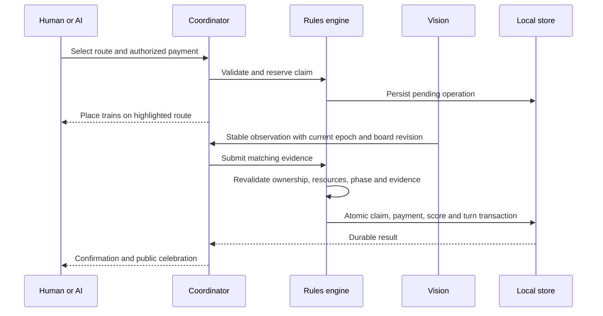
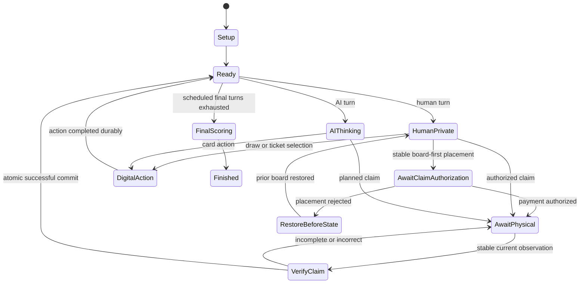
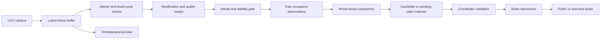
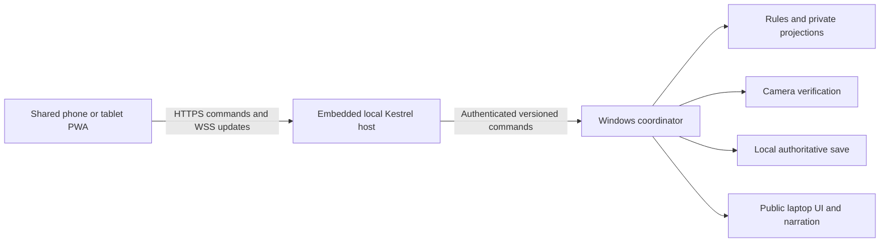

# GoldenTicket: Ticket to Ride Windows Companion

**Status:** Product specification with a partial C# implementation. The manual desktop slice, state-only pack-away and standalone connectivity spike have automated validation; the full camera/PWA product is incomplete. See the [implementation audit](docs/AUDIT-2026-09-12.md) and [remaining work](TODO.md).

**Design date:** September 11, 2026.  
**Working name:** GoldenTicket. This is a project codename, not an approved product name.  
**Target:** Windows 11 x64; the classic English North America Ticket to Ride board shown in the user's photographs, product DO7201 / 7201.  
**Companion:** An optional iOS/iPadOS and Android PWA on a phone or tablet passed between multiple human players. A single human uses the laptop display.

**Primary experience:** Physical board and trains, digital cards, human operators, camera verification, and local computer opponents.

## Contents

1. [Product contract and decisions](#1-product-contract-and-decisions)
2. [Scope and implementation boundaries](#2-scope-and-implementation-boundaries)
3. [Physical setup and onboarding](#3-physical-setup-and-onboarding)
4. [Player experience and screen design](#4-player-experience-and-screen-design)
5. [Digital cards and private information](#5-digital-cards-and-private-information)
6. [Classic North America rules profile](#6-classic-north-america-rules-profile)
7. [State model and invariants](#7-state-model-and-invariants)
8. [Commands, events, and physical transactions](#8-commands-events-and-physical-transactions)
9. [Turn and recovery state machines](#9-turn-and-recovery-state-machines)
10. [Camera acquisition and image pipeline](#10-camera-acquisition-and-image-pipeline)
11. [Calibration and automatic camera recovery](#11-calibration-and-automatic-camera-recovery)
12. [Train recognition and move verification](#12-train-recognition-and-move-verification)
13. [Wake gesture](#13-wake-gesture)
14. [Developer training and model delivery](#14-developer-training-and-model-delivery)
15. [Computer opponents](#15-computer-opponents)
16. [Story mode and sound](#16-story-mode-and-sound)
17. [Windows implementation and dependencies](#17-windows-implementation-and-dependencies)
18. [Processes, interfaces, and repository layout](#18-processes-interfaces-and-repository-layout)
19. [Persistence, undo, and restoration](#19-persistence-undo-and-restoration)
20. [Performance and resource budgets](#20-performance-and-resource-budgets)
21. [Failure handling and diagnostics](#21-failure-handling-and-diagnostics)
22. [Verification and acceptance criteria](#22-verification-and-acceptance-criteria)
23. [Implementation milestones](#23-implementation-milestones)
24. [Release readiness and remaining evidence](#24-release-readiness-and-remaining-evidence)
25. [Sources](#25-sources)

## 1. Product contract and decisions

### 1.1 What the application does

GoldenTicket supplies missing players for a physical game of Ticket to Ride. A laptop runs the complete game locally. A stationary overhead camera observes the board. The laptop tells the human operator where to place the computer player's trains, checks the resulting physical arrangement, and advances the game only when the action is resolved.

The board and plastic trains remain physical. Train cards, destination tickets, decks, discards, and card selection are digital for every seat. This eliminates routine card scanning, preserves AI secrets, and makes card-only turns observable through application commands.

The Windows laptop stays beside the board as the game display, camera processor, referee, AI host, and save owner. When there is exactly one human, that player's cards and destinations appear directly on the laptop; no phone, pairing or local HTTPS setup is required. Multiple humans may pass around a phone or tablet running the companion PWA to view their private cards and submit choices, or use pass-and-hide on the laptop. Companion devices communicate over a local network without requiring internet access.

The computer is an opponent and a referee. These are separate responsibilities: the referee holds the full game state; each opponent receives only that seat's permitted information.

Ticket to Ride is a route-claiming game. Trains are placed to occupy the spaces of a claimed route. They are not moved along an itinerary from city to city after being placed. The user's preference for final-position verification means that pieces may be placed in any order and the application verifies the completed placement, without requiring a prescribed hand movement or animation-following sequence.

### 1.2 Confirmed requirements

| ID | Requirement | Design consequence |
|---|---|---|
| R01 | Ticket to Ride only; no other board games | No game-plugin platform or generic board-game interpreter. |
| R02 | The classic North America edition pictured by the user | One versioned board and rules profile; no Europe, expansions, or automatic substitution of the 2025 refresh. |
| R03 | Windows 11; automatically use a supported GPU at launch, otherwise CPU, with a visible status icon | Default Auto selection validates the packaged GPU inference path before using it. Retain CPU/GPU overrides, a complete CPU path, and automatic CPU fallback. Show the effective backend with a chip/CPU or GPU/lightning indicator. |
| R04 | Offline operation with no subscriptions or server costs; no PWA inputs required from outside the LAN | The Windows app locally hosts the companion, its assets, and game data. QR-assisted connection and initial synchronization use the LAN only; no account, hosted server, internet dependency, or recurring infrastructure cost. |
| R05 | Human places trains while the camera watches | Durable pending actions, visual/audio instructions, and verified physical completion. |
| R06 | Printed alignment markers are acceptable | A printable marker layout beside the board supports orientation and recovery. |
| R07 | Pause after a camera jog; detect return to a suitable position automatically | Preserve state and pending action, reacquire geometry, compare the board, and resume automatically when consistent. |
| R08 | Verify final placement; no required intermediate ordering | Evaluate complete routes and all unaffected board regions. |
| R09 | An open-palm gesture can wake the app | A debounced gesture requests reconciliation; it cannot grant a turn or spend cards. |
| R10 | Developer trains with their pieces and ships the model if ML is needed | No consumer labeling, training, model accounts, or model downloads during setup. |
| R11 | Voice, visual-only, or both | Separate presentation modes with identical underlying game state and accessible controls. |
| R12 | Optional story mode with train and congratulation sounds; Training mode uses the same story without sound effects | One local narrative layer with presentation presets and no changes to rules or hidden information. Voice/story/audio are the final feature work, after photographed save-and-rebuild. |
| R13 | Multiple humans with pass-and-hide | Pass the companion phone/tablet between human seats; keep AI information isolated and the laptop's normal display public. |
| R14 | Use the game's box color scheme for the app | Parchment surfaces, burgundy actions, antique-gold accents, dark-brown text, and muted-blue secondary accents as specified in section 4.8. |
| R15 | The passed-around phone/tablet app must be a PWA for iOS and Android | Responsive browser client with home-screen launch, local shell caching, secure local pairing, and no native app-store dependency. |
| R16 | Photograph and save the game so the board can be cleared and rebuilt later | Explicit Save and pack away workflow: version-matched board photo, complete digital checkpoint, cleanup-safe pause, and guided physical restoration. |
| R17 | A single human uses the main monitor for their cards without connecting a phone | Count human seats in the current match, hide Connect phone for one human, and present that human's card choices on the laptop. Preserve AI secrecy and physical-placement instructions. |

### 1.3 Explicit design assumptions

These are implementation choices, not additional statements attributed to the user:

- Digital cards apply to **all** seats and both card families. A mixed physical/digital deck is excluded because it would require a second synchronization problem.
- English is the first UI and narration language, matching the supplied edition reference. Text and speech resources remain separable for later translation.
- Normal matches have at least one human and at least one AI. Local all-human play can reuse the same referee and privacy screens. All-AI play belongs to simulation and testing.
- The physical board, train molds, and colors must match a validated classic-edition profile. Replacement miniatures and other editions are outside the initial recognition guarantee.
- Voice means spoken guidance. Free-form speech recognition is not required. A single human selects cards on the laptop; multiple humans choose laptop pass-and-hide or the companion touchscreen.
- When companion play is selected for multiple humans, one shared companion device is the first-release controller. Separate simultaneous devices per human are outside the initial scope. No additional device is required for a single human or for AI seats.
- Offline means no internet connection is required. Companion play does require a working local link to the laptop, normally the same private Wi-Fi network. A disconnected PWA cannot take authoritative turns independently.
- Strictly offline PWA setup uses guided device trust for local HTTPS. This adds a one-time manual step per companion device; trust installation and actual browser behavior must pass M0 before mobile support is claimed.
- Speech-only **guidance** still needs a screen for private cards and interactive choices. Shared speakers must not read hidden hands aloud. This limitation is explained when selecting the mode.
- Optional sound effects and narration are shipped recordings, synthesized effects, or locally installed Windows speech. No language model or online speech service is required.
- Save/resume, correction history, camera failure recovery, and replay tooling from the original idea remain in scope.
- Numerical vision and performance thresholds below are initial engineering targets. They are not claims of measured reliability.

### 1.4 What supersedes the original idea document

The earlier document is background, not a second set of implementation orders. Its Chinese Checkers recommendation, generic game adapters, private-card scanning roadmap, and publisher-partnership roadmap do not define this product. The present requirements replace those portions. The underlying observe, propose, verify, save, and recover principles remain useful.

## 2. Scope and implementation boundaries

### 2.1 Complete first product

The implementation plan must reach a complete local game, including setup, companion installation/pairing, seat assignment, digital dealing, mobile pass-and-hide, computer decisions, physical route verification, card-only turns, camera recovery, final scoring, story presentation, and photo-assisted save, pack away, and board restoration.

Early milestones deliberately use manual input and recorded imagery, but they are development steps rather than a substitute for the final camera-assisted product.

### 2.2 Excluded features

- Other games, other Ticket to Ride maps, expansion rules, or a user-supplied rules engine.
- Physical card recognition, a second camera, or a hybrid shared deck.
- Robot movement, projected instructions, or augmented-reality glasses.
- Native iOS/Android packages, an independently installed LAN server, internet multiplayer, cloud saves, telemetry endpoints, or account systems. The embedded local companion host is in scope.
- Consumer model training, automatic self-training, or silently collected training footage.
- AI access to opponents' secrets, future deck order, or referee-only state.
- Generative dialogue, historical simulation, and story choices that modify the board game's rules.
- Mandatory storefront integration, online activation, or automatic updates.

### 2.3 Three different kinds of truth

| Kind | Meaning | Owner |
|---|---|---|
| Rules state | Cards, turn, route ownership, scores, remaining trains, and pending operations | Deterministic domain engine |
| Observation | What a frame suggests about physical train occupancy and visibility | Vision pipeline |
| Presentation | What a screen, narrator, or animation currently shows | UI and presentation services |

Neither a convincing image nor an animation completion changes rules state by itself. The coordinator submits an explicit validated command. Likewise, a camera problem does not erase cards, re-deal tickets, or pick a new starting player.

## 3. Physical setup and onboarding

### 3.1 Table layout

Use a rigid overhead mount, a UVC USB camera, and even lighting. Show a live preview and negotiated capture format rather than assuming the camera is delivering its advertised resolution. Aim to fit the complete board, registration markers, and a small gesture area into the image while retaining enough pixels per train.

The laptop sits within the operator's reach. Spare trains remain outside the mapped board area. Physical score markers may be used for familiarity, but the app's computed score is authoritative. Their perimeter region is separately masked so score-marker movement is not mistaken for a route change.

Place the shared phone/tablet outside the mapped board area. Keep both devices on the same private network; the router does not need a WAN connection. Validate any optional Windows hotspot mode on the actual adapter and OS, rather than assuming it works without an upstream connection. Guest-network client isolation may prevent the two devices from communicating.

The physical card decks stay in the box during an application-managed match. Setup explicitly states this, preventing players from drawing from two different sources of cards.

### 3.2 Printable registration layout

Ship a locally generated vector/PDF print asset containing distinct ArUco markers, orientation labels, a print-scale check, board placement guides, and a palm area. Implementation must use an approved fixed dictionary and reserved IDs; do not accept any four arbitrary squares as a valid board fixture.

Use four primary markers near different board corners and two optional redundant markers where framing allows. Do not rely on a ruler-perfect print scale for a planar warp: relative correspondences establish the transform. Scale still matters for setup guidance and quality checks.

Prefer a mat or corner guides that fix the board's relationship to the markers. Markers lying independently on a table do not prove the board has stayed in place. The application always cross-checks marker geometry against visible board borders and printed landmarks.

### 3.3 First-run sequence

1. Choose the presentation mode, Standard/Training/Story experience, and audio device. Processor mode defaults to Auto; run the launch capability check and show its result, with CPU/GPU overrides available in settings.
2. Explain that operation is local and that private cards appear only in the active human's private view.
3. Select a camera by preview. Confirm camera access and enumerate usable formats.
4. Identify the supported classic board. Show the reference edition description, not a vague “Ticket to Ride compatible” label.
5. Guide framing until the complete board, markers, and gesture region are sufficiently visible.
6. Establish board-to-image mapping and verify orientation using marker IDs plus board landmarks.
7. Run automatic quality checks for blur, reflections, clipping, occlusion, and piece resolution.
8. Capture an empty-board reference, with all trains off the mapped routes. This is automatic calibration, not consumer training.
9. Select seats, human/AI assignments, physical train colors, clockwise order, starting player, and AI difficulty.
10. Ask players to prepare the correct starting stock of trains. Do not pretend the camera can count an overlapping pile outside its view.
11. With one human, use the laptop automatically and omit Connect phone. With multiple humans, offer laptop pass-and-hide or connect/install and pair the companion as described in section 18.5. Create the saved match, perform digital setup, and visit each human's ticket-selection screen on the chosen controller.
12. Return to public view and begin the first turn only after the physical board is consistent.

No user has to label a train, photograph one color at a time, install Python, or teach the model their set. If the set falls outside the shipped recognizer's support, offer manual verification or explain the compatibility issue.

### 3.4 Camera quality screen

Report actionable categories rather than a single unexplained confidence number:

| Check | Example guidance |
|---|---|
| Coverage | “Move the camera slightly higher to include the lower board edge.” |
| Detail | “The trains appear too small. Move closer while keeping all markers visible.” |
| Stability | “Tighten the mount or remove tension from the camera cable.” |
| Glare | “A reflection covers this route. Adjust the light shown here.” |
| Orientation | “Move the board into the printed corner guides.” |
| Occlusion | “Clear the highlighted area before continuing.” |

Show the affected region on the preview. A format that is nominally 4K but blurred is less useful than a crisp lower-resolution format. Compatibility is determined by actual image evidence and acceptance tests.

## 4. Player experience and screen design

### 4.1 Public table screen

The public screen contains:

- Active player name, color, symbol, and turn status.
- Live board view with transforms synchronized to its displayed frame.
- Current route instruction or a short explanation of the current card action.
- Public card market, public scores, and remaining-train indicators.
- A public event history that omits private draws and unplayed tickets.
- Always-reachable Pause, Save and pack away, Recheck, Repeat instruction, and sound controls.
- Camera status and the actual inference backend in use.

Never place a hidden hand in the public screen's visual tree merely with zero opacity. Construct public and private view models from different data projections.

### 4.2 Human card turn

With one human, that player's card view opens on the laptop when a human decision becomes available. With multiple humans, the active player explicitly reveals their private view through pass-and-hide on the laptop or companion. The screen offers the available action families. Selecting a face-up card or a blind draw submits a command to the laptop, shows its authoritative result privately, and updates the market before a subsequent choice is permitted. Ticket draws open a private selection view with clear keep/return controls. Disable duplicate submissions while a result is unknown; do not locally invent a successful draw.

The game completes these actions through the rules engine. It does not wait for a nonexistent physical board change to decide that the turn ended. It returns to the privacy curtain before another human's information becomes available.

### 4.3 Human route claim: planned placement

1. The human selects a route through the map or an accessible city/route list.
2. If parallel routes exist, identify the specific lane using endpoint labels and a lane marker.
3. The private view offers legal payments and clearly shows the proposed expenditure. A player chooses among alternatives rather than having the app silently spend valuable wild cards.
4. Confirming the payment creates a pending claim and reserves the resources. It does not yet deduct them or award points.
5. The screen returns to public view and highlights every physical space to fill with that player's trains.
6. The human places the trains in any order. Temporary partial placement remains a pending action.
7. After hands leave, the camera verifies the full target route and the unchanged remainder of the board.
8. One atomic commit spends the cards, records ownership, updates derived values, and ends the turn.

### 4.4 Human route claim: board-first placement

A human may begin placing trains without preselecting a route. When the board stabilizes, the app proposes a matching route for the active seat. It then asks that human to authorize the digital payment privately. A visual observation cannot silently choose between legal payment combinations.

The candidate remains provisional until both payment authorization and current physical evidence are available. Enter `AwaitClaimAuthorization`, bind the proposal to its seat, state version, board revision, camera epoch, and proposal ID, and block unrelated card actions. Allow only authorization, rejection with physical restoration, pause, or recovery. After authorization, obtain fresh full-board evidence; the proposal frame alone cannot commit the claim.

If the player started a route during an already selected card action, explain the conflict and guide them to restore the physical board. Do not reinterpret the card action as a claim or discard an already revealed card to make the history fit.

### 4.5 AI turn

AI card actions run digitally and produce a brief public summary. Keep enough pacing for humans to follow the game, with a user-controlled speed and Skip narration button. Consecutive AI card turns may continue automatically, but never run past an unresolved physical claim.

For an AI claim, reserve its chosen legal payment and show:

- The acting seat, physical color, and a redundant symbol.
- Both endpoint cities and the exact lane for a parallel route.
- The number of trains to place and all required locations.
- A plain-language instruction such as “Place Blue's trains on the highlighted route.”

The app should display the actual board image with a contrasting outline and numbered segment labels. A schematic inset supports users who find the camera view difficult to read. Claim verification checks the final arrangement; it does not require following the numbered order.

### 4.6 Presentation modes

| Mode | Public move guidance | Private cards and interaction | Story behavior |
|---|---|---|---|
| Visual only | Text, shapes, and board overlays | Screen and accessible controls | Silent story captions; no automatic audio |
| Voice guidance | Spoken instructions; persistent status and controls remain available | Private screen; secrets never read over shared speakers | Spoken story and optional effects |
| Both | Synchronized text/overlays and speech | Private screen | Captions, narration, and optional effects |

Voice guidance is not a promise that a hidden-card game can be played entirely without looking at a screen. Private choices use the companion display or the laptop fallback. Offer accessible touch controls and keyboard navigation where available. A user-selected private headphone output could later provide screen-reader access to secrets, but headphones must not be assumed from the presence of an audio device.

Select the experience separately from voice/visual output: **Standard** uses essential game guidance; **Story** adds the railway narrative and optional sound effects; **Training** follows the same narrative with effects and ambience disabled. In Training, narration follows the existing Voice/Visual/Both selection. Visual-only Training is silent. Section 16 defines the shared presentation behavior.

### 4.7 Pass-and-hide

For exactly one human, use **Your cards** on the laptop and **Back to table** instead of pass-the-device wording. Open the human's card or ticket choices when a human decision becomes available, then return to the table for physical placement and AI guidance. A deliberate Back to table, Escape, timeout or deactivation remains respected; refreshing the public state must not reopen a deliberately hidden hand. Normal board-check, pack-away and rebuild gates still apply before card actions. Derive the mode from the actual match roster, including resumed matches; setup edits affect only a future match. Hide **Connect phone** and prevent starting companion gameplay in single-human mode.

With multiple humans, at a human handoff first show a neutral curtain on the companion: “Pass this device to Alex.” Reveal the active seat's private view only after an explicit action and a fresh laptop-issued private-view grant. The user can hold a touch target to peek at their hand; releasing it returns to the curtain. A persistent reveal option is permitted with a visible Hide control and inactivity timeout. The laptop remains on the public board view when using the companion. Laptop-only play uses the equivalent curtain and keyboard/mouse controls.

Hide on seat changes, deactivation, device lock, sleep, connection loss, recovery dialogs that leave the private workflow, and entry into public mode. Clear private DOM/view models, tooltips, search results, accessible labels, and pending narration at the same transition. The public scoreboard cannot acquire focus behind an unhidden private window. Mobile lifecycle and operating-system snapshot limitations are addressed in section 4.9.

This is social privacy on a shared device, not protection against another person watching over a shoulder, screen-recording software, or a local administrator. The app must make the handoff easy without pretending to solve those physical limitations.

### 4.8 Box-derived color scheme

Use the classic box photographs supplied by the user as the visual reference throughout onboarding, gameplay, private hands, settings, recovery, and story mode. The dominant treatment is warm parchment with deep burgundy, antique gold, dark brown, and restrained blue accents. The locomotive contributes charcoal for dark panels; the illustrated clothing and luggage provide optional muted green.

These sRGB values are implementation choices visually matched to the supplied photographs, not publisher-issued brand specifications. They establish a consistent starting palette rather than sampling shadows, paper texture, or lighting variation differently on each screen.

| Palette token | Hex | Reference and role |
|---|---|---|
| `Parchment` | `#F1E7D2` | Cream box background; main window and page surfaces |
| `Paper` | `#FBF6EA` | Light paper highlights; raised cards, dialogs, and text on dark surfaces |
| `AgedPaper` | `#E4D3AF` | Warm map tones; grouped panels and selected-row background |
| `Burgundy` | `#7A241C` | Red title lettering; primary actions and prominent headings |
| `BurgundyHover` | `#621B17` | Deeper title shading; primary-action hover/pressed treatment |
| `AntiqueGold` | `#B28A48` | Title edging and decorative details; dividers, ornaments, and restrained story accents |
| `Ink` | `#33271F` | Dark illustration outlines; primary text and strong boundaries |
| `SecondaryInk` | `#6B5845` | Sepia map lettering; secondary text and meaningful input borders |
| `RailBlue` | `#254B63` | Blue clothing and box accents; links, secondary actions, and keyboard focus |
| `RailCharcoal` | `#252729` | Locomotive metal; camera surround and opaque privacy curtain |
| `Forest` | `#3E5842` | Green illustration details; optional success icon paired with explicit text |

#### Component application

- Main screens use `Parchment`, with `Paper` cards and `Ink` text. Use `SecondaryInk` for supporting copy. Keep reading areas flat and uncluttered; any subtle paper decoration stays outside text, cards, and camera evidence.
- Primary buttons use `Burgundy` with `Paper` labels; hover/pressed uses `BurgundyHover` with a visible state change. Secondary actions use `RailBlue` text and borders on a light surface. Selected items combine `AgedPaper` with an explicit border/checkmark.
- Use `AntiqueGold` sparingly for ornament and story presentation. It must not be the sole indicator of focus, route selection, a required boundary, or small text on parchment. A gold-filled badge uses `Ink` text.
- The privacy curtain and camera surround use `RailCharcoal` with `Paper` text. Keep the curtain fully opaque. Recovery, success, and error states include clear words and icons, rather than relying on a theme color alone.
- Maintain canonical theme tokens and generate a WPF resource dictionary and PWA CSS custom properties from them. Map colors to semantic roles such as `Surface.Window`, `Surface.Card`, `Text.Primary`, `Action.Primary`, and `Focus.Outline`. Both clients use the same box-derived palette rather than scattering literal hex values.

#### Gameplay colors and readability

Physical player colors, train-card colors, and printed route colors remain distinct gameplay encodings. Their tokens are separate from the decorative palette: a burgundy app button is not the red player's identity, and a forest-colored success icon is not the green player's turn. Keep gameplay colors recognizable and pair them with seat names, symbols, labels, or patterns. Pale cards need a contrasting boundary.

Keep camera imagery and recognition input color-accurate; apply the box theme to the surrounding interface. On-camera route indicators use a light/dark double outline, endpoint labels, and segment numbers so they remain visible over varied board artwork. Honor Windows high-contrast settings and use system colors when needed.

Calculated contrast for the proposed opaque sRGB pairs is 11.79:1 for `Ink` on `Parchment`, 5.50:1 for `SecondaryInk` on `Parchment`, 9.29:1 for `Paper` on `Burgundy`, and 7.55:1 for `RailBlue` on `Parchment`. `AntiqueGold` on `Parchment` is only 2.58:1 and is decorative. `Ink` on an opaque gold badge is 4.56:1; avoid opacity or gradients that reduce that margin.

Use project targets of at least 4.5:1 for normal text and 3:1 for essential boundaries/focus indicators, checking every actual foreground/background pair and interactive state. These calculations validate the listed pairs, not an unbuilt interface. M6 must verify the rendered controls, camera overlays, high-contrast behavior, and color-independent player identification.

### 4.9 Mobile companion screens and behavior

The PWA is a private controller for the existing Windows game, not a second game engine. Its screens are:

1. **Connect:** Laptop identity, local connection status, setup/install help, and pairing controls.
2. **Pass:** Opaque curtain identifying the next human; no hidden cards loaded in advance.
3. **Private turn:** This human's hand, tickets, legal choices, visible market, and payment selection.
4. **Placement:** Public instructions for an authorized route, mirrored from the laptop, with Recheck and Hide controls. The laptop remains the principal camera-overlay display.
5. **Waiting:** Current public phase while an AI acts or physical verification is pending.
6. **Reconnect:** Opaque, read-only connection guidance; no private hand, queued card purchases, or independent turn advancement.

Use a responsive layout for phones and tablets in portrait and landscape, with a single-column phone view, grouped card counts, large ticket-selection controls, and a sticky Hide action. Initial usability targets are 48 CSS-pixel touch targets and operation at 360 CSS pixels of width. Honor safe-area insets, dynamic viewport height, text enlargement, reduced motion, and device/browser contrast settings. Interaction must not depend on hover, dragging precisely, or a physical keyboard.

On `visibilitychange` to hidden, `pagehide`, pointer cancellation, a dropped connection, or an expired private-view grant, synchronously cover the view and remove private data from application memory/DOM. On `pageshow`, foregrounding, reload, or restored history, start covered and request a new grant only after an explicit reveal action. A held-to-peek view hides on release and on `pointercancel`; it must not remain revealed when scrolling interrupts the gesture.

Maintain a client-local `revealGeneration`, incremented on every Hide, background event, peek release/cancellation, handoff, and disconnect. Every asynchronous private request captures it. Apply a private response only if its generation still matches, the document is visible, the reveal/peek state is still active, and the server grant/controller/handoff remain valid. Discard stale responses even when they concern the same human seat; a delayed response must never uncover a hidden hand.

These events are best-effort browser signals. The PWA cannot guarantee that iOS/Android never takes a task-switcher snapshot before its handlers run, prevent screenshots, or securely erase browser process memory. Encourage Hide before passing the device; never claim operating-system-level screenshot protection. Do not put private data into page titles, notification text, URLs, browser history state, application icons, or shared-device audio.

Narration and train sounds remain on the laptop by default. The companion is silent except for explicitly enabled non-private feedback. This avoids duplicate narration and dependence on background audio or mobile autoplay permissions. No push service or notification permission is needed.

### 4.10 Save and pack away

Provide a **Save and pack away** action on both the laptop and the connected companion. The Windows app uses the overhead camera to take the board picture; players do not need to use the phone camera or move the mount.

The normal flow is:

1. Pause gameplay and cover private screens. Keep the exact current turn and any unfinished action.
2. Ask everyone to clear their hands from the board while the app checks alignment and takes a sharp, unobstructed board photo.
3. Save the photo together with every claimed route, seat assignment, remaining train count, score, digital hand, destination ticket, deck order, and pending action.
4. Verify that the checkpoint and its photo are readable from local storage.
5. Show the board thumbnail, save name/time, and **“Saved. You can pack the game away.”** The game remains suspended as the pieces are removed.

Later, select the saved game and choose **Rebuild the board**. Display the saved photograph beside a clean placement diagram, with routes grouped by player color and labeled by endpoint cities and train count. Players may restore one color at a time or work in any order. The live camera marks missing, incorrect, or extra trains until the entire target is restored. Then **Resume game** returns to the saved turn and private-card workflow.

The photo is a visual reference paired with the full saved game. A standalone photo cannot recover hidden cards, ticket choices, deck order, or an exact interrupted turn. All digital state stays on the laptop and survives packing the physical cards and trains into the box.

If a photo cannot be verified or the user has disabled saved images, offer **Save game state without photo** with a clear status. The app can still rebuild the board from its stored route diagram. Do not present an old or obstructed image as a verified picture of the saved position. Technical handling of pending moves and capture failures is specified in section 19.8.

**Exit confirmation.** Closing an unfinished match without a verified pack-away checkpoint asks
whether to exit, with **No** as the default. Explain that completed digital actions are saved
automatically and that **Save and pack away** is required before clearing the physical board;
do not claim that confirmed digital progress will be lost. Apply this from every screen, including
Camera and Connect phone. No confirmation is needed before a match starts, after final scoring,
or while a verified checkpoint is packed or being rebuilt. A missing optional photo does not
make that digital checkpoint unsaved. If storage is faulted, warn that the latest action may
not have been saved. Refuse closing while a game action or photo operation is still in progress
and ask the user to retry afterward. Cover private views and reject new game/companion inputs
while the confirmation is open. Cancel keeps the application and tools available without
revealing a private hand. Confirm disposes local tools and defers the final window close until
the original canceled WPF closing event has returned. Never capture a photo or create a
pack-away checkpoint as a side effect of the exit prompt.

## 5. Digital cards and private information

### 5.1 Single source of card state

The referee owns both shuffled decks and all hands. Each physical card type has a digital definition and each card instance has a unique internal ID. Identical train cards still need distinct instance IDs for conservation checks, replay, and deduplication.

Do not generate an independent deck for each AI. All seats participate in the same match supply. Do not retain a physical draw pile alongside the digital one.

### 5.2 Information projections

| Projection | May contain | Must exclude |
|---|---|---|
| Referee state | Complete ordered decks, all hands, ticket selections, random state, pending operations | Nothing required by the engine |
| Public state | Claimed routes, public scores, turn/phase, visible market, public action history, publicly permitted counts | Blind-card identities, unplayed tickets, ordered future cards, private previews |
| Seat view | Public state plus this seat's cards and current private choices | Other seats' secrets and referee random/deck state |
| Narration event | Allowlisted public facts and presentation parameters | Hidden ticket completion, private draw identity, AI intention inferred from tickets |
| Diagnostic summary | Timing, quality codes, version IDs, errors | Default inclusion of card faces, raw state dumps, speech containing secrets |

The product policy is to show card and ticket counts, but not identities, as public counts. Document this visibility choice; AI and humans receive the same published public information. Do not give the AI a detailed discard-history advantage unless that history is equally available to humans in the UI.

### 5.3 Fair AI access

Construct a fresh immutable `SeatView` before each decision. The AI API accepts that value and an action interface; it has no reference to `GameState`, persistence, the deck service, or another seat's view.

Computer opponents may infer likely plans from public behavior. They may not read secret tickets to make those inferences accurate. Separate per-seat search state and random streams prevent accidental sharing of private knowledge between AI seats.

### 5.4 Randomness and replay

Use a versioned, unbiased shuffle implementation and record either the resulting permutations or the deterministic generator state in referee-only storage. Production seeds originate from the operating system random source; simulation seeds are explicitly set for reproducible tests.

Public saves, logs, and AI payloads must not expose a seed that reconstructs future cards. A resumed match preserves the exact remaining order. Closing and reopening must not reroll a draw or an AI decision already committed to the journal.

## 6. Classic North America rules profile

### 6.1 Profile identity and rule summary

Pin `ttr-us-classic-en-v1` to the publisher's [classic English rulebook](https://ncdn0.daysofwonder.com/tickettoride/en/img/tt_rules_2015_en.pdf), matching the photographs.

Classic USA: 2–5 players; each starts with 45 trains, four train cards, three tickets (keep ≥2). Decks: 110 train cards (12×8 colors, 14 locomotives), 30 tickets; five-card market. Turns proceed clockwise, choosing one action: draw train cards, claim one route, or draw tickets. Normally draw two train cards sequentially; refill/resolve market after each face-up pick. A face-up locomotive consumes the turn and cannot be the second pick; blind locomotives count normally. A ≥3-locomotive market is discarded/refilled; exhausted train deck reshuffles discards. Payments equal route length: required color or one color for gray, with wild substitutions. Claims need available trains; score lengths 1–6 as 1,2,4,7,10,15. No player owns both parallel routes; with 2–3 players either claim closes its twin. Draw up to three tickets, keep ≥1; rejections go underneath. After someone finishes with ≤2 trains, everyone—including trigger—gets one additional turn. Score route points ±tickets; longest edge-unrepeated continuous train trail earns 10 (all tied). Victory ties: completed-ticket count, then longest-path bonus holder.

Implementation must use the edition's complete rulebook and reviewed fixtures; this compact profile summary is not a replacement instruction booklet. The [2025 rulebook](https://cdn.svc.asmodee.net/production-daysofwonder/uploads/2025/07/7201N_TICKET2RIDEV2_RULES_EN_20250425_WEB.pdf) describes different components and setup and must not silently replace this profile.

### 6.2 Rules implementation responsibilities

Keep the rule engine independent of images, speech, UI, model confidences, and wall-clock delays. Its responsibilities are legal actions, private/public views, exact resource accounting, phase transitions, and scoring.

Use explicit action subphases. A draw is not a single UI animation: an intermediate draw changes information available to the acting player, and that result must be persisted before the next choice. Return legal-action descriptors tied to the current state version, so a stale market-slot click cannot draw its replacement.

Payment candidates are vectors indexed by train-card kind. Validate nonnegative counts, ownership, exact expenditure, route compatibility, and remaining physical stock. Distinguish physical player colors from card/route colors in both types and UI; Blue's trains can occupy routes of several printed colors.

For parallel tracks, store a distinct route ID per lane and a shared parallel-group ID. A pair of city IDs is not sufficient to identify a claim.

### 6.3 Board and card data package

Ship a versioned data manifest, separate from executable code:

```text
ClassicUsManifest
  profileId, schemaVersion, rulesPolicyVersion, dataHash
  cities[]: stableId, displayName, normalizedAnchor
  routes[]: routeId, cityA, cityB, length, requiredCardKind?, parallelGroupId?
            centerline[], segmentPolygons[], displayLaneLabel
  tickets[]: ticketId, cityA, cityB, points
  trainCardDefinitions[]: cardKind, multiplicity, localAssetId
  geometryProfile: orientationLandmarks, boardBoundary, markerFixture
  rulesConstants: setup, draw, stock, scoring, endgame values
  compatibility: supportedBoardArt, pieceProfile, modelContractVersion
```

Digitize the actual supported board's geometry from a controlled developer capture. Independently verify every city connection, printed color, lane, segment count, and ticket value against the physical edition. Store a reviewed source-data checksum. The photographed box establishes edition identity; its small board illustration is not accurate enough to derive production coordinate polygons.

Do not invent a route count or ship placeholder edges just to fill the schema. Completing and independently auditing this data is an implementation milestone with a named acceptance artifact.

### 6.4 Rare cases and explicit software policies

Some pathological supply states require an explicit software policy beyond ordinary gameplay. Keep these separate from the official rules, version them, and describe them in local help.

| Situation | Initial product policy |
|---|---|
| Several setup ticket returns | Collect all initial offers before recycling returns; append rejected cards in deterministic seat order. |
| Several tickets returned together | Let the acting seat choose their order; preserve it in the journal. |
| Partial supply or no selectable second draw | Expose a reviewed `RulesDecisionRequired` state rather than silently inventing an action. Preserve every already revealed result. |
| Market reset cannot stabilize | Detect impossible supply composition and bound repeated refresh computation. Pause with the exact cause; do not hang the UI or silently accept a different rule. |
| No legal action under the selected profile | Save and surface the condition; no undocumented forced pass. |
| Official final tie-break still leaves multiple winners | Treat as shared victory, recording this as a product clarification. |

Before the consumer release, each supply case needs a documented decision supported by the edition's official clarification where available, or an explicitly disclosed house policy. This is outstanding rules work, not permission to ship a normal game loop that can freeze. A pause preserves the match while policy implementation is incomplete; it is not claimed as a satisfying final resolution.

### 6.5 Graph algorithms

Ticket connectivity uses the acting seat's claimed-route graph. A disjoint-set structure or BFS is sufficient; recompute from claimed edges after undo rather than patching an irreversible union structure incorrectly.

The final longest route calculation is a **maximum weighted edge-simple trail**. Cities may be revisited; a route edge cannot be reused. A shortest-path algorithm or a visited-city-only DFS is incorrect.

Assign local bit positions to that seat's claimed routes. Evaluate:

```text
Best(city, usedEdges) = max(
    0,
    length(edge) + Best(otherEndpoint(edge, city), usedEdges | bit(edge))
    for each incident edge not already used
)
answer = max(Best(startCity, emptySet) for every incident city)
```

Run this separately on connected components, retaining the best witness trail. Add exact memoization and a safe upper bound based on unused reachable edge length. Never cache an incompletely explored, pruned result as an exact value. Do not substitute a timeout approximation when determining the winner. Run final scoring off the UI thread and show progress if needed. Heuristic versions may be used inside AI evaluation but must never supply official results.

## 7. State model and invariants

### 7.1 Domain entities

```text
GameSession
  sessionId, profileId, manifestHash, rulesPolicyVersion
  stateVersion, journalSequence, boardRevision
  lifecycle, verificationMode, seats[], activeSeatId, turnNumber, turnPhase
  routeOwners: routeId -> seatId?
  trainStockBySeat, routeScoresBySeat
  trainDeck, trainDiscard, faceUpSlots[], trainHandsBySeat
  ticketDeck, ticketHandsBySeat, setupOffersBySeat, ticketOffer?
  provisionalPhysicalChange?, pendingClaim?, finalRound?, randomState, createdAt, updatedAt
  packAwayCheckpointId?, packAwayRequestId?, suspendedTurnPhase?

PendingClaim
  operationId, seatId, routeId, payment, origin
  baseBoardRevision, createdAtStateVersion
  expectedBeforeBoardHash, expectedAfterBoardHash
  status, authorization, lastVerifiedEvidence?

ObservationEnvelope
  sessionId, frameId, capturedAtMonotonic
  cameraEpoch, calibrationRevision, modelVersion
  operationId?, requestedStateVersion, baseBoardRevision
  visibilityMask, cellObservations[]
  markerFit, boardFit, stability, unknownForeground

FinalRound
  triggeringSeatId, triggeringTurnNumber
  finalTurnsRemainingBySeat, completionOrder

PackAwayCheckpoint
  checkpointId, sessionId, name, createdAt, formatVersion
  sourceSnapshotId, sourceStateVersion, boardRevision, sourceJournalSequence
  profileId, manifestHash, logicalStateHash, suspendedTurnPhase
  pendingOperationId?, physicalTarget, physicalTargetHash, targetProvenance
  pendingPlacementMask?, photoHash?, photoCaptureContext?, status
```

`stateVersion` advances on every authoritative transaction, including pending-operation changes. `boardRevision` advances when expected physical ownership changes. `journalSequence` orders durable events. `cameraEpoch` advances whenever old image geometry becomes unsafe; it is not a substitute for any domain version.

### 7.2 Non-negotiable invariants

1. Card instances exist in exactly one legal location, including temporary offers. Supply is conserved.
2. A claim cannot spend resources or award points more than once.
3. Only one foreground game operation is active. Two AI seats cannot instruct the operator simultaneously.
4. A route owner changes only through a domain transaction or an explicitly recorded correction branch.
5. A final-board observation must match the pending operation's seat, lane, and complete occupancy pattern.
6. Unrelated trains must remain consistent and visible enough to establish agreement.
7. A gesture, timer, speech completion, or camera reconnect never ends a turn by itself.
8. Stale inference, stale UI selections, and stale AI results are rejected by version checks.
9. Private information cannot enter public projection or narration payloads.
10. Camera failure cannot alter deck order, restart a turn, or discard a pending claim.
11. Declaring victory requires exact final scoring from confirmed domain state.
12. Replay reaches the same state and hashes without rerunning vision or making new random choices.
13. Each seat's remaining stock plus the total length of its owned routes equals its starting stock.
14. Each public route score equals a fresh scoring calculation from that seat's owned routes.
15. Packing away or rebuilding never changes card ownership, route ownership, scores, or turn order. A photographed pending placement remains uncommitted until the normal claim protocol succeeds after resume.

## 8. Commands, events, and physical transactions

### 8.1 Command envelope

Every mutating command carries `sessionId`, `commandId`, `actorSeatId` when applicable, `expectedStateVersion`, and a typed payload. Persist the command ID/result association for deduplication. Repeated clicks, camera retries, or a post-crash resend must return the previous outcome instead of applying it again.

Commands include `SelectTrainCard`, `RequestTicketOffer`, `KeepTickets`, `PlanClaim`, `AuthorizeObservedClaim`, `SubmitClaimEvidence`, `CancelPendingClaim`, `RequestRecheck`, `PauseSession`, `SaveAndPackAway`, `BeginBoardRebuild`, `ResumePackedGame`, and `BeginCorrection`.

Do not accept arbitrary “set turn to AI” or “replace full state from camera” operations from the interaction layer.

### 8.2 Durable events

Use small typed events with a schema version and visibility classification:

```text
SessionCreated, SetupOfferCreated, TicketSelectionCommitted
TrainCardDrawn, MarketRefilled, MarketReset, DeckReshuffled
ClaimPlanned, ClaimPaymentAuthorized, ClaimVerified, ClaimCommitted
TurnCompleted, FinalRoundStarted, FinalScoringCompleted
ObservationRejected, CameraRecoveryStarted, CameraRecovered
ClaimCancellationRequested, ClaimCancelled
CorrectionBranchCreated, ManualVerificationRecorded
PackAwayRequested, PackAwayCheckpointCommitted, PackAwayCheckpointVerified
BoardRebuildStarted, PackedGameResumed
```

Not every frame belongs in the game journal. Persist actionable failures and recovery boundaries; retain per-frame metrics in a bounded diagnostic ring only when needed.

### 8.3 Route claim commit protocol



The reserved payment remains in the owning hand with a reservation flag until commit, and cannot be used by another action. The UI may display it as committed to the pending action, but card conservation still treats it as one location.

The logical database transaction cannot move physical objects. Recovery therefore reconciles the durable before/after expectations with the table rather than assuming an atomic transaction spans the camera and the world.

### 8.4 Cancellation and misplaced pieces

If no physical placement occurred, cancellation releases the reservation immediately after a current observation verifies the before-state. If trains were placed, cancellation enters `RestoreBeforeState`; the operator removes only the highlighted new trains. Release the reservation and allow the next action only after restoration or an explicit manual reconciliation.

A wrong-color train, wrong lane, extra train, or missing segment keeps the same operation pending. Display an exact correction instead of deducting cards and asking the user to fix the board afterward.

### 8.5 Digital action transactions

Each card selection commits its own informational result durably. Market refresh and any required shuffle complete atomically with that selection in the normal path. Only then generate the subsequent legal choices.

If bounded market resolution cannot finish, atomically persist the selected card, the intermediate market/pool, the exact random continuation, and `RulesDecisionRequired` before revealing the result. The incomplete operation remains resumable. Do not throw away the selection, reroll the shuffle on retry, or permit a different action after private information has been exposed.

If the process crashes after a revealed first card, restoration returns to the remaining selection with that card still owned. There is no automatic rollback that allows a player to sample a different result. Ticket offers similarly remain fixed across crashes, privacy handoffs, and pauses.

## 9. Turn and recovery state machines

### 9.1 Game operation states



Board-first observations enter an authorization substate of `HumanPrivate`, then reuse the same `AwaitPhysical` protocol. They do not create a second claim path with weaker checks.

### 9.2 Orthogonal readiness gates

Track camera readiness separately from the game operation:

```text
Camera: NoDevice -> Acquiring -> Calibrating -> Tracking
Tracking -> Occluded | Unstable | Reorienting | Disconnected
Recovery -> GeometryVerified -> BoardReconciliation -> Tracking

Privacy: Public | Curtain | Private(seatId)
Audio: Ready | Muted | Unavailable
Storage: Writable | Faulted
Session: Active | PreparingPackAway | PackedAway | Rebuilding | Finished
```

The session lifecycle gates the operation state machine without replacing its saved turn phase. `PreparingPackAway`, `PackedAway`, and `Rebuilding` disable gameplay commands, AI submissions, and ordinary move inference. They allow only the appropriate save, camera, rebuild, and recovery controls. Cleaning up a packed game and placing trains during reconstruction cannot enter `AwaitClaimAuthorization` or `VerifyClaim`. Section 19.8 defines these transitions and their durable boundaries.

During an ordinary digital action, no camera change is required. In `CameraVerified` mode, a detected camera-loss or reorientation event freezes new gameplay commands to honor the pause-and-recover requirement and to avoid compounding an unknown physical change. Already committed digital substeps remain saved. Read-only private review and recovery controls may remain available.

The deliberate `Manual` verification mode replaces camera readiness with an explicit whole-board operator attestation. Selecting it requires a visible mode-change action and reconciliation of the current table, changes the state version, and cancels old image callbacks. It permits continued play with a disconnected camera and stays visibly labeled until the user re-enables camera verification. A generic confirmation button cannot accidentally change this mode.

### 9.3 Resume conditions

Automatic resume of an active game after camera recovery requires all of the following: valid mapping, supported quality, stable unobscured board evidence, agreement with a permitted before/after/pending state, writable persistence, and a current operation context. A packed game instead requires the explicit rebuild/resume workflow in section 19.8; camera agreement alone cannot leave `PackedAway` or `Rebuilding`.

If nothing physical changed, continue the same phase. If the exact fully authorized pending claim was completed while the view was unavailable, fresh full-board verification may finish it. If the table differs in another way, ask for reconciliation; never guess through multiple unobserved turns.

For an interrupted unauthorized board-first placement, reacquire the complete board and reconstruct a provisional candidate from fresh evidence. If it uniquely fits the same seat's otherwise unstarted turn, re-enter `AwaitClaimAuthorization` and permit that private authorization while ordinary actions remain blocked. Otherwise require restoration to the committed board. No pre-jog proposal gains authority merely because it was saved.

Final-round bookkeeping is attached to completed domain turns, not camera frames. Recovery cannot consume a final turn twice.

## 10. Camera acquisition and image pipeline

### 10.1 Capture contract

Use one camera selected by stable device identity, with graceful re-enumeration after reconnect. Request video only. Enumerate actual formats and display the negotiated resolution and rate. Prefer a high-resolution mode that passes the quality test; lower-resolution operation remains available when evidence supports it.

Preview and analysis have different rate requirements. Provide a responsive preview while submitting a smaller number of current frames for vision. Do not accumulate a backlog of high-resolution frames.

Each frame carries a sequence number, monotonic timestamp, negotiated format, device generation, and mapping epoch. Retain these through rectification and rendering. Dispose native frame resources promptly.

### 10.2 Pipeline



Use a capacity-one or capacity-two latest-frame channel and drop superseded work. Expensive inference is cancellable. An old frame arriving after a jog is discarded even if its prediction is very confident.

### 10.3 Coordinate spaces

Keep these spaces explicit:

1. Sensor pixels, including negotiated rotation or mirroring metadata.
2. Corrected camera pixels if an approved lens-distortion correction is used.
3. Normalized board coordinates defined by the data manifest.
4. Analysis image pixels produced by rectification.
5. Display pixels after preview scaling, letterboxing, and panel transforms.

Store the transform chain with each displayed frame. Overlay rendering consumes that chain, not the latest global transform. This prevents route instructions from jumping to incorrect locations when preview and inference run asynchronously.

Perspective rectification assumes a plane; plastic trains extend above it. Account for expected parallax in segment tolerances and restrict accepted camera tilt. A homography does not correct arbitrary lens distortion or severe three-dimensional occlusion.

### 10.4 Exposure and lighting

After stable setup, attempt to lock supported exposure and white-balance controls. Unsupported controls are normal and should produce guidance, not failure. A substantial automatic exposure or lighting change invalidates the appearance baseline until the board is re-evaluated.

Do not use an old empty-board subtraction image as the sole detector after lighting changes. Preserve geometric calibration separately from appearance quality.

## 11. Calibration and automatic camera recovery

### 11.1 Initial registration

Detect the configured marker IDs and their corners, estimate a robust board-plane transform, and compare it with board borders and several printed landmarks distributed across the map. Reject implausible scale, handedness, or orientation. Normalize orientation to the edition profile so a rotated board cannot silently swap city identities.

Use all usable correspondences and evaluate held-out landmark residuals. Four corner points alone can fit a wrong quadrilateral perfectly. Require spatial coverage: a cluster of visible markers on one side gives poor confidence at the opposite edge.

Persist fixture identity, transform, residual statistics, visible landmark IDs, camera format, and a calibration revision. A saved transform is a starting hint, never proof that the current camera placement matches it.

### 11.2 Detecting a jog

Trigger `Reorienting` on inconsistent marker displacement, board-border motion, landmark disagreement, framing loss, abrupt perspective change, or incompatible capture metadata. A tiny vibration can first enter `Unstable`; use hysteresis so a normal hand entering the scene does not repeatedly announce camera failure.

Immediately stop accepting physical evidence, advance `cameraEpoch`, cancel in-flight inference, retain the pending game operation, clear misleading placement overlays, and show/say: “Camera moved. Put it back so the board and markers are visible.”

### 11.3 Automatic recovery sequence

1. Continue low-cost preview and marker search while gameplay is paused.
2. Detect the known fixture and candidate board pose. Exact pixel-for-pixel return is unnecessary.
3. Confirm markers and printed board landmarks still agree. If only the board moved, derive a new board transform instead of trusting stationary markers.
4. Check framing, orientation, scale, glare, sharpness, and occlusion.
5. Require agreement over a stable window using fresh frames in the new epoch.
6. Rebuild the mapping and discard appearance data that no longer applies.
7. Compare the entire physical board with the saved logical state and any authorized pending placement.
8. For an `Active` session, resume automatically when a permitted match is verified; emit one recovery event and one brief notification. For a pack-away/rebuild lifecycle, return only camera readiness to that workflow and retain its gameplay gate.

A “similar position” means any pose within the validated camera-angle, image-detail, and coverage envelope, not a fixed number of centimeters. Thresholds are expressed in projected train dimensions and registration error so they remain meaningful across resolutions.

### 11.4 Recovery outcomes

These gameplay outcomes apply only to an `Active` session. During save preparation or reconstruction, use the frozen checkpoint target and controls in section 19.8; restoring camera geometry cannot resume play or complete a claim.

| Observed board | Action |
|---|---|
| Matches committed state | Resume the saved phase. |
| Matches the full authorized pending claim | Submit fresh evidence through the normal claim commit path. |
| Matches a partial pending placement | Keep that claim open and highlight remaining segments. |
| Has unrelated changes | Enter guided correction; preserve all digital state. |
| Is ambiguous or partially hidden | Remain paused with specific framing/visibility guidance. |
| Geometry differs from marker fixture | Reacquire from board evidence or request reseating within guides. |

Do not estimate a series of unseen actions from a plausible final arrangement. Do not use the expected state as evidence that the image really contains those trains.

## 12. Train recognition and move verification

### 12.1 Observation representation

The board is a known set of route-segment regions. For each segment, estimate `Empty`, one supported physical player color, or `Unknown`, with separate visibility and quality values. Preserve the unthresholded evidence for matching and diagnostics.

Unknown is an intentional outcome, not a sixth player color or an empty cell. Include evidence for foreign objects and unassigned foreground in board areas outside normal segments. Otherwise a misplaced train between routes could disappear from the occupancy-only model.

### 12.2 Baseline first

Implement a measured non-trained baseline using known geometry, empty-board appearance, shape/texture cues, calibrated image normalization, and temporal comparison. Printed route colors are not player ownership. A colored track on an empty board must remain empty regardless of its hue.

Use the baseline to establish failure cases. Introduce a small targeted learned classifier or segmentation component when the baseline misses required reliability targets, particularly for dark trains, similar printed colors, shadows, glare, and crowded parallel routes.

### 12.3 Model candidate

A compact batched patch classifier remains a candidate once measured route-segment geometry is available. The current manifest does not yet contain production pixel geometry, so the first learned preview experiment will instead use independent tiled object detection for individual trains and player score markers. It must find pieces without an empty-board reference; filtering only subtraction candidates would retain the baseline's blind spots. Inputs, tile geometry and output classes are versioned. A segmentation head is an alternative if bounding boxes cannot separate touching or neighboring pieces.

The [ML implementation sequence](docs/piece-recognition-ml.md) specifies developer-only annotation, grouped training/evaluation data, a small YOLOX experiment, ONNX export, and eventual offline CPU/GPU integration. The [local annotation and COCO export tools](tools/piece-training/README.md) implement data preparation only. No trained model is bundled yet. Physical color is annotation metadata until separately trained and evaluated; neither object class nor printed route hue establishes ownership.

Do not select an architecture solely because it achieves a high frame-level accuracy number. Evaluate complete claimed routes, previously occupied routes, and unknown-foreground detection. A model that confidently mistakes one black train for a shadow can corrupt a whole match.

### 12.4 Occlusion and stability

First determine whether relevant regions are visible, then estimate occupancy. Use scene motion, foreground masks, and available hand evidence to wait until placement is finished. A motionless hand still occludes the board; low motion is not proof of visibility.

Initial timing targets are a roughly 0.6–1.0 second stable interval with observations from multiple distinct frames, followed by verification. Tune using recorded human sessions rather than increasing delays until errors seem to disappear.

Successive frames are correlated. Requiring five identical predictions is useful debounce, not statistical proof of five independent observations. Acceptance confidence must be calibrated on separate recording sessions and conditions.

### 12.5 Match against expected changes

For a pending claim, generate the expected after-state from the legal operation. Compare all target segments, both lanes of any parallel group, and all other occupied/empty route regions. Require complete placement, correct physical color, no unexplained change, and acceptable coverage. Each relevant segment must pass its visibility and confidence floor; a high route-average score cannot compensate for one unknown or wrong segment.

For board-first human placement, enumerate legal route claims for the current seat and rank observation agreement. A unique plausible candidate may be presented for payment approval. Multiple candidates or insufficient visibility produce a specific question or a highlighted correction, not an automatic best guess.

Never renormalize probabilities over legal moves and then treat the winning legal move as high-confidence physical evidence. A camera error can make every legal candidate implausible. Preserve a reject/unknown hypothesis with an absolute quality floor.

### 12.6 Confidence policy

Separate three decisions:

- **Automatic accept:** Independently calibrated image evidence, current geometry, complete coverage, legal authorized operation, and unchanged remainder agree.
- **Ask or correct:** A plausible operation is visible but evidence or authorization is incomplete.
- **Pause:** Geometry, visibility, device health, or state consistency is unsafe for interpretation.

Do not advertise a raw network softmax as “99% certain.” Thresholds must map to measured outcomes, especially the rate at which wrong physical boards are accepted.

### 12.7 Human correction

Highlight missing, extra, wrong-color, and displaced trains separately. Use symbols and text in addition to color. If the camera remains unable to decide, allow an explicit manual attestation after displaying the complete expected board, including the pending route and all unrelated mismatches or unknown areas. The operator must resolve or attest each highlighted area; confirming only the new route cannot waive another discrepancy. Record the operator, time, route, full-board attestation, reason, and `Manual` provenance through a distinct evidence type.

A manual confirmation is not counted as an automatic vision success. Persistent trouble can switch the session to manual physical verification, with a visible status that tracking is reduced.

## 13. Wake gesture

The gesture area is beside the board and inside the camera image. An open palm held there for an initial target of about one second requests `RequestRecheck`. Require presence in the gesture region, a stable gesture classification, release before rearming, and a cooldown to avoid repeated commands.

Use a non-learned bounded hand/foreground heuristic if measured reliability is sufficient; otherwise train and ship a small gesture model under the same local delivery constraints as train recognition. Do not assume the train classifier also recognizes hands.

The action wakes the coordinator, refreshes current evidence, and repeats the appropriate instruction. If it is a human's digital selection phase, the response is “Finish your card choice on the shared device,” or the laptop equivalent in fallback mode. If an AI result is ready and the board is consistent, continue it. If the camera is displaced, continue recovery.

It never increments the active seat, approves a hidden-card spend, dismisses a mismatch, or overrides a rules violation. A Recheck button and keyboard shortcut provide the identical command when the camera cannot see the gesture. Gesture activity cannot reveal a private hand.

## 14. Developer training and model delivery

### 14.1 Training is a development task

This section concerns developer ML model training. The user-facing **Training mode** in section 16 is a gameplay presentation preset; it does not collect labels, train a model, or require the player to teach the camera their pieces.

The developer captures their supported board and pieces, labels ground truth, trains offline on their workstation, evaluates the model, exports it, and ships a fixed bundle. Consumer setup performs geometric alignment and automatic quality assessment only.

The initial dataset may use the developer's own set. Shipping claims must be limited to conditions tested independently; a successful fit to one recording is not proof that every classic box, worn train, camera, or lighting condition will work.

### 14.2 Dataset plan

Collect controlled empty boards and partial/full games with:

- Every supported physical train color on varied printed route colors.
- All map regions, parallel lanes, neighboring trains, and dense late-game layouts.
- Correct claims, partial claims, wrong-color pieces, wrong lanes, and stray trains.
- Hands, sleeves, resting hands, shadows, reflections, blur, and cable-induced movement.
- Several supported resolutions, exposure settings, camera heights, tilts, and illumination arrangements.
- Jog/recovery sequences, moved markers, shifted board, sleep/reconnect, and resumed matches.
- Score-marker movement and train stock outside the board.

Store session ID, capture hardware, format, calibration, edition, piece set, lighting tags, ground-truth board state, occlusion masks, timestamps, and labeling provenance. Human corrections become training labels only after explicit review; do not infer labels solely from the AI's intended move.

### 14.3 Splits and evaluation

Split by physical recording session and setup, not adjacent video frames. Hold out camera/lighting combinations; where possible hold out another physical copy of the same edition. Keep a locked release test set separate from tuning data.

Report per-color and per-region error rates, unknown detection, full-claim false acceptance, whole-board mismatch detection, correction frequency, recovery success, and CPU/GPU latency. Evaluate gesture models separately so successful train recognition cannot hide poor gesture behavior.

### 14.4 Reproducible training

Use a local Python environment with pinned packages, a versioned training configuration, deterministic seeds where supported, dataset manifests, and recorded tool versions. Start with a small network trained from the developer's data or an explicitly approved checkpoint. An open-source training framework does not automatically establish the license of downloaded weights or datasets.

Export ONNX with a tested opset, supported operators, explicit tensor shapes, preprocessing, channel order, normalization, and label mapping. Validate the exported output against training-framework output on fixed samples, then evaluate both deployed inference backends on the same replay set.

Quantization is optional and must earn its place through accuracy and latency measurements. Keep an unquantized CPU reference model for comparison if an optimized variant ships.

### 14.5 Model bundle contract

```text
model.json
  modelId, semanticVersion, fileHashes
  profileId, geometryVersion, inputContract, outputContract
  opset, supportedBackends, precision
  preprocessingVersion, confidencePolicyVersion
  trainingDatasetManifestHash, evaluationReportHash
  frameworkVersions, licenseProvenance, buildId
model.onnx
labels.json
evaluation-summary.json
THIRD-PARTY-NOTICES.txt
```

The application rejects incompatible or corrupted bundles and explains the problem. No executable code loads from a user-provided model manifest. Updates are shipped through a complete installer or an explicitly selected local update package; no automatic model fetch occurs on launch.

### 14.6 Generalization policy

If a user has a supported board but poor lighting, guide physical setup adjustments. If the shipped model is inadequate, preserve the match with manual verification and optionally offer local diagnostic recording. The consumer is never asked to train a replacement model. Improving support is a developer release task with a new evaluated bundle.

## 15. Computer opponents

### 15.1 Local strategy

Implement local strategy over the known graph and permitted information. No remote LLM, subscription, or learned gameplay model is required. Keep gameplay AI independent from computer-vision ML.

Begin with a deterministic heuristic opponent that evaluates ticket connectivity, missing path cost, scarce route risk, usable card sets, route points, remaining trains, and game tempo. It must choose complete legal actions and understand that a second card choice depends on the updated market.

### 15.2 Candidate evaluation

For each private ticket, estimate useful paths through owned, unclaimed, and opponent-blocked edges. Account for route overlap between tickets and alternative corridors. Value cards by marginal utility to plausible near-term claims, avoiding a strategy that endlessly collects cards without building.

Evaluate claims using immediate public value, private network improvement, resource cost, alternative-route loss, competition inferred from public play, and final-round risk. AI may block an opponent based on public evidence; it must not consult that opponent's real ticket list.

### 15.3 Difficulty

| Level | Initial behavior | Target decision budget |
|---|---|---|
| Relaxed | Legal heuristic with bounded variation and forgiving planning | About 0.25–0.75 seconds |
| Standard | Better route alternatives, resource planning, and public opponent signals | About 1–2 seconds |
| Challenging | Bounded sampled lookahead with stronger evaluation | About 3–5 seconds |

These are initial latency targets, not strength claims. Difficulty changes computation and decision policy, never private-information access or deck order. Personality changes wording and optional strategic preferences, but cannot grant illegal actions.

### 15.4 Search without hidden-state leakage

For harder play, sample plausible unknown hands/decks consistent with public information and the AI's own cards. Use those synthetic worlds only inside search. Do not take samples from the actual hidden referee state or reveal its future order through a shared RNG.

Avoid building an opponent policy inside rollouts that acts on secrets it would not have. Use information-set-aware action selection or bounded public-information opponent models. Document the limitations of determinization before claiming strong play.

### 15.5 Cancellation and validation

Every request contains a state version, seat ID, deadline, and cancellation token. The coordinator discards late results after a turn change, correction, or changed information. Validate the selected action again through the rules engine.

On timeout, use the best already validated candidate. On an exception, fall back to a simple legal policy and record diagnostics. Do not stall a match because a more sophisticated search failed.

### 15.6 Evaluation

Run reproducible simulated matches with seat and color permutations. Compare completion rate, illegal-action rate, time per decision, strength against baseline, and diverse play patterns. Inspect held-out seeds rather than tuning repeatedly on a small set of wins. An AI that finishes games reliably is required before cosmetic personalities.

## 16. Story mode and sound

### 16.1 Purpose

Story mode carries players through the match as a railway journey. It adds atmosphere and acknowledgment while preserving ordinary rules and accurate instructions. The default story pack is authored locally, replayable, and independent of internet access.

Use an original conductor voice and original wording rather than copying the box's introductory story. A pack contains a departure introduction, short route acknowledgments, occasional public progress remarks, a final-call transition, and a closing sequence for the actual result.

**Training mode** uses this same story sequence and guidance with all train sounds, whistles, congratulations effects, music, and ambience suppressed. Spoken narration remains governed by the Voice/Visual/Both setting; disabling sound effects does not silently change that preference. Use the same public events, story pack, repetition controls, and privacy filters rather than creating a second game or narrative engine. Training does not change rules, difficulty, card information, or scoring and does not perform ML training.

### 16.2 Narrative state

```text
StoryState
  experienceMode: Standard | Training | Story
  packId, packVersion, verbosity
  stage: Departure | OnTheRails | FinalCall | Arrival
  lastPresentedEventId, recentLineIds, cooldowns
  presentationSeed, narrationVolume, effectsVolume, ambienceVolume
```

The presentation seed is separate from card shuffling and AI decisions. Toggling story mode cannot alter gameplay randomness. Store stage and repetition history so resume does not restart a long introduction.

Persist experience mode with presentation settings. Switching between Training and Story preserves narrative progress; entering Training stops queued/current effects and ambience immediately. Keep the player's Story volume preferences for a later return, but suppress effect playback at dispatch while Training is active. Captions and permitted speech continue according to the selected output mode.

### 16.3 Allowed triggers

| Event | Example response | Constraint |
|---|---|---|
| Game begins | Brief departure whistle and welcome | After setup and privacy handoffs finish |
| Verified claim | Short wheel/rail sound and “Blue's new line is open.” | After durable claim commit, not during partial placement |
| Public score milestone | A brief congratulatory chime | Based only on already public score |
| Final round begins | “Final call. Make this last journey count.” | From the rules event, not a narrator estimate |
| Camera recovery completes | Short neutral acknowledgment | Recovery guidance takes priority over celebration |
| Final scores revealed | Closing narration and winner/tie acknowledgment | After all final information is legitimately public |

Do not announce destination completion during normal public play, congratulate a seat for an undisclosed ticket, or use a distinctive sound whose occurrence leaks the same secret. “No card name spoken” is insufficient if the trigger itself exposes private progress.

### 16.4 Audio engine

Provide separate narration, effects, and ambience volume controls. Keep ambience off by default or very quiet. Support mute, skip, repeat essential instruction, and reduced effects. Duck effects while speech runs and stop long narration immediately for a correction or camera problem.

Use a priority queue: recovery/correction, required turn instruction, optional acknowledgment, ambience. Stamp every queued item with operation/state context and discard stale lines. If an AI claim is cancelled, its queued placement instruction must not play later during another player's turn.

Sound playback is not a dependency for state transitions. A missing file or failed audio device results in visible guidance and an unobtrusive status. Do not delay the next player until a celebratory sound finishes.

### 16.5 Offline assets

Ship short original or approved reusable audio clips with documented provenance. Train effects can be recorded by the developer, synthesized, or sourced under suitable redistribution terms. All used assets must be included in the application package; no streaming audio URLs.

Use Windows local speech for dynamic city and player instructions when available, and ship core prerecorded prompts so basic guidance does not depend on downloading a language pack. Arbitrary player names may be displayed but spoken as seat/color if pronunciation is unreliable. Maintain a local pronunciation dictionary for city names.

### 16.6 Story acceptance

Story mode must pass the same complete-game and privacy tests as plain mode. Turning it on or off during a pending claim, private ticket selection, camera recovery, or final scoring cannot change the game state or expose new information.

Run the same public event sequence in Training and Story: narrative progression and game-state results must match, while Training dispatches zero effects/ambience clips. Cover all voice/visual settings, switching during an active effect, save/resume of the experience setting, and rejected private-information triggers. Training in Visual-only mode must produce no automatic audio.

## 17. Windows implementation and dependencies

### 17.1 Selected baseline

Use C# on .NET 10 LTS with WPF and MVVM for the Windows application. Add an embedded ASP.NET Core/Kestrel host for the mobile PWA and its local API, sharing the existing coordinator in the same process. The companion uses TypeScript, HTML, and CSS built with Vite; its static output ships inside the Windows distribution. No Electron shell, Python runtime service, hosted backend, or separate user-managed web server is required.

Target `net10.0-windows10.0.26100.0` with `win-x64`. Officially validate Windows 11 24H2 and later releases while they are supported by the selected .NET runtime. A `SupportedOSPlatformVersion` of `10.0.22000.0` may retain a technical compatibility floor for older Windows 11 builds, but is not a support promise. Guard newer APIs and align installer checks with the actual release support matrix. [Windows version targeting](https://learn.microsoft.com/en-us/windows/apps/get-started/versioning-overview), [.NET 10 supported operating systems](https://github.com/dotnet/core/blob/main/release-notes/10.0/supported-os.md)

Publish a self-contained application directory, without trimming, Native AOT, or single-file native extraction in the first release. These can complicate WPF, WinRT, speech, and native model loading before delivering user value. Use the current serviced .NET 10 patch when locking the implementation. [.NET support policy](https://dotnet.microsoft.com/en-us/platform/support/policy)

### 17.2 Dependency and cost matrix

The versions below are researched design baselines, not a tested lockfile. M0 must compile and exercise their native dependencies, then record exact versions and hashes. No floating package versions are allowed in released builds.

| Purpose | Selected dependency | Cost/license basis | Validation required |
|---|---|---|---|
| Runtime, compiler, CLI | .NET 10 SDK/runtime | Free development/runtime; core code MIT. [.NET terms](https://dotnet.microsoft.com/en-us/platform/free) | Self-contained clean-machine launch; serviced patch pin |
| Desktop UI | WPF | MIT. [License](https://github.com/dotnet/wpf/blob/main/LICENSE.TXT) | DPI, keyboard, accessibility, dispatcher responsiveness |
| Local companion host | ASP.NET Core 10 / Kestrel, included in the self-contained Windows publish | MIT framework; no hosting fee. [License](https://github.com/dotnet/aspnetcore/blob/main/LICENSE.txt), [HTTPS endpoints](https://learn.microsoft.com/en-us/aspnet/core/fundamentals/servers/kestrel/endpoints?view=aspnetcore-10.0) | Trusted local HTTPS, same-origin API/WSS, firewall scope, clean-machine deployment |
| Companion UI and build | TypeScript, Vite, HTML/CSS, standard browser APIs; Node.js LTS only on the development machine | TypeScript Apache-2.0; Vite and Node.js MIT with component notices. [TypeScript](https://github.com/microsoft/TypeScript/blob/main/LICENSE.txt), [Vite](https://github.com/vitejs/vite/blob/main/LICENSE), [Node.js](https://github.com/nodejs/node/blob/main/LICENSE) | Exact locked versions, no CDN/runtime Node dependency, Safari/Chrome and real-device testing |
| MVVM helpers | CommunityToolkit.Mvvm 8.x | MIT. [Project license](https://github.com/CommunityToolkit/dotnet/blob/main/License.md) | Lock tested patch; no paid toolkit dependency |
| Camera | Windows `MediaCapture` / `MediaFrameReader` | Included Windows APIs; no separate service. [Capture guide](https://learn.microsoft.com/en-us/windows/apps/develop/camera/process-media-frames-with-mediaframereader) | WPF initialization, consent, negotiated formats, sleep/reconnect |
| Implemented image preprocessing | Vortice.Direct3D11 and Vortice.D3DCompiler 3.8.3; Windows Direct3D 11 compute and a C# CPU reference | Vortice MIT; Windows graphics APIs supplied locally. [Vortice license](https://github.com/amerkoleci/Vortice.Windows/blob/main/LICENSE) | CPU/GPU output comparison, hardware probe, fallback, device loss, accurate backend/source-size reporting; no model runtime required |
| Native CV wrapper | OpenCvSharp4 4.13.0.20260627 and matching slim Windows runtime | Apache-2.0 wrapper and modern OpenCV; inspect native notices. [Wrapper license](https://github.com/shimat/opencvsharp/blob/main/LICENSE), [OpenCV license](https://opencv.org/license/) | Required marker/warp/image exports and native dependency availability |
| Model runtime | Microsoft.Windows.AI.MachineLearning 2.3.42, self-contained | Microsoft runtime redistribution terms; no required runtime subscription or service. Bundled ONNX Runtime has MIT notices; the entire package is not MIT. [Package](https://www.nuget.org/packages/Microsoft.Windows.AI.MachineLearning/2.3.42), [License](https://www.nuget.org/packages/Microsoft.Windows.AI.MachineLearning/2.3.42/License) | Offline CPU/DirectML startup, redistribution conditions/notices, model operator support |
| Local database | Microsoft.Data.Sqlite 10.x plus bundled SQLite native library | Wrapper MIT; SQLite public domain. [Wrapper license](https://github.com/dotnet/efcore/blob/main/LICENSE.txt), [SQLite status](https://www.sqlite.org/copyright.html) | Actual transitive native bundle, transactions, backup/recovery |
| Local speech | System.Speech 10.x, installed SAPI voices | .NET code MIT; Windows voice terms apply. [Voice enumeration](https://learn.microsoft.com/en-us/dotnet/api/system.speech.synthesis.speechsynthesizer.getinstalledvoices?view=net-10.0) | No assumed voice download; bundled recording fallback |
| Sound playback/mixing | NAudio 2.x | MIT. [License](https://github.com/naudio/NAudio/blob/release/2.x/license.txt) | Device changes, independent volumes, cancellation and ducking |
| Developer training | Python 3.12, PyTorch, optional torchvision, ONNX export tooling | Python PSF; PyTorch/vision BSD-style; audit exporter dependencies. [Python](https://docs.python.org/3/license.html), [PyTorch](https://github.com/pytorch/pytorch/blob/main/LICENSE), [torchvision](https://github.com/pytorch/vision/blob/main/LICENSE) | Exact environment lock, model provenance, reproducible export |
| Packaging | Portable ZIP; NSIS installer with an audited compression choice | NSIS primarily zlib/libpng with component-specific terms. [License](https://nsis.sourceforge.io/License) | Per-user offline install and uninstall; include all notices |

Build with the free `dotnet` CLI and any suitable free editor. Do not make commercial Visual Studio Community eligibility, C# Dev Kit licensing, a paid IDE, or hosted CI a prerequisite. Initial development may download SDKs/packages; installed application operation must not need those downloads or an account.

“Free of subscriptions and server costs” does not mean every bundled Windows component is open source. Maintain `THIRD-PARTY-NOTICES`, an SBOM, asset provenance, and license copies for the exact shipped versions, including native/transitive code and trained weights.

### 17.3 Camera implementation

Use WinRT directly from C#. Initialize `MediaCapture` from WPF's UI/STA context for the first consent-sensitive initialization; request `StreamingCaptureMode.Video` so the app does not unnecessarily request microphone access. Process subsequent frame events off the UI thread. [Initialization requirements](https://learn.microsoft.com/en-us/uwp/api/windows.media.capture.mediacapture.initializeasync?view=winrt-26100)

Acquire the latest frame, copy required pixel data into a reusable bounded buffer, and release the frame and bitmap/surface resources. Update a WPF `WriteableBitmap` preview through the dispatcher at a capped rate. Avoid pinning capture-owned objects across lengthy model execution.

Use the camera's negotiated orientation and mirror metadata consistently. Device removal creates a new device generation. Reopening starts a new camera epoch and requires registration and board verification.

OpenCvSharp supplies image analysis, not capture. Its [slim runtime](https://www.nuget.org/packages/OpenCvSharp4.runtime.win.slim) excludes several modules, so the initial native smoke test must explicitly exercise marker detection, homography, warping, image conversion, and image saving. If a required export is absent, use a verified fuller runtime and audit its dependencies. Do not call `VideoCapture` while assuming a slim package provides it.

#### Implemented capture and output policy, September 12, 2026

The current direct WinRT implementation defaults to **4K preferred · best available**. It ranks
native modes advertised across color Record/Preview sources by pixel area up to 3840 × 2160,
then proximity to 15 fps within the supported 5–60 fps range. A rejected mode or reader startup
falls through to another advertised candidate within the startup budget. Balanced mode caps the
request at 1080p; Shared current mode never changes another camera owner's format. The reader
does not request an artificial output size. Its actual delivered bitmap dimensions are reported
separately from negotiated source metadata and subsequent enhancement dimensions.

The processing target preserves aspect ratio inside 3840 × 2160. It does not stretch the 8:5 board:
an exported board crop is 3456 × 2160. A lower-resolution source is explicitly identified as
upscaled; interpolation cannot recover missing captured detail. Manual exports use deterministic
enhancement. Checkpoint photos retain the unsharpened source-derived crop, its camera/crop
identity and existing evidence checks. Changing the preview toggle does not change the evidence
source or grant any route-verification authority.

Read-only inspection of the connected Pixel's `Android Webcam` found a current 1920 × 1080,
15 fps NV12 source and no advertised resolution above 1080p. This describes that UVC connection,
not the phone's recording sensor. Vendors configure UVC advertised modes independently;
[Android's webcam documentation](https://source.android.com/docs/core/camera/webcam?hl=en)
describes those configurations. Native-4K physical input remains untested. Reproduce the format
inventory using `tools/GoldenTicket.CameraDiagnostics`; it uses SharedReadOnly initialization,
without setting formats or starting a frame reader. See [camera setup and evidence](docs/camera-processing.md).

### 17.4 CPU/GPU processing and future model inference

#### 17.4.1 Implemented preprocessing

The current build includes actual hardware Direct3D 11 compute for image enhancement/resizing and
a C# CPU implementation of the same operations. At launch, Auto tests local hardware adapters,
preferring dedicated video memory and excluding software adapters. A small shader execution must
match the CPU reference within the accepted two-level channel tolerance before GPU status is
reported. The ten-second probe budget is cooperative; an individual operating-system driver call
cannot be forcibly interrupted. GPU execution checks completion and falls back to CPU on supported
initialization, execution or device-loss failures.

**Auto · prefer GPU**, **CPU only**, and **GPU · CPU fallback** are explicit choices. **Apply
processor** activates and locally persists the requested mode. The displayed CPU/chip or GPU/lightning
badge reflects the actual resizing/enhancement backend, with adapter and fallback details in its
tooltip. Rules, AI and the experimental piece comparison still use CPU. A GPU badge in this build
therefore means real image-processing shader execution; it does not claim learned inference.

The enhancement is deterministic and nongenerative: a small luminance adjustment smooths weak
noise and sharpens stronger edges with a bounded correction, followed by bicubic resizing clamped
to local source-channel limits to avoid ringing. Raw and enhanced previews can be compared through
**Enhanced 4K preview**; analysis continues on the enhanced path. Frame work is serialized and
superseded work is dropped. Camera epoch, crop, processor and reference revisions reject stale
results; changes of crop/camera/processor clear the empty-board reference and candidate overlays.

The experimental recognizer compares equally rectified images against an empty-board reference,
uses color/shape components, and draws white rotated rectangles for train candidates and squares
for player-marker candidates. It withholds results on stale frames, insufficient detail, motion
or substantial image misalignment/change. Returning the camera to the prior view permits further
comparisons; arbitrary-pose recovery with automatic board registration remains future work.
This low-false-positive baseline has no measured physical accuracy guarantee. Printed routes,
shadows, touching pieces, lighting changes, and references containing pieces can cause false
candidates or missed pieces. It has no authoritative ownership output and cannot commit a move.

Current setup, measured hardware observations, integrated-check status and remaining physical
acceptance are maintained in [docs/camera-processing.md](docs/camera-processing.md). There is no
shipped recognition model, Windows ML/ONNX runtime, download, subscription or server dependency in
this slice. The following model-inference requirements remain a separate conditional M4/M5 step.

#### 17.4.2 Planned learned-model inference

Windows ML's self-contained deployment can include its runtime, ONNX Runtime, and DirectML beside the executable. Select that mode and include all required files. Do not add the aggregate Windows App SDK/runtime packages that switch this setup to an external framework dependency. Do not call execution-provider download/catalog acquisition APIs. [Windows ML deployment](https://learn.microsoft.com/en-us/windows/ai/new-windows-ml/distributing-your-app)

Expose **Auto (default)**, **CPU only**, and **GPU accelerated**, with detected adapter names and a short explanation that this setting accelerates camera recognition. Auto implements the user's requested launch behavior: use a supported GPU when its inference check succeeds, otherwise use CPU. Gameplay search, rules, and much preprocessing remain CPU work. Supported DirectX hardware must pass model and driver tests; the presence of a GPU alone is insufficient. [DirectML provider requirements](https://onnxruntime.ai/docs/execution-providers/DirectML-ExecutionProvider.html)

At launch, enumerate local adapters and validate the shipped provider/model without blocking the UI or requesting downloads. In Auto, prefer a compatible discrete adapter, then a compatible integrated adapter; exclude software adapters from the GPU status. Initialize the candidate session and execute a bounded warm-up using packaged test input, checking model outputs against the accepted contract before enabling live verification. Start with a ten-second total GPU-probe budget and tune against supported hardware. If the check fails, expires, or finds no supported adapter, activate the packaged CPU path and report its reason. If CPU initialization also fails, show vision unavailable and require explicit manual verification instead of pretending inference is active.

Persist `preferredComputeMode` separately from `effectiveComputeBackend` and the active adapter. An explicit CPU preference skips GPU initialization; GPU preference still falls back safely if unavailable. Retry the selected preference at the next launch or through an explicit safe retry, without repeatedly switching providers during placement. A baseline with no ML model uses its actual processing path and must not display GPU inference merely because WPF rendering uses a graphics card.

Place a compact indicator in the laptop's persistent status area: a **chip icon with CPU text** for CPU operation, or **GPU text with a lightning outline around it** for GPU operation. Use the box palette and a static shape, with accessible labels and tooltips containing the adapter name, requested mode, effective backend, and any fallback reason. During detection show **Checking processor...**; during recovery show the transition rather than a healthy GPU badge. Only display GPU after actual model execution on that adapter is established. If execution uses both GPU and CPU operators, disclose that in the tooltip. The icon opens processor settings; it must not imply that the rules engine or opponent strategy has moved to the GPU.

Choose providers explicitly and allowlist only the packaged CPU/DirectML paths. Record the actual provider/device and operator assignment during diagnostics, rather than trusting the requested setting. Avoid loading additional `Microsoft.ML.OnnxRuntime.*` packages that supply competing native binaries. [Provider selection](https://learn.microsoft.com/en-us/windows/ai/new-windows-ml/select-execution-providers)

The first inference spike uses a conservative FP32 model contract, initially ONNX opset 17, with fixed input sizes or a tested fixed maximum batch with padding/masks. Validate every operator against both shipped backends. For the chosen DirectML session, apply its documented sequential execution and memory-pattern settings, and serialize calls to an individual session.

GPU initialization or device loss pauses observation acceptance, cancels queued inference, disposes the failed session, creates the CPU session, and rebuilds a fresh stability window. Keep the user preference but show “CPU in use” with the reason. A manual retry can reselect the GPU when no physical verification is in progress.

Acceptance includes launch with no compatible GPU, integrated-only and discrete hardware, multiple adapters, initialization timeout, unsupported model operations, device loss, explicit CPU preference, and a remembered GPU preference on a later CPU-only machine. Verify equivalent accepted observations across providers, reject stale GPU results after fallback, and check that the status icon always reports the effective backend. These hardware tests remain implementation evidence to obtain.

If the Windows ML integration fails M0, the bounded fallback is one pinned `Microsoft.ML.OnnxRuntime.DirectML` package, which includes a CPU fallback. Do not also install a separate CPU native runtime package. Record the change in this document and repeat offline/provider validation. DirectML's maintenance status is a dependency risk to track, not a reason to require vendor cloud runtimes or paid GPU services.

### 17.5 Audio and packaging

Enumerate enabled local speech voices. If an appropriate voice is absent or fails, use the packaged English prompt/city/color/number recordings. Story and essential instructions must remain available on a clean offline machine without extra voice installation.

Place native libraries, models, story packs, help, print assets, and the complete companion PWA build inside the application distribution. Include the ASP.NET Core runtime needed by the embedded host in the self-contained publish. Inspect whether the selected native binaries need a Microsoft VC runtime and include permitted app-local redistributables or an offline prerequisite installer if necessary. A development machine's installed runtimes do not prove self-contained delivery.

Begin with a per-user installer and a ZIP artifact. Storefronts, paid code-signing services, and publisher agreements are separate distribution choices, not implementation/runtime dependencies. The app must be usable locally without them.

## 18. Processes, interfaces, and repository layout

### 18.1 Process model

Use one desktop process initially, with the embedded companion host calling the application coordinator through typed contracts. Only the device-to-laptop boundary is a network API; internal rules, vision, AI, and storage do not become microservices. Camera callbacks, inference, AI search, persistence, audio, and HTTP/WebSocket handling run through bounded asynchronous workers. Only WPF view updates run on the dispatcher.

Serialize authoritative commands through a single coordinator queue. That queue performs version checks and database transactions; do not hold it while waiting for a human, GPU execution, speech, or a search result. Workers return results tied to the state/operation that requested them.

Native process crashes remain a risk when capture and CV share a process. Durable operation journaling limits recovery loss. Move a demonstrably unstable component into a local helper process only if measured failures justify the complexity. The PWA enters reconnect mode if the Windows process exits; it never becomes the referee. Any future helper remains local and does not require a hosted endpoint.

### 18.2 Service interfaces

The following contracts are schematic design interfaces, not compiled source:

```csharp
interface IGameRules {
    LegalActions GetLegalActions(SeatView view);
    Transition ValidateAndApply(GameState state, GameCommand command);
    PublicView ProjectPublic(GameState state);
    SeatView ProjectSeat(GameState state, SeatId seat);
}

interface IBoardVision {
    ValueTask<BoardObservation> ObserveAsync(
        FrameLease frame, Calibration calibration, ModelContract model,
        CancellationToken cancellationToken);
}

interface IPhysicalMatcher {
    MatchResult Compare(ExpectedBoard before, PendingClaim? pending,
        BoardObservation observation, VerificationPolicy policy);
}

interface IAiPolicy {
    ValueTask<AiDecision> ChooseAsync(SeatView view, DecisionBudget budget,
        AiRandomStream random, CancellationToken cancellationToken);
}

interface ISessionStore {
    CommitResult Commit(Version expected, CommandId id, Transition transition);
    RestoredSession Restore(SessionId session);
}

interface IStoryDirector {
    IReadOnlyList<PresentationCue> OnPublicEvent(
        PublicEvent gameEvent, StoryState story);
}
```

`FrameLease` has explicit ownership and disposal rules. `MatchResult` includes discrepancies and rejected-evidence reasons, not just a Boolean. `Transition` contains domain effects and journal events to commit together. None of these interfaces should leak a WPF control, raw database connection, or global mutable state.

### 18.3 Proposed repository layout

```text
GoldenTicket.sln
global.json
Directory.Packages.props
NuGet.config
src/
  GoldenTicket.Domain/          rules, cards, graph, events, projections
  GoldenTicket.Application/     coordinator, operations, version checks
  GoldenTicket.AI/              strategies, synthetic simulations
  GoldenTicket.Vision/          geometry, observations, matching, model contract
  GoldenTicket.Windows/         capture, inference adapter, audio, OS integration
  GoldenTicket.Persistence/     SQLite, replay, backup, migrations
  GoldenTicket.Desktop/         WPF views and view models, composition root
  GoldenTicket.CompanionHost/   embedded Kestrel, pairing, device/seat grants, API
companion/                     TypeScript PWA, manifest, service worker, touch UI
shared/theme/                  canonical tokens generating WPF and CSS resources
tools/
  GoldenTicket.Simulator/       headless matches and AI evaluation
  GoldenTicket.Replay/          recorded frames and fault injection
  GoldenTicket.DatasetTool/     developer capture and annotation export
training/                      pinned Python environment and training scripts
data/classic-us/                reviewed graph/tickets/geometry manifest
assets/                        original UI, audio, marker print files
models/                        release manifests and approved model bundles
tests/                         domain, property, replay, integration, UI tests
docs/evidence/                 small reports and links/hashes of larger corpora
packaging/                     installer and offline dependency checks
DESIGN.md
```

Keep full training recordings outside ordinary source history; reference them by dataset manifests and checksums in a developer-managed local storage location. No external dataset host is required. Add a README and task tracker during implementation to distinguish built milestones from this design.

### 18.4 Test toolchain

Use `dotnet test` with a pinned free test framework, such as xUnit, and a small seeded property/fault generator. WPF UI integration may use a pinned Windows UI Automation wrapper after its license is verified; do not make a commercial UI-test runner mandatory.

Test runners can execute on the developer's laptop or a local Windows machine. GPU tests require actual compatible hardware; simulation cannot establish driver compatibility. Companion browser tests cover rendering, protocol, and service-worker behavior, but real iPhone/iPad and Android installation/lifecycle tests remain mandatory.

### 18.5 PWA hosting, installation, and local transport

#### Responsibility and network boundary



The laptop serves the PWA shell and API from one origin. Use ordinary same-origin HTTPS requests for commands and a WSS connection for updates. No cloud signaling, TURN relay, internet DNS dependency, CDN assets, analytics, or paid certificate service is required. “No server costs” means no hosted infrastructure; the Windows app's embedded local endpoint is part of the product.

The user explicitly confirmed that all PWA data may be hosted on the laptop, without inputs from outside the LAN. Apply this to initial setup and synchronization as well as subsequent play: bundle application assets, public board/card definitions, help, and any QR-generation code with the Windows installation. The phone obtains them directly from the laptop. No external website, QR redirect service, account lookup, download, or Internet response may be required to complete the supported local setup path. This is the application's network boundary; it does not claim to control unrelated operating-system or browser traffic.

Enable companion hosting through an explicit laptop setting. Bind only the selected private LAN interface and a stable configured port, initially 8443. Configure a narrowly scoped Windows Firewall rule for the app, selected private network, and local subnet, with normal OS consent where required. Do not disable the firewall, open a router port, enable UPnP, or expose the game on a public network interface. Validate request `Host` and `Origin` against the current allowlist.

Setup must inspect the actual Windows network profile; a private-range IP address does not prove
that Windows classifies the connection as Private. Explain a Public/unknown-profile block and
guide the user through changing only a trusted connection, including Administrator/UAC prompts
where required. Show the proposed firewall scope before applying it and verify the resulting
profile and reachability. Ethernet on the laptop and Wi-Fi on the phone may share the same LAN.
Record setup outcomes and actionable failures. The first Pixel session exposed these requirements;
see [phone setup and the September 12 event](docs/phone-setup.md).

#### Trusted HTTPS is a required setup step

Service workers require a secure context. A phone opening `http://192.168.x.x` on the laptop does not receive the phone's `localhost` exception. A plain HTTP bookmark or dismissing a certificate error is not an acceptable substitute for the trusted offline PWA design. [W3C secure contexts](https://www.w3.org/TR/secure-contexts/)

For first installation without internet, generate a unique local CA and matching server certificate per Windows installation, using the operating system's cryptographic APIs. Protect private keys on the laptop with current-user access and DPAPI-backed storage. Ship no shared private key. Export only the public CA certificate/profile for the companion. Certificate subject alternative names must match the actual local hostname or IP used; do not disable TLS validation in any client.

The user installs and trusts that certificate on each companion device. On iOS/iPadOS, manually installed certificates require explicit full SSL/TLS trust in Settings. Android trust installation and browser behavior need device-specific instructions and validation; installing a Wi-Fi authentication certificate is not automatically the same as trusting a web-server CA. [Apple trust setup](https://support.apple.com/en-us/102390), [Chromium local certificate trust](https://chromium.googlesource.com/chromium/src/+/main/net/data/ssl/chrome_root_store/faq.md)

Provide local illustrated setup/removal instructions and show the certificate fingerprint on the laptop for verification. Certificate trust is an OS-level user decision and cannot be silently granted by JavaScript or a QR code. If the user declines, offer laptop-only play.

A temporary local HTTP bootstrap, if needed for certificate transfer, serves only the public certificate and static setup instructions, carries no game credentials or private data, and closes after setup. Verify the transferred certificate's fingerprint through the laptop's trusted display or an explicit offline file-transfer workflow. Final pairing and all game operations occur over trusted HTTPS.

Handle browsers that warn about downloading the public certificate over HTTP. Explain the
provisioning step and offer a verified local file-transfer alternative, such as USB, without
copying private keys. Distinguish the OS confirmation to add a CA from a browser HTTPS error:
the former is an explicit user trust decision, while bypassing the latter never counts as
successful connection setup. Include device-specific CA installation and removal instructions.

Manage certificate expiration, device-clock errors, and renewal explicitly. Renew hostname-matching leaf certificates locally before expiry; keep the installation's CA stable. CA replacement requires new device trust. Removing the Windows app must provide instructions for removing its dedicated trust entry from companions. Prefer HTTPS over TCP and WSS; HTTP/3 is not required for this workflow.

#### Stable local origin

Prefer a unique installation hostname such as `gt-<installation-id>.local`, advertised through a validated local mDNS implementation, and keep the port stable. Test name resolution on every supported phone/tablet and network configuration. The pairing screen also shows the current reachable address for diagnostics.

If local name resolution fails, permit an IP-based HTTPS origin with a matching certificate and explain that changing the IP can require installing/pairing the companion at a new origin. A router DHCP reservation can stabilize that fallback. Do not promise that a QR update automatically migrates service-worker caches, cookies, or installed home-screen links to a new origin. Match state always remains on the laptop.

The M0 connectivity spike must prove the chosen name-discovery and certificate method with WAN access disabled. If it does not work on a target device, record the blocker and revise the connection approach before presenting mobile support as complete.

#### Installation and pairing sequence

1. Join the laptop and companion to the same reachable private network.
2. Establish local HTTPS trust through the guided setup and confirm that the browser reports a secure context.
3. Load `/companion/`, register the service worker, cache the complete public shell, and report installation readiness only after verification succeeds.
4. On iPhone/iPad, guide the user through Safari's Add to Home Screen flow. On Android, offer the supported install/shortcut flow and a browser-launch fallback. No native store account is required. [Apple web-app installation](https://support.apple.com/guide/iphone/open-as-web-app-iphea86e5236/ios)
5. Launch the installed home-screen app where available and pair inside that final context. Do not assume an initial browser tab and a home-screen web app share all session storage or cookies.
6. Enter the laptop's short-lived pairing code in that launched PWA. A QR scanned with the device's existing scanner can open the initial connection/install page, but must not be assumed to target an already installed PWA. The first release does not require an in-PWA camera scanner.
7. Show the same pairing identity on the phone and laptop; confirm the device on the laptop. Issue a revocable device session and the current controller lease.
8. Synchronize initial data directly from the laptop: verify compatible application/API/profile versions, obtain public board/card definitions and the current public match snapshot, then subscribe to current updates. Keep private hands covered until the normal active-seat reveal authorization succeeds.

Android's native-like WebAPK installation may use a cloud minting service. Strictly offline setup must remain usable through a home-screen shortcut or browser launch when that is unavailable; do not promise app-drawer/Settings integration in every offline environment. Test secure shell caching and gameplay separately from install UI. [Google PWA installation behavior](https://web.dev/learn/pwa/installation)

Pairing secrets are single-use, short-lived, rate-limited, and scoped to this laptop. The connection QR contains only the local landing address; the readable code is consumed inside the final PWA context with an attempt limit. Never put reusable game credentials in query strings, browser history, or a manifest `start_url`. Pairing establishes a device, not unrestricted access to every seat's secrets.

#### QR-assisted initial synchronization

The laptop's **Connect phone or tablet** screen displays a locally generated QR code, the same local address as readable text, and the separate short-lived pairing code. QR is the chosen barcode format for opening the setup page with the phone's existing scanner. Scanning starts connection/setup; the actual initial data is transferred over the LAN after pairing. The QR is not a serialized game save and carries no hands, destination choices, deck order, private keys, or reusable credentials. Manual address/code entry remains available if scanning fails.

Reuse the stable local origin and the trust/installation sequence above. A QR does not replace certificate trust or guarantee that the operating system opens the installed PWA instead of a browser tab. The setup page guides the player into the final installed context before pairing there. Generate the code from the selected reachable LAN address; report a local connection problem if the phone is on an isolated guest network rather than redirecting to an external service.

Expose an authenticated bootstrap response containing the current public projection, profile identifier and manifest hash, API/asset versions, controller/handoff generations, `stateVersion`, and public event cursor. Capture the projection and cursor consistently on the coordinator. Reconcile the update subscription against that cursor: apply only later ordered events, and request a fresh public snapshot if updates were missed. Mark the phone **Synchronized** only after the versions and event stream agree. Never start a second game, reshuffle, or replay old private views to fill an event gap. Private state is fetched separately through a current seat grant, and the authoritative save remains on Windows.

#### Manifest and cache policy

Ship `manifest.webmanifest`, an original app icon with appropriate normal/maskable variants, Apple touch icon metadata, a stable `id`, `start_url: /companion/`, `scope: /companion/`, `display: standalone`, and box-derived theme/background colors. Keep the URL free of match IDs, player names, and private information.

Use a small explicit service worker with a versioned allowlist of local HTML, hashed JavaScript/CSS, icons, and public help. It may provide a cached reconnect screen when the laptop is unavailable. It must never cache `/api/`, authenticated responses, ticket selections, card hands, WebSocket payloads, or game commands. Mark private/API HTTP responses `Cache-Control: no-store`; the fetch handler must bypass those paths even if a generic cache helper is added later.

The browser holds private hand data only in the active view's memory. No hidden cards, ticket offers, or private pending command bodies go into Cache Storage, IndexedDB, localStorage, or persisted browser history. A device-authentication cookie may be `Secure`, `HttpOnly`, and `SameSite=Strict`; protect POST requests with origin validation and a CSRF token. Reauthentication/re-pairing is acceptable after browser storage eviction.

Cache persistence is not guaranteed. If storage is evicted, reload the shell from the laptop and reconstruct the current view after authorization. Game progress is unaffected because the PWA owns no authoritative save. [WebKit storage policy](https://webkit.org/blog/14403/updates-to-storage-policy/)

#### Device, controller, and private-view authorization

Permit one active controlling companion tab/device for the match. Track `deviceSessionId`, `controllerLeaseId`, `controllerGeneration`, `handoffGeneration`, and a short-lived `privateViewGrant` for the active human seat. A second tab or replacement phone cannot concurrently spend cards; taking control requires a deliberate laptop action and revokes the previous lease. Start with a foreground heartbeat every two seconds and hide/disable after six seconds without a valid response, then tune against real devices. Renew grants only while the correct controller is active; reconnecting does not automatically reveal a hand.

Before handoff, blank and clear the current private view locally, revoke its grant, and acknowledge handoff to the laptop. The next reveal obtains a fresh grant for the expected seat. The host projects and sends only that seat's allowed data. It never broadcasts all hands and relies on the UI to hide them. Reject cross-seat requests, expired grants, late messages from a prior handoff, and old controller generations.

Pairing and pass-and-hide do not authenticate the human holding the shared device. Players still follow the social handoff convention. No online account, per-person password, or remote identity service is introduced.

All remote commands go through the same validation and durable transaction path as local commands. The companion cannot directly replace state, mark a camera claim verified, alter an AI's cards, or bypass the laptop's recovery gates. Administrative correction and switching to manual verification remain laptop controls in the first release.

#### Protocol and reconnect behavior

| Message/endpoint | Purpose | Important constraint |
|---|---|---|
| `GET /api/v1/capabilities` | Protocol, application build, and connection readiness | No private state; schema compatibility checked before play |
| `POST /api/v1/pair` | Consume pairing challenge and establish device session | Laptop confirmation and attempt limits |
| `GET /api/v1/bootstrap` | Synchronize compatible public data and a consistent current snapshot/event cursor | Paired controller only; no private hands or deck order, no caching, and no second referee |
| `POST /api/v1/private-view` | Obtain a current active-seat view/grant | Controller and handoff checks; no arbitrary seat query |
| `POST /api/v1/commands` | Submit a versioned card, ticket, claim choice, Recheck, or Save and pack away request | Validate command/state/controller/operation; private choices also require the active seat grant |
| `GET /api/v1/commands/{id}` | Resolve an uncertain result after reconnection | Only the owning authorized controller; private result details require a current matching seat grant |
| `WSS /api/v1/events` | Public updates and explicitly authorized private responses | Filter per connection/grant; include sequence/state version |
| `POST /api/v1/hide` | Revoke private view and complete a handoff | Local covering occurs before waiting for the network |

Use a versioned JSON envelope with bounded payload size, a message ID, session ID, state version, controller/handoff generation, and message type. Validate schemas and authorize each operation on the laptop. Reject unknown message types, stale market card IDs, and incompatible clients. Keep secrets out of server access logs and exception payloads.

The controlling companion may request `SaveAndPackAway` without revealing a private hand. Only the laptop can capture the board, create the checkpoint, and confirm it durable. A request acknowledgment means saving has started; the PWA displays permission to pack away only after the host reports the verified completed checkpoint and its current lifecycle is `PackedAway` for that same checkpoint. Resolve an uncertain save result through the command-result endpoint, including a fresh public lifecycle/version projection. Reject out-of-order responses and clear pack-away permission on disconnect or lifecycle change. An old successful receipt remains a historical save result; it cannot authorize clearing a game that has since resumed. Starting a rebuild, changing its target, and resuming a packed game remain laptop controls in the first release. The companion receives public progress and stays covered; no save or board-photo recovery cache is added to the phone.

On disconnection, cover the hand, disable commands, and show reconnect guidance. Do not implement background synchronization of purchases or optimistic card dealing. If a submitted command's acknowledgment was lost, query its ID after reauthorization; the laptop returns its durable outcome. If the turn has already changed, return a non-private completion receipt and the current handoff, not the previous seat's revealed cards. After a page termination that loses the command ID, obtain a fresh authoritative phase/view before offering another action.

Use bounded reconnect attempts with backoff and foreground retry. On any missed event sequence, request a fresh permitted projection rather than replaying a stream that could contain an earlier seat's secrets. Fresh private authorization is required after backgrounding, controller changes, or laptop restart. Phone and laptop timers cannot confer an extra turn.

A PWA disconnect does not cancel an authorized physical claim. While the session lifecycle is `Active`, the laptop may verify and commit that exact placement normally, then pause before beginning another turn until the companion reconnects or an operator explicitly selects laptop-only control. Pack-away and rebuilding gates suppress that completion path. Preserve partially completed digital actions. Never reroll cards or launch a second autonomous game on the phone.

#### Updates and compatibility

Version the PWA build, API protocol, asset cache, and data contract independently. Bundle compatible versions in each Windows release. A new service worker waits for a safe handoff or paused state; do not force-reload a private card choice or pending action. Keep the old shell assets until no active client needs them, and reject incompatible clients with reconnect/update guidance.

Apply a restrictive content security policy with same-origin scripts/styles/connections, no third-party embeds, no inline private data in bootstrap HTML, and no external fonts. Serve untrusted player names as text. Keep the LAN API limited to game-controller operations, never arbitrary file access or execution.

## 19. Persistence, undo, and restoration

### 19.1 Local storage layout

Use `%LOCALAPPDATA%\GoldenTicket\` for settings and match storage, independent of the installation directory:

```text
settings.json
companion-host/                 local endpoint settings, protected TLS keys, pairing registry
sessions/<session-id>/session.db
sessions/<session-id>/images/<hash>.png
sessions/<session-id>/backups/
diagnostics/                    bounded, user-clearable
```

Game images are board-only references, not desktop screenshots containing private cards. Explain saved board photographs in setup privacy controls. Raw video recording is off by default. Users can disable stored images and still save/resume using the route diagram. The normal Save and pack away action explicitly includes a verified photograph; the image-disabled or unavailable path is labeled Save game state without photo.

### 19.2 SQLite schema outline

| Table | Key fields | Purpose |
|---|---|---|
| `Session` | ID, schema/profile/policy versions, manifest hash, lifecycle | Match identity and compatibility |
| `Event` | session, sequence, command ID, type/version, visibility, encrypted payload, prior hash | Append-only authoritative history |
| `Snapshot` | sequence, state version, board revision, encrypted state, checksum | Fast restore and replay check |
| `Operation` | operation ID, type, status, base revision, payload | Pending physical/digital operation recovery |
| `CommandResult` | command ID, result/version | Idempotency across retries and crashes |
| `Calibration` | camera identity, epoch/revision, fixture/profile, fit metadata | Saved starting hints and diagnostics |
| `ImageReference` | hash, capture context, relative filename, retention owner | Board-only image; required for a checkpoint labeled as saved with photo |
| `PackAwayCheckpoint` | ID, source snapshot/version/sequence, state/target hashes, pending mask, photo reference, status | Immutable named reconstruction checkpoint linked to the complete encrypted game state |
| `PresentationCheckpoint` | story version, last event, repetitions, settings | Resume without replaying stale narration |
| `MigrationHistory` | version, timestamp, completion | Controlled save upgrades |

Keep paired-device credentials and local TLS material in a separate protected host registry, not in portable match exports. Private-view grants and active controller leases are ephemeral and revoked on restart. The companion caches only its public shell; all match snapshots, deck state, and pending operations stay on Windows.

Public events may retain public payloads, but protect full referee state, deck permutations, hands, private offers, and private event payloads. Use a random per-session data key with authenticated encryption; protect the key with Windows DPAPI for the current user. Record format/algorithm versions and nonces. Windows file permissions provide an additional local boundary.

This prevents casual reading of a copied database but does not protect secrets from the running Windows account or a process debugger. Do not sell pass-and-hide as adversarial security.

### 19.3 Transaction discipline

Use SQLite WAL with a single writer and a durability setting appropriate for power-loss recovery, initially `synchronous=FULL`. Commit domain events, operation status, command deduplication result, and current snapshot/version in one transaction. Profile the actual storage cost before weakening durability.

At this game's scale, writing a compact authoritative snapshot on every command is acceptable and simplifies crash recovery. Keep periodic historical snapshots for replay and branches. Derived scores are checked against recomputation at restore.

Write images before committing their reference using temporary-file plus atomic rename and flush the file before reporting durability. An absent image must not invalidate an otherwise intact logical match, but it prevents a successful saved-with-photo result until recovered or explicitly downgraded. The pack-away protocol additionally reads back the snapshot and photo before its success message. A database backup uses SQLite's backup API or a properly checkpointed closed database; copying a live database file while ignoring its WAL is not a valid backup plan.

### 19.4 Restore procedure

The saved-match picker shows a visible checkmark for the selected session. Automatically select
the sole saved match; with several matches, require one selection and preserve it by session ID
when refreshing the list. Keep **Resume selected match** disabled while no match is selected or
another game action is in progress. Explain selection beside the list, and show restore failures
beside the Resume button so an unsuccessful attempt never appears to do nothing. Loading a
match never bypasses physical reconciliation or reveals private cards on its own.

Display the most recently committed checkpoint name first, followed by the updated date, turn,
readable lifecycle status (for example, **Packed away**) and player names. Read the name from existing
checkpoint metadata without decrypting private cards or requiring a resave. Choose the latest
checkpoint by source state version, retain its name when play resumes, and replace it on the next
committed named save. Older saves without a checkpoint table or name show date, turn, status and
players. A listed name or status does not replace checkpoint integrity and readback verification.

1. Open a selected session without displaying private state.
2. Validate schema, manifest, model compatibility, checksums, and the latest durable command.
3. Load the snapshot and verify it against journal replay where required.
4. Restore pending card offers, partial digital actions, reservations, and final-turn schedule exactly.
5. Show the desired public board diagram and acquire the current camera mapping.
6. Highlight missing, extra, displaced, or wrong-color trains.
7. Resume the saved operation only after the physical board agrees or a recorded manual reconciliation is completed.

If the durable lifecycle is `PreparingPackAway`, `PackedAway`, or `Rebuilding`, recover that paused workflow first. Do not perform ordinary auto-resume or launch AI thinking. A packed checkpoint uses its saved physical target and section 19.8's explicit Resume gate, including any separately identified pending placement.

Because all cards are digital, exact card-order restoration does not depend on preserving a physical shuffled deck. A restored board may be rebuilt from scratch using the public diagram while hidden hands stay concealed.

### 19.5 Crash boundaries

| Last durable point | Expected restore behavior |
|---|---|
| Claim planned, no placement | Re-show the same placement request. |
| Claim planned, partial/full physical placement in an active game | Re-register and verify; continue or commit the same operation once. Packed/rebuilding sessions first restore their lifecycle gate. |
| Claim committed, confirmation not displayed | Show the committed result without spending or scoring again. |
| Card revealed, next choice incomplete | Restore the remaining choice with the revealed result preserved. |
| Ticket offer displayed, choice incomplete | Reopen that exact offer behind the privacy curtain. |
| Final round partially played | Restore the saved remaining-turn queue. |
| Story sound interrupted | Restore public state; skip obsolete audio rather than replaying a move request. |
| Pack-away preparation interrupted | Remain paused; verify or retry capture against the preserved source state. No safe-to-pack success was issued. |
| Packed checkpoint committed, success acknowledgment lost | Return the same checkpoint result after readback; remain packed even if trains have already been removed. |
| Board partially rebuilt | Reopen the same target with fresh calibration; reconstruction has not spent cards or advanced turns. |

### 19.6 Undo and corrections

Distinguish correction of an uncommitted placement, manual verification, and rollback of a committed game event.

Before commitment, use the pending-operation restoration protocol. After commitment, preserve the original history and create a correction branch from a selected checkpoint. Show all affected public turns and ask for a deliberate local rollback action. Guided physical restoration must complete before play continues on the branch.

Undo cannot erase information someone already saw. If rollback crosses private draws or ticket offers, mark the branch as a casual corrected game and preserve deterministic future order; do not offer repeated re-deals for a better outcome. Never silently claim competitive fairness was restored.

### 19.7 Portability and retention

Same-machine resume is required. Optional manual export can create a portable encrypted archive using a user-supplied passphrase, because DPAPI alone is tied to the Windows account/machine context. Include the compatible data manifest, selected checkpoints and their photographs, and preserve original package hashes; importing must not execute content. A copied board photograph alone is not a portable game save.

Offer delete-session and clear-diagnostics controls. Apply explicit size limits to recordings, retaining no raw video by default. Uninstall preserves saves unless the user explicitly selects their removal.

Pin a named pack-away checkpoint's source snapshot, required journal history, and image until that checkpoint/session is explicitly deleted. Diagnostic cleanup and automatic image quotas must not evict them. Later play creates newer state without changing the old checkpoint's target or rebinding its photo to a newer turn. Restoring an older checkpoint after subsequent play follows the correction-branch and information-exposure policy in section 19.6.

### 19.8 Save, pack away, and rebuild protocol

#### Capture one consistent checkpoint

`SaveAndPackAway` is a coordinator operation around the existing foreground game action, not another gameplay action. It may suspend a partial digital draw, an offered ticket choice, or an authorized physical placement without forcing the player to finish the turn.

1. Serialize the request on the referee writer queue. Finish any transaction already executing, then durably enter `PreparingPackAway`, record the request ID and suspended phase, and advance `stateVersion`. Revoke private-view grants, cover both interfaces, stop move narration, cancel AI work, and reject gameplay callbacks from the earlier version. Keep the existing operation ID and reservations. A client retry resolves the same request instead of opening a second save operation.
2. Freeze the resulting source state. Record its snapshot ID, state version, board revision, journal sequence, manifest hash, pending operation ID, and state hash. Save all deck permutations, hands, temporary offers, selected first draws, random state, final-round progress, and narrative checkpoint with the existing encrypted persistence scheme. No game command may mutate that state while capture is underway; camera readiness may still change.
3. Acquire a fresh full-board observation and its source frame. Require valid geometry, adequate sharpness/exposure, no occlusion, and the normal temporal stability checks. Bind both observation and image to the save request, frozen source version, board revision, pending operation, camera epoch, and calibration revision. Recheck those values on the coordinator before accepting the capture. A jog, stale frame, or changed operation invalidates the attempt.
4. Compare the entire board with the committed ownership map. An authorized pending claim may add a verified subset of its own cells in the correct lane and color. Store that subset as `pendingPlacementMask`, distinct from committed route ownership. Any missing old train, unexplained extra train, uncertain cell, or unauthorized board-first placement blocks the verified-photo path. Guide correction or offer the explicitly labeled state-only fallback below.
5. Encode the actual accepted camera frame as a board-only PNG, retaining enough detail to identify individual trains. A normalized preview is optional; retain capture metadata that maps it to the stored route diagram. Hash, flush, atomically finalize, decode, and validate the stored image before referencing it. Never substitute a renderer screenshot or a last-known preview and label it a new board photograph.
6. In one database transaction, create the checkpoint referencing the frozen source snapshot with status `CommittedAwaitingReadback`, append `PackAwayCheckpointCommitted`, and set lifecycle to `PackedAway` with its checkpoint ID. Keep the command result pending. This transaction advances the current state version; the photo remains explicitly tied to the earlier frozen source version. Only lifecycle/checkpoint bookkeeping changes between these versions. Read back and validate the referenced snapshot, hashes, and photo. In a subsequent durable transaction, mark the checkpoint `Verified`, append `PackAwayCheckpointVerified`, and complete the command result. The checkpoint's source state, target, and image references are immutable throughout; only validation status changes. Command-result queries must never return safe-to-pack success from `CommittedAwaitingReadback`; restart/retry repeats validation before completing it.
7. After the verification/result transaction commits, show the successful save name, timestamp, and thumbnail on the laptop and send the non-private completion receipt to the companion. Persisting `PackedAway` before this message ensures that removals during cleanup cannot become game changes, even after a crash. The camera may stop or show a passive preview; ordinary board interpretation remains disabled.

If storage fails, retain the last valid state, remain paused, and show an actionable retry result. A committed checkpoint whose post-commit readback fails stays packed and faulted until resolved; do not resume play or report success. If failure occurs after the image is finalized but before the database commit, the unreferenced file may be reclaimed later. Never delete a referenced checkpoint as part of that cleanup. Cancellation of preparation returns to the suspended operation only after fresh board reconciliation, not by accepting an old image result.

#### Pending placements and the state-only fallback

The saved physical target is the committed board plus any verified `pendingPlacementMask`. Public reconstruction instructions mark those pending trains as **uncommitted placement**, followed by either completion or cancellation guidance for the saved subphase. Their resources remain reserved and their route has no owner or score yet. Preserve remaining off-board stock separately from this placement guidance: temporarily placed reserved trains must not be counted as already spent trains.

For **Save game state without photo**, persist the same exact logical continuation, but set `photoHash` to null, `targetProvenance` to `LogicalStateOnly`, and use only committed routes as the physical reconstruction target. Pending claim authorization and payment reservations survive, but uncommitted physical progress is omitted. After resume, a forward claim needs its trains placed again; a cancellation instead verifies the restored before-state and finishes its removal/reconciliation workflow. Explain the appropriate continuation in the success screen. An unresolved board-first proposal remains non-authoritative: rebuilding to the committed board clears the observed proposal through a recorded reconciliation, and the player can initiate that claim again. No secret draw, ticket choice, or completed game action is undone.

This fallback is also available when the camera is unavailable or saved photographs are disabled. An image failure cannot silently choose it for the user. A failed logical-state write cannot offer a safe-to-pack result in either mode.

#### Guided reconstruction

Selecting **Rebuild the board** loads the immutable checkpoint and durably enters `Rebuilding`, retaining its suspended phase and pending operation. Start a fresh camera epoch, invalidate old evidence/grants, and register the same supported board in its current location. A similar usable camera pose is sufficient; the original pixel coordinates are not required. Do not use new-match setup, redeal cards, or demand an empty-board reference to restore an already partly rebuilt board.

Display the saved photograph, when present, beside the canonical target diagram. List routes by seat/color, endpoint cities, lane, train count, and completion status. Show committed and pending placements with distinct labels and patterns, and provide remaining stock guidance. The camera computes missing, extra, wrong-color, and wrong-lane cells against the full immutable target. Players can reconstruct in any order; temporary discrepancies update guidance without producing move proposals, ownership changes, scoring, or repeated congratulations. Keep private hands and tickets covered throughout.

Enable **Resume game** only after fresh stable full-board agreement with that target, or a deliberate laptop manual-mode selection and whole-target attestation under the existing manual-verification policy. Clicking Resume runs the same current-evidence/version checks again. A moved train or jog after the button was enabled must block stale confirmation. Persist `PackedGameResumed` and return to the saved operation exactly once, with a new state version and private grants obtained only on a subsequent reveal.

Resume does not itself commit a pending route. Restore its existing operation and exact subphase, invalidate old claim evidence, and run the appropriate ordinary protocol against a new observation. For a forward placement, a completely restored authorized route may then commit once; a partially restored placement continues with the missing trains. For an operation already being canceled or restored to its before-state, resume removal/reconciliation and release reservations only at the normal cancellation boundary; it must never become a forward claim. The state-only fallback likewise returns to the saved placement or cancellation instructions. Resume a partial card draw or ticket offer with the original outcomes and remaining choices, and restart interrupted AI computation only from its permitted current view.

If the photo becomes corrupt or is missing later, preserve the valid digital save and show the problem. The stored physical target/route diagram can still guide rebuilding; do not infer hidden state or replace ownership by recognizing the damaged image. Board/profile incompatibility or an unrecoverable state checksum failure must stop restoration and offer a valid backup, without inventing missing state.

## 20. Performance and resource budgets

These budgets guide optimization and acceptance. They must be measured on named hardware; none are verified by this document.

| Area | Initial target | Measurement boundary |
|---|---|---|
| CPU reference system | Contemporary four-core x64 CPU, 8 GB RAM, Windows 11 | Record exact CPU, camera, OS build, and drivers |
| Recommended development system | 16 GB RAM; optional supported DirectX GPU | Training and capture workload may need more than runtime |
| Preview | At least 15 fps in the supported reference setup | Displayed timestamps; do not count repeated frames |
| Board analysis | Approximately 2–5 fresh observations/second on CPU | Full preprocessing, visibility, model, and comparison |
| UI interaction | Typical feedback within 100 ms | Dispatcher latency under simultaneous capture/search |
| Correct claim acknowledgment | Median ≤2.5 s; 95th percentile ≤4 s after hands leave | Includes stability interval and durable commit |
| Camera recovery | 95th percentile ≤5 s after a valid stable view returns | Includes board agreement, excludes time spent repositioning |
| Setup calibration | Typically ≤3 min after mounting/framing | Includes markers and automatic quality checks |
| Runtime memory | Initial target ≤1.5 GB sustained | Include native buffers, model sessions, and replay caches |
| Save transaction | Typical ≤100 ms on reference storage | Includes required durability; UI remains responsive |
| Save with board photo | Initial target ≤5 s after a clear stable board is available | Full capture, image encoding/flush, checkpoint commit, and readback; excludes player correction time |
| Extended session | Four hours without unbounded memory/resource growth | Includes camera reconnects and repeated private handoffs |

Benchmark CPU and GPU independently. A tiny patch model may not benefit from GPU transfer overhead; offer honest measurements and do not imply every GPU will be faster. Use one reusable inference session per active provider, pool pixel/tensor buffers, cap AI parallelism, and leave resources for UI and capture.

Throttle recognition during long digital decisions while retaining pose monitoring. Resume the normal analysis rate before accepting physical evidence. Battery-saving settings must not weaken acceptance thresholds.

Use measured train pixel dimensions and geometric residuals to define compatibility. Initial tuning values can use marker/landmark error below a small fraction of a segment's width, but the exact threshold must come from known-good and known-bad recordings. A universal fixed pixel threshold across 1080p and 4K is inappropriate.

## 21. Failure handling and diagnostics

### 21.1 Failure response matrix

| Failure | User-visible response | State behavior |
|---|---|---|
| Camera permission denied | Explain how to enable camera access; offer manual mode | No false claim of tracking |
| Camera busy or absent | Preview unavailable, Retry/Select camera | Preserve game and pending operation |
| Camera jog or board displacement | Reorientation guidance | Reject old evidence; automatically reacquire |
| Hands, sleeves, or glare | Highlight obscured region and wait | No assumption that hidden trains are unchanged |
| Wrong route or wrong trains | Exact correction overlay | Keep payment reserved, score unchanged |
| Ordinary draw misunderstood as no action | Show the current digital phase | Turn follows commands, not camera silence |
| Recognition below confidence threshold | Ask for correction or explicit manual verification | Record provenance; no forced classification |
| GPU device loss | “Using CPU while graphics processing is unavailable” | Cancel old results and re-establish stable evidence |
| Model missing/incompatible | Explain and offer manual verification | Never download automatically or run an arbitrary substitute |
| Disk full or commit failure | Pause with “Game could not be saved” | Do not announce success or request another physical move |
| Sleep, lock, or app suspension | Hide private views and release/reacquire camera | Restore exact operation and recheck the board |
| Speaker/headphone change | Stop private-sensitive output; use configured public fallback | Audio never changes the game |
| Database corruption | Offer last valid local backup and preserve original files | No silent replacement with a fresh match |
| Stale UI/card/AI result | Refresh the relevant action view | Reject by version and operation ID |
| Companion disconnects or is suspended | Cover its hand and show reconnect guidance | Preserve laptop state; no queued offline turn commands |
| Local HTTPS trust or certificate name fails | Show local setup/renewal instructions | No certificate bypass or fallback to unprotected private traffic |
| Companion origin changes or cache is evicted | Reopen/install from the current laptop origin and pair if needed | No lost game state; do not claim automatic cache migration |
| A second companion takes control | Cover/revoke the old controller; show explicit handoff | Reject stale controller generations and private-view grants |
| Rare unresolved supply state | Save and explain the specific rules-resolution state | Preserve revealed cards and RNG continuation |

### 21.2 Diagnostic design

Default diagnostics contain timings, error codes, provider identifiers, calibration residuals, model/data versions, and operation IDs. Do not log complete game objects or private card text. Use structured logging with an allowlist, not arbitrary object serialization.

Provide an optional local diagnostic recording with a clear start/stop indicator and size limit. Capture board-camera frames and synchronized public/ground-truth metadata under explicit user control. Export previews show exactly which files are included. No upload button or remote support service is required for the first release.

### 21.3 Replay

Replay supports both deterministic event playback and reprocessing recorded images. The first validates rules/persistence independent of vision; the second evaluates a proposed model/threshold change against fixed ground truth.

Inject camera motion, frame loss, format changes, clock delays, disk errors, process interruption, and duplicate commands at named operation boundaries. A replay report records false acceptances, abstentions, corrections, latency, and version information. Never silently use the saved expected move as the recognizer's answer.

### 21.4 Manual operation

Manual mode retains digital cards, rules, AI, story, save/resume, and guided route instructions. The operator explicitly confirms physical placement. Indicate that camera verification is unavailable or reduced and exclude these turns from automatic-recognition statistics.

Re-enabling vision requires a full registration and board comparison. Manual mode must not turn a corrupted physical board into a new logical truth without a recorded correction.

## 22. Verification and acceptance criteria

### 22.1 Verification layers

1. **Rules fixtures:** Reviewed classic-edition examples and edge cases, independent of the implementation's own legal-move generator.
2. **Properties:** Resource conservation, valid route ownership, idempotent commands, replay equality, and phase invariants across seeded random games.
3. **AI fairness and completion:** Identical permitted observations yield identical choices for the same AI seed regardless of actual hidden opponent state.
4. **Vision replay:** Ground-truthed supported and adversarial camera sessions, with no session leakage between training and evaluation.
5. **Windows integration:** Real cameras, actual CPU/GPU providers, audio devices, clean offline install, suspend/reconnect, and storage failures.
6. **Human play sessions:** Multiple humans passing the companion phone/tablet while operating AI trains, including deliberate mistakes and jogs; repeat laptop-only fallback separately.

### 22.2 Required domain tests

| Case | Required result |
|---|---|
| Every action family in each legal subphase | Correct offered actions and rejection of inappropriate commands |
| Visible versus blind wild-card draws | Correct action-state progression and market behavior |
| Replacement appears between selections | Subsequent choices use the new card instance/revision |
| Duplicate market click | Exactly one result for one command ID |
| Gray route payment alternatives | Explicit authorized choice; no silent wild expenditure |
| Parallel routes across supported seat counts | Ownership and lane restrictions from the pinned profile |
| Invalid or insufficient payment | No state change or physical instruction |
| Ticket offer kept/returned/restored | Exact offered instances persist and supply remains conserved |
| Depleted supply and reset-limit states | No hang, fabricated cards, lost random continuation, or reroll |
| Final-round trigger and every remaining seat | Queue created once and consumed only by completed turns |
| Longest trail with loop, junction, parallel edge, and disconnected components | Exact value plus independently validated witness |
| Equal final comparisons | Profile tie-breaks followed; disclosed shared-victory policy if needed |
| Alter hidden referee state without changing seat view | AI output unchanged for fixed AI seed |
| Event replay after every command | State/board hash equality and card conservation |

### 22.3 Required physical and recovery tests

| Case | Required result |
|---|---|
| Trains placed in a different order | Accept complete authorized placement without requiring the demonstrated order |
| One segment left empty | Claim remains pending |
| One wrong-color train | Correct segment highlighted; no commit |
| Neighboring parallel lane filled | Reject wrong physical lane |
| Correct new claim plus moved old train | Reject until unrelated mismatch is corrected |
| Motionless hand covers an old route | Wait; low motion cannot imply visibility |
| Reflection resembles a light-colored train | Abstain or reject; no false ownership |
| Dark train on similarly dark printed region | Correct classification or explicit uncertainty |
| Spare train dropped between mapped routes | Unknown-foreground discrepancy, not ignored |
| Jog during inference | Old-epoch result cannot commit |
| Camera returns to a nearby valid pose | Automatic registration and continuation of the same operation |
| Pending claim completed while camera unavailable | Fresh evidence may finish only that exact authorized operation |
| Jog before board-first payment authorization | Rebuild a current proposal or guide restoration; no deadlock or automatic payment |
| Board slides while markers remain fixed | Board-to-marker disagreement detected |
| Marker sheet moves separately from the board | Reject stale geometry and reacquire |
| Mirrored/rotated capture or ambiguous orientation | Unique validated mapping or continued pause |
| Full markers but clipped board edge | Remain paused with framing guidance |
| Reconnect negotiates a different resolution | New transform/epoch; no stale overlays |
| Cancel partial placement | Before-state restored before reservation release |
| Manual confirmation with an unrelated mismatch | Whole-board correction/attestation required; cannot confirm only the new route |
| Explicit manual mode after disconnection | Continue only after mode-change reconciliation; old camera callbacks rejected |
| Score marker moves on perimeter | No route-change false positive |
| Ordinary hand crosses board or holds palm repeatedly | No turn advancement; at most one recheck per deliberate gesture |
| Gesture during private card choice | Restore phase guidance without revealing a hand |

### 22.4 Crash, privacy, and story tests

Kill the process before/after every durable boundary of a claim, a card draw, a ticket offer, and final scoring. On restart, require exactly-once accounting and a covered private view. Inject storage failure before confirmation, not just before startup.

For every public state, search the view-model serialization, accessibility tree, tooltips, event history, diagnostic output, notification strings, and queued speech for secret identifiers. Use sentinel ticket/card names in tests. Compare narration from two matches with identical public events and different private tickets; the public output must match.

Test focus loss, screen lock, handoff, resize, restore, and app restart while each private screen is open. Test muted audio, missing local TTS voices, removed audio device, and story-mode switching during recovery. No event may spend cards or advance a turn because a sound ended.

### 22.5 Release evidence targets

| Area | Initial consumer-release gate |
|---|---|
| Illegal domain transitions | Zero accepted in the reviewed fixture/property corpus |
| Incorrect automatic physical acceptance | Zero in a locked corpus with at least 1,000 negative verification opportunities across varied sessions |
| Correct automatic claim recognition | At least 98% within the documented supported setup envelope; report exclusions and manual confirmations |
| Supported-session coverage | At least 20 independent recordings, varied lighting/poses, all physical colors and map regions |
| Camera recovery | Every scripted recovery scenario passes; measured timing meets the reference target in normal cases |
| Persistence | Every injected transaction-boundary crash restores valid state without duplicate accounting |
| Pack away and rebuild | Full board removal and reconstruction restores identical digital state, pending operation, and final-round schedule; no cleanup/rebuild action changes scores |
| Privacy | No secret-bearing public output in the automated sentinel suite and reviewed human handoffs |
| Offline installation | Clean Windows machine completes a match with internet unavailable; shared LAN remains available for companion testing, while laptop-only mode also works with networking disabled |
| iOS/iPadOS and Android PWA | Real phone/tablet tests prove trusted local HTTPS, shell caching, launch, pass-and-hide, reconnect, and command deduplication with WAN disconnected |
| GPU | Each advertised hardware family tested against the same model/replay acceptance criteria |
| Story | Full matches complete with story on/off and all guidance modes without state differences |

These sample sizes are an initial engineering gate, not proof of a near-zero real-world error rate. Report a confidence interval for false acceptance using the number of independent opportunities, and do not count adjacent frames as independent trials. Any incorrect automatic commit blocks release until its cause is understood, fixed, and evaluated on new held-out evidence.

### 22.6 Human acceptance walkthrough

Run a complete mixed human/AI match on the actual supported board. Include pass-and-hide, digital card-only turns, a board-first human claim, wrong-lane placement, a partial AI placement, a held palm, a deliberate camera jog, sleep/resume, mid-operation restart, saving with a photo followed by complete board removal and guided rebuilding, and final scoring with a visible witness trail. Repeat with CPU-only and a supported GPU, then repeat offline with no optional speech voice installed.

Keep a checklist and annotated event log. A feature is marked implemented only when its scenario passes; a screenshot of a screen is not evidence that its state transitions work.

### 22.7 Companion-specific acceptance

Test current stable iOS/iPadOS Safari and Android Chrome, plus the previous supported Safari major where feasible; record exact OS/browser versions and real hardware in the compatibility report. Desktop device emulation is useful but does not establish home-screen or background behavior.

| Scenario | Required result |
|---|---|
| Fresh setup with WAN disconnected | Guided trust, secure-context check, service-worker registration, and local play succeed without external downloads |
| Scan the laptop QR on a fresh companion with WAN disconnected | Local landing page, trust guidance, pairing in the final app context, and initial public synchronization succeed entirely from laptop-hosted content |
| Game changes between initial snapshot and update subscription | Catch up from the snapshot cursor or resynchronize; no lost/duplicated action, stale hand, or new deal |
| Android offline WebAPK service unavailable | Browser/shortcut operation remains functional; install status is reported honestly |
| Browser tab versus home-screen launch | Correct pairing in the final context; no assumed shared credentials |
| Phone and tablet, portrait/landscape, enlarged text | Card choices and Hide stay usable with the box palette and safe areas |
| HTTP LAN address or invalid/expired/mismatched TLS | No private game traffic; actionable local setup guidance |
| Guest Wi-Fi isolation, blocked port, hostname lookup failure | Diagnose connection layer without changing game state |
| DHCP change or laptop restart | Stable-name recovery where validated; explicit new-origin workflow otherwise |
| Handoff followed by delayed private response | Prior seat's response rejected by grant/handoff generation |
| Hide or release peek while a private-view request is in flight | Client reveal generation rejects the late response; the same seat's hand stays covered |
| Two tabs/devices submit an action | Only the current controller and command version can succeed |
| Network drops before/after command commit | Query durable outcome; no duplicate draw, spend, ticket offer, or turn |
| Network drops during physical placement | Laptop preserves/verifies the authorized operation; next turn waits for control recovery |
| Lock, switch apps, back/forward cache, or process termination | Resume covered and require fresh private authorization |
| Inspect browser caches/storage/history and public WebSocket messages | No hidden hands, tickets, reusable pairing secrets, or pending private command bodies |
| Service-worker update during a private action | Defer activation/reload to a safe state; preserve the Windows operation |
| Delete PWA cache or uninstall/reinstall shortcut | Recover from laptop without losing match progress |

M0 must prove certificate trust, local-origin resolution, and offline installation behavior on actual iOS and Android before substantial companion UI work. These platform gates are currently unverified implementation tasks, not promises based solely on PWA standards.

### 22.8 Save, pack away, and rebuild acceptance

| Scenario | Required result |
|---|---|
| Save at an ordinary turn boundary, remove every train, restart, and rebuild in a different order | Saved hands, decks, tickets, scores, stock, turn, and story position remain identical; full target verified before resume |
| Save after the first card draw or while choosing destination tickets | Same revealed result/offer and remaining choice restored; no reroll, forced decision, or extra draw |
| Save during partial and complete authorized placement | Photo and pending mask match the frozen operation; no payment or score during capture, cleanup, or rebuild; ordinary completion happens at most once after resume |
| Save during cancellation/restoration of a pending placement | Resume the cancellation subphase and release reservations only after before-state reconciliation; never turn it into a claim |
| Save while an old route is disturbed or a board-first proposal is unauthorized | Verified-photo path waits for correction; explicit state-only save retains logical state and does not adopt unexplained ownership |
| Camera jog, stale callback, or hand occlusion during save capture | Invalid attempt rejected; photo cannot be attached to a different state/operation/epoch |
| Gameplay request races with Save and pack away | Serialized outcome matches the frozen source version; later gameplay request rejected while saving/packed |
| Remove trains immediately after the success message while app remains running | Lifecycle is already durably packed; no proposals, score changes, undo, or turn advancement |
| Power loss before/after image finalize, checkpoint commit, and success response | Valid prior state or the exact completed checkpoint recovers; no premature safe-to-pack result, orphan reference, or duplicate save |
| Result query or restart between checkpoint commit and readback completion | Pending validation result only; safe-to-pack success requires the durable verified result |
| Storage full, unreadable snapshot, or image readback failure | Remain paused with an actionable failure; never claim both state and photo were saved |
| Save requested from PWA, then disconnect or lose acknowledgment | Laptop owns capture and durability; durable result query returns same checkpoint; no success from request acceptance alone |
| Old successful save receipt arrives after the game has resumed | Show historical save status only; current lifecycle/checkpoint/version checks prevent permission to clear the active board |
| Rebuild with a different valid camera pose, markers, or resolution | Fresh registration maps the same canonical target; no dependency on the old camera's pixel coordinates or an empty board |
| Wrong parallel lane, missing old train, extra train, or hidden region during rebuilding | Highlight discrepancy and block normal Resume; no route transaction created |
| Board changes after Resume becomes enabled | Current evidence/version revalidation rejects stale confirmation |
| State-only save or later missing photo | Diagram can reconstruct the documented target; hidden game state remains exact and photo status is honest |
| Repeated resume request, crash during resume, or delayed pre-save inference | One lifecycle transition; old evidence rejected; any later pending claim spends/scores once |
| Automatic diagnostics cleanup after saving | Named checkpoint, required state history, and image remain readable |
| Inspect photo, thumbnail, public rebuild payload, and narration | Board/public placement information only; no hidden digital cards or tickets |

Compare the checkpoint's logical-state hash with the restored state before gameplay resumes, excluding lifecycle/version bookkeeping and explicitly recorded proposal reconciliation. Then compare the continuation against an equivalent uninterrupted game. Use real board removal/replacement in addition to replay fixtures; a successful PNG write alone does not establish resumability.

## 23. Implementation milestones

Each milestone ends with a runnable, reviewable artifact and relevant validation. The user's priority is explicit: complete camera/PWA/inference and photographed save-and-rebuild before voice/story/audio. Training belongs to the same final narrative feature pass. Finish other planned feature work and establish offline installer packaging before that pass; final integration, packaging refresh, and release verification still follow it. Milestone IDs remain work-package references: perform M7's packaging foundation before M6's narrative work, then close M7 after all features pass acceptance. Essential visual move and recovery guidance must already work throughout earlier milestones.

| Milestone | Work | Exit evidence |
|---|---|---|
| M0: Platform and data feasibility | WPF shell; free CLI build; WinRT camera; CV/inference spikes; exact-edition data capture; local HTTPS PWA install/pairing spike on real iOS and Android; defer audio implementation to the final feature pass | Clean-machine offline spike; device trust/origin/launch evidence; actual package lock; native notices; camera/provider report; no paid service required |
| M1: Deterministic game | Reviewed board/ticket manifest; complete rules actions/subphases; invariants; exact scoring; pending operations; versioned rare-case policies | Independent fixtures, seeded simulations, data audit, documented supply-case decisions |
| M2: Full digital interaction | Seat assignment, PWA pass-and-hide and laptop fallback, digital market/hands/tickets, basic AI, manual physical confirmation, exact save/checkpoint/lifecycle persistence, diagram-based rebuild, reconnect protocol | Complete local mixed-seat match using the shared companion; privacy, duplicate-command, connection-loss, mid-turn save, and crash tests |
| M3: Camera and replay | Calibration, print layout, board landmarks, capture quality, frame leases, recorder and annotation/replay tooling | Reproducible recordings with ground truth; jog/board-shift detection; no user training |
| M4: Verification loop | Baseline recognition, full-board matcher, planned and board-first claims, correction UI, automatic recovery, wake gesture, verified pack-away photos and guided reconstruction | Recorded and live claim/recovery scenarios plus complete pack-away/rebuild with no incorrect commits or duplicate scoring |
| M5: Recognition model if needed | Developer dataset expansion, small model, ONNX export, backend comparison, bundle versioning; Auto/CPU/GPU launch policy and effective-backend indicator for the selected inference path | Held-out evidence showing required improvement over baseline when training is needed; provider-selection/fallback tests, compatibility manifest and licenses |
| M6: Game experience | Complete non-audio AI/theme/accessibility work first; implement Training/Story, voice/visual modes, original narration/sounds, and private-output filtering as the final feature pass after photographed save-and-rebuild and packaging foundation | Complete Training and Story mixed-seat matches; Training produces no sound effects; verified theme contrast and player-color distinction; no hidden-information leakage; measured AI completion/latency |
| M7: Hardening and release candidate | Offline installer/PWA distribution, native dependencies, certificate renewal, mobile lifecycle/cache updates, suspend/reconnect, disk faults, photo/checkpoint crash recovery and retention, save migration, extended sessions, documentation | Full acceptance matrix, clean-machine/local-network install, real-device report, known limitations, reviewed release artifacts |

M1 may proceed alongside M0's camera experiments because rules do not depend on capture. Dataset collection begins as soon as M3 tooling produces trustworthy synchronized labels. M5's model training is conditional on measured need; skipping training is acceptable only if M4's recognizer meets the same final criteria. Processor selection and truthful status remain required for whichever recognition path is implemented.

### 23.1 First implementation slice

The smallest useful slice is one classic map, local digital cards, a human seat and AI seats, legal route selection, a persistent pending claim, a manual confirmation button, and an accurate final result. Add mixed-human privacy before introducing recognition, so the camera does not distract from card-state correctness.

Then replace only the physical confirmation source with camera evidence. The command pipeline, transaction semantics, and replay result should remain unchanged. This provides a direct comparison between manual and observed operation.

### 23.2 Milestone reports

For every milestone, record what works, which checks ran, exact data/model/package versions, known failures, and the next blocked capability. Keep design assumptions distinguishable from measured results. Do not label a model ready because training converged or a GPU selected successfully.

## 24. Release readiness and remaining evidence

### 24.1 Decisions already settled

The game, physical/digital division, local operation, Windows host, iOS/Android companion PWA, selectable inference, automatic reorientation, developer-only model training, presentation modes, story mode, box palette, multiple-human handoff, and photo-assisted save/pack-away/rebuild are specified. No further product clarification is necessary to start M0 and M1. The local HTTPS trust workflow is the proposed implementation tradeoff for strictly offline PWA setup and needs real-device validation.

### 24.2 Evidence still to obtain during implementation

| Item | Why it remains open | Resolution point |
|---|---|---|
| Exact board geometry and ticket data audit | Box images identify the edition but are not production calibration data | M1 data manifest review |
| Physical camera/mount reference configuration | Shared-read-only inspection confirms the connected Pixel UVC source currently advertises at most 1920×1080. The NEEWER DS009 arm/existing upright need mounted stability/lighting acceptance; native-4K physical input remains untested. Exact phone model is unrecorded | M0/M3 measured compatibility report and [current camera report](docs/camera-processing.md) |
| Train appearance generalization | Training on the developer's pieces is permitted, but coverage is unmeasured | M4/M5 held-out evaluation |
| Actual package/native compatibility | Version research is not a compiled integration test | M0 locked dependency report |
| Local PWA installation and trust | Secure-context, CA provisioning, local naming, and offline home-screen behavior differ by platform | M0 iPhone/iPad and Android device evidence before declaring support |
| Rare depleted-supply policies | Classic printed rules do not resolve every software boundary condition explicitly | M1 documented decisions and fixtures |
| Narration pronunciation and recording inventory | Voice mode must work with no downloadable voice | M6 audio manifest and offline walkthrough |
| Final public distribution rights and naming | Software-library permissions do not establish rights to game branding, copied artwork, ticket presentation, or audio | Distribution review before public packaging/marketing |

The rights item does not prevent designing or testing the application. Use original interface art, original narrative text, and controlled developer captures; retain provenance for game data and recognition assets. Any plan to publish a branded digital companion needs a separate, documented rights decision. This design does not claim that owning a physical box or using free libraries grants redistribution rights.

### 24.3 Release checklist

- README, this DESIGN, the implementation task tracker, help, and compatibility descriptions match the final implementation.
- All required rule-policy decisions are explicit and tested; no placeholders remain in a shipped data manifest.
- CPU operation, camera verification, privacy, digital deck restoration, and offline sound pass on a clean machine.
- A photographed checkpoint survives complete board cleanup, restart, and guided reconstruction, including partial turns and injected save faults; checkpoint retention and state-only fallback pass.
- The companion passes installation, certificate trust, pass-and-hide, cache, update, and reconnect checks on real iOS/iPadOS and Android devices without internet; local networking requirements are disclosed.
- Every advertised GPU/camera configuration has supporting evidence; untested support is not implied.
- The installer includes runtime/model/audio/native dependencies and exact license notices, with no first-launch downloads.
- The supported physical edition is unmistakable in onboarding and packaging.
- Diagnostic recording is opt-in and local; saved image behavior is disclosed.
- Known recognition limits and manual recovery are explained in user-facing terms.
- Documentation updates are included in the source revision used to build the release before any release tag/artifact is created.

This document specifies the complete intended product. Implemented behavior and executed checks are recorded in the audit, README and current camera report; the remaining sections must not be read as evidence that a feature exists. A preprocessing GPU probe establishes only that tested operation on that adapter. Model training, physical recognition accuracy, full GPU compatibility, companion-device support, AI strength, and camera recovery timing remain unverified.

### 24.4 Implementation audit and follow-up status, September 12, 2026

The user's current development workflow is Visual Studio plus GitHub Windows CI, which builds/tests
the solution and retains diagnostic evidence. Routine personal ZIP generation is no longer requested;
future installer work remains separate. Build-time downloads on GitHub or a developer machine do not
change the installed-runtime contract: Windows and the companion communicate only over the trusted
LAN, using bundled assets and local game state, without Internet services or connectivity checks.
The browser regression harness blocks non-laptop origins while exercising LAN play with an offline
Internet indication. [Build/CI documentation](docs/build-and-ci.md) distinguishes these checks from
remaining physical-device installation and disconnected-WAN acceptance.

The repository now contains Domain, Application, AI, Persistence, Desktop, Simulator, and test projects. The implemented desktop uses explicit manual physical verification and a private laptop view. It implements digital dealing/turns, route reservation and confirmation, exact scoring algorithms, heuristic opponents, SQLite event replay, and the box-derived palette. Audit fixes add stale-view protection, physical reconciliation before resumed play, strict save integrity and path checks, concurrent-write protection, bounded AI waiting, and regression tests.

The subsequent work adds state-only named checkpoints, pack-away/rebuild lifecycles, disclosed supply-policy continuations and a standalone local HTTPS/QR/pairing/PWA connectivity spike. The September 12 audit corrects checkpoint verification and restart gates, policy/desktop continuation bugs, network/session/certificate security and browser diagnostic/cache behavior. The spike has no game commands or private-seat views and is not embedded in the desktop app.

The follow-up implementation adds `GoldenTicket.CompanionHost`, an embedded local HTTPS game PWA
with laptop-approved controller pairing, short private-view grants and the four human digital
actions; `GoldenTicket.Vision`, with real Windows capture, manual board cropping and scene-reference
comparison; and encrypted optional checkpoint-reference photos. The Windows shell now exposes
camera, connection and photo screens. These changes are described in
[the implementation record and acceptance checklist](docs/IMPLEMENTATION-2026-09-12.md).

Single-human play now uses the laptop's card view directly for opening destinations and human
decisions, with **Your cards** and **Back to table** labels and no **Connect phone** navigation.
Setup changes update the proposed mode; an active or resumed match uses its own human-seat count.
Multiple-human pass-and-hide and the optional companion remain available. The solo workflow keeps
the table available for placements and AI instructions, respects explicit covering, and retains
the physical reconciliation gate before restored gameplay.

The manual photo crop retains four editable numbered handles after selection. Operators can drag
an existing handle while placing the remaining corners or after the crop is complete; the valid
crop preview updates immediately. Keyboard users focus the camera preview, choose a handle with
1–4, then use arrows (Shift for larger steps). During selection, Enter leaves handle editing and
returns to keyboard placement; arrows and Enter position and place that next corner. Mouse selection
shows only the numbered corners already placed. While selecting corners, the mouse pointer becomes
a crosshair over the camera image, with a move cursor over existing handles and an arrow outside
the image. The separate placement
crosshair appears only after explicit keyboard input and hides when mouse interaction resumes. Crossed,
overlapping or undersized crops retain the handles for correction and disable photo capture.
Every geometry edit invalidates previous photo geometry before notifying the view. A camera-session
or frame-size change clears the selection; crop editing alone does not reset the scene reference.

The camera preview supports view-only zoom from Fit (100%) through 800%, with + / − buttons,
Ctrl + mouse wheel anchored at the pointer, and 0 or Fit to reset. Pan mode, Space + left drag,
or middle-button drag moves the enlarged image within bounded limits. The viewport clips the
image and overlays together; corner handles retain their screen size. Normalized corner input
and detection overlays use the same displayed-image transform. Keys 1–4 reveal the chosen
corner when it is offscreen, and arrow movement scales inversely with zoom for finer adjustment.
Fresh frames retain the view; stopping the preview resets it. Zoom/pan never changes source
pixels, board registration, crop/reference revisions, or export/processing dimensions.

**Export board photo** uses the current fresh frame and valid manual crop independently of the
scene reference. A missing reference, stabilization or scene-change hold must not disable manual
PNG export. Missing/stale frames, invalid geometry and camera/crop changes during encoding still
prevent export. This does not attach a checkpoint photo or change the match; checkpoint photo
capture retains its scene-reference and operator-confirmation requirements.
Headless synthetic interaction/rendering checks cover this behavior; real pointer dragging with
the overhead-camera setup remains a physical acceptance check.

The photo foundation explicitly distinguishes a digital checkpoint, a live unsaved crop and a saved
photo attachment. Save and pack away does not capture a photo automatically. The photo page shows
the missing prerequisite (camera, crop, stable reference or operator confirmation), links to camera
setup and labels its live crop as unsaved. Capture is disabled outside packed/rebuilding sessions
or while the camera is not ready. Only successful encrypted attachment readback supplies the saved
image. The rebuild page shows that image above the authoritative route list, and supplies clear
messages for missing photos and zero-route positions. A checkpoint with no attachment cannot
recreate a historical board picture after the physical board has been cleared.

The latest camera slice adds the native-resolution policy and CPU/GPU preprocessing in §17.3–17.4.1,
including saved processor preference and source-versus-output reporting. Experimental empty-board
outlines are available from a captured or loaded reference. Manual exports are enhanced 3456 × 2160
board crops; checkpoint evidence remains unsharpened. Locked restore/build, 546 automated tests,
50 synthetic WPF render cases and the dependency advisory audit passed. The implementation,
bounded photo-pair/GPU evidence and remaining physical acceptance are described in
[the current camera report](docs/camera-processing.md).

Current deviations remain explicit: the PWA uses bundled plain JavaScript and two-second public
snapshot polling instead of the specified TypeScript/WSS event cursor. Controller sessions are
process-local and each page reload requires fresh laptop-approved pairing. The device uses a
30-second reveal timeout and Hide, without hold-to-peek. Photos are operator-attested encrypted
sidecars to `LogicalStateOnly` checkpoints, not `VerifiedBoardPhoto` evidence. Automatic train/
landmark/gesture recognition, learned models, model-provider inference selection and measured full
camera recovery remain absent. Experimental piece candidates and a return-to-reference image
comparison do not satisfy those requirements. The rebuild target remains a route list rather than a geometry-based diagram.
Snapshot rows hold validation metadata and state hashes rather than complete encrypted snapshots.
Physical board-data review, narrated story/audio and installer acceptance remain outstanding.
The normal developer build is framework-dependent; the offline packaging workflow produces a
separate self-contained x64 ZIP after documented source validation. These are implementation gaps,
not changes to the full requirements above.

The packaging builder selects a separate reviewed `packages.win-x64.lock.json` graph for each
application project. Before archiving, the published executable's explicit `--check-package` mode
tests its loaded bundled runtime and synthetic WPF/SQLite/DPAPI/PNG/ASP.NET/asset operations without
a visible window, camera, listener or player save. This does not satisfy clean-machine or physical
device acceptance.

Normal and cache-only offline builds from source `54fd076b5394b896f9332d59a409b1bf5fe2cc22` passed
the executable checks and archive validation. [Package evidence](docs/evidence/offline-package-2026-09-12/README.md)
records the local artifact and checksums; installer and clean-machine acceptance remain unfinished.

The [original audit](docs/AUDIT-2026-09-11.md) maps R01–R16 to source evidence; the [follow-up audit](docs/AUDIT-2026-09-12.md) records the reviewed changes, fixes and current validation. [TODO.md](TODO.md) lists the remaining implementation and real-device acceptance work. Passing domain, persistence, view-model or browser-script tests does not satisfy the camera, privacy lifecycle, packaging, or mobile hardware gates.

## 25. Sources

Sources were consulted on September 11, 2026. They establish edition facts and platform capabilities, not validation of an implementation. Package versions and terms must be locked and reviewed with the binaries actually shipped.

### 25.1 Product inputs and rules

- User-supplied `IDEA_Board-Game-AI-multiplayer.md`: background architecture and reliability ideas; superseded where described in section 1.
- User-supplied front/back box photographs: classic artwork, North America board, 30-ticket edition identity. The exact printing cannot be established solely from the product listing.
- [User's Amazon reference, ASIN 0975277324](https://www.amazon.com/Days-Wonder-DO7201-Ticket-Ride/dp/0975277324): product reference, subordinate to the supplied edition photos and classic rulebook.
- [Publisher classic English rulebook](https://ncdn0.daysofwonder.com/tickettoride/en/img/tt_rules_2015_en.pdf): authoritative baseline for the supported rules profile.
- [Publisher current product page](https://www.daysofwonder.com/game/ticket-to-ride/): current edition and old-rules access; not the source for the classic manifest.
- [Publisher refreshed English rulebook](https://cdn.svc.asmodee.net/production-daysofwonder/uploads/2025/07/7201N_TICKET2RIDEV2_RULES_EN_20250425_WEB.pdf): evidence that the newer North America product must not be silently substituted.

### 25.2 Windows and native integration

- [.NET free development and distribution](https://dotnet.microsoft.com/en-us/platform/free), [.NET support policy](https://dotnet.microsoft.com/en-us/platform/support/policy), and [WPF license](https://github.com/dotnet/wpf/blob/main/LICENSE.TXT).
- [Windows frame-reader guidance](https://learn.microsoft.com/en-us/windows/apps/develop/camera/process-media-frames-with-mediaframereader) and [MediaCapture initialization](https://learn.microsoft.com/en-us/uwp/api/windows.media.capture.mediacapture.initializeasync?view=winrt-26100).
- [OpenCvSharp license](https://github.com/shimat/opencvsharp/blob/main/LICENSE), [slim native runtime package](https://www.nuget.org/packages/OpenCvSharp4.runtime.win.slim), and [OpenCV license](https://opencv.org/license/).
- [Windows ML self-contained deployment](https://learn.microsoft.com/en-us/windows/ai/new-windows-ml/distributing-your-app), [provider selection](https://learn.microsoft.com/en-us/windows/ai/new-windows-ml/select-execution-providers), and [provider acceleration options](https://learn.microsoft.com/en-us/windows/ai/new-windows-ml/accelerate-ai-models).
- [Windows ML package 2.3.42](https://www.nuget.org/packages/Microsoft.Windows.AI.MachineLearning/2.3.42), its [package license](https://www.nuget.org/packages/Microsoft.Windows.AI.MachineLearning/2.3.42/License), and [ONNX Runtime license](https://github.com/microsoft/onnxruntime/blob/main/LICENSE).
- [DirectML execution provider requirements and limitations](https://onnxruntime.ai/docs/execution-providers/DirectML-ExecutionProvider.html).
- [SQLite transactional behavior](https://www.sqlite.org/transactional.html), [WAL](https://www.sqlite.org/wal.html), and [backup API](https://www.sqlite.org/backup.html).

### 25.3 Training, audio, and distribution

- [Python license](https://docs.python.org/3/license.html), [PyTorch license](https://github.com/pytorch/pytorch/blob/main/LICENSE), and [torchvision license](https://github.com/pytorch/vision/blob/main/LICENSE): framework provenance; separate dataset/model rights remain necessary.
- [Installed local speech voices](https://learn.microsoft.com/en-us/dotnet/api/system.speech.synthesis.speechsynthesizer.getinstalledvoices?view=net-10.0) and [NAudio license](https://github.com/naudio/NAudio/blob/release/2.x/license.txt).
- [NSIS license](https://nsis.sourceforge.io/License): installer baseline and component-specific review.

### 25.4 Companion PWA and local hosting

- [W3C Secure Contexts](https://www.w3.org/TR/secure-contexts/) and [service-worker guidance](https://developer.mozilla.org/en-US/docs/Web/API/Service_Worker_API/Using_Service_Workers): trusted contexts and local-origin limitations.
- [Apple certificate trust](https://support.apple.com/en-us/102390) and [Chromium local trust handling](https://chromium.googlesource.com/chromium/src/+/main/net/data/ssl/chrome_root_store/faq.md): device trust must be established explicitly; no certificate-error bypass.
- [Apple home-screen web apps](https://support.apple.com/guide/iphone/open-as-web-app-iphea86e5236/ios) and [Google PWA installation](https://web.dev/learn/pwa/installation): installation flows and Android shortcut fallback.
- [WebKit storage policy](https://webkit.org/blog/14403/updates-to-storage-policy/): cache persistence and eviction must not own match progress.
- [Kestrel HTTPS endpoints](https://learn.microsoft.com/en-us/aspnet/core/fundamentals/servers/kestrel/endpoints?view=aspnetcore-10.0), [ASP.NET Core license](https://github.com/dotnet/aspnetcore/blob/main/LICENSE.txt), [TypeScript license](https://github.com/microsoft/TypeScript/blob/main/LICENSE.txt), [Vite license](https://github.com/vitejs/vite/blob/main/LICENSE), and [Node.js license](https://github.com/nodejs/node/blob/main/LICENSE): local hosting and development dependency basis.
