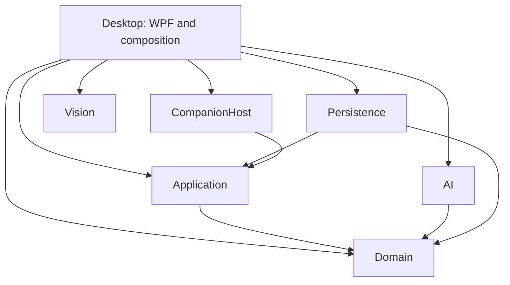

# Architecture and contribution boundaries

This document describes the implemented structure. [DESIGN.md](../DESIGN.md) also contains future
product requirements; an interface shown there is not necessarily implemented.

The [2026-09-21 validation record](evidence/architecture-2026-09-21/validation.md) records the
checks run for this architecture pass and their limits.

GoldenTicket is a layered desktop application with a local phone host. One process avoids
distributed transactions between the referee, camera and local storage. Separation comes from
project dependencies, typed contracts and ownership of state. Only the phone communicates across
a network boundary.

## Dependency direction

An arrow means a direct project reference. `ArchitectureTests` enforces the allowed graph, rejects
cycles and production references to tools/tests, and checks core assemblies for UI, hosting and
native dependencies.

| Project | Responsibility | Boundary |
|---|---|---|
| Domain | Rules, events, reducer, graph, legal actions, projections and board manifest | No other application projects or infrastructure packages; no native calls |
| Application | Command coordination, AI orchestration, timing and storage contracts | Depends on Domain; does not choose a database, UI or transport |
| AI | Deterministic policy and route planning | Receives `SeatView`, never authoritative state or other players' private holdings |
| Persistence | SQLite journal, replay integrity and checkpoint photos | Implements Application's `ISessionStore`; owns database/filesystem details |
| Vision | Windows capture, processing, geometry and detection | Produces observations; does not change scores, spend cards or own game rules |
| CompanionHost | Local HTTP, pairing, phone assets and request adaptation | Uses Application contracts; is not a second referee |
| Desktop | WPF presentation, device/session composition and physical/privacy workflows | Composes adapters; keeps controls and dispatcher concerns out of the core |

Domain includes loading its versioned manifest from disk. The command/reducer path itself does not
read files, call devices or use wall-clock randomness. This is a small data-loading facility, not
a claim that every type in the Domain assembly is a pure function.

## Authoritative state and transactions

`GameCoordinator` is the match's single writer. It serializes a command, checks its session/version
and deduplication identity, evaluates the rules against a candidate state, then asks `ISessionStore`
to commit events, outcome and fingerprint together. Only an acknowledged commit publishes the new
state and public projection. Notifications run outside the writer lock so observers can query
without deadlocking. A storage failure requires restoration because a lost acknowledgement cannot
establish whether a transaction reached disk.

The reducer owns mutable collections inside `GameState`. Public accessors return actual read-only
wrappers, including each hand and ticket list. These are live read-only views, not snapshots or a
thread-safety mechanism. Consumers outside the referee use immutable projections; AI/phone consumers
receive only their authorized projection. Tests alone have internal access for arranging controlled
states. A cast from a read-only interface must never bypass the event path.

Both `InMemorySessionStore` and `SqliteSessionStore` implement the same commit/restoration checks:
accepted nonempty commits, expected versions and journal length, retained deduplication, compatible
rules/data, replay fingerprints and domain invariants. Shared contract tests exercise both. The
in-memory adapter is for tests/simulation and does not provide durability.

Turn timing is outside rule-state hashes but joins the saved transaction. The tracker prepares a
candidate snapshot without advancing the live turn. After acknowledgement it reconciles the live
clock, preserving pause/marker controls changed while I/O was pending. Write latency stays with the
still-published turn. A crash can lose elapsed time since the last timing snapshot; exact accounting
across power loss is not promised. `TurnTimingSnapshotValidator` owns logical checks for both
adapters; SQLite owns parsing its representation.

## Hardware and asynchronous work

`ICameraCapture` describes a single capture lifecycle: start/stop, device/format/epoch, latest/fresh
frame and disposal. `CameraCaptureService` implements it with Windows capture. `CameraViewModel`
accepts that interface, and desktop composition can inject a camera view model. The default app
still selects the real service.

Tests inject `FakeCameraCapture` rather than changing a service's private fields. Start/stop state,
reconnect epochs, frame age and disposal are under explicit test control. Frames and asynchronous
results still need freshness/epoch checks before affecting physical workflows. Replacing capture
does not replace verification rules or authorize a move.

AI and camera work must not hold the coordinator's writer while waiting for a person or device.
Operations carry cancellation and state/operation identity where relevant. WPF owns dispatcher
updates and subscriptions; the core never receives controls or a dispatcher.

## Test structure

- `tests/GoldenTicket.Core.Tests`: portable `net10.0` rules, coordinator, AI, SQLite, failure and
  architecture checks. References only Domain, Application, AI and Persistence. CI includes an
  Ubuntu job for this suite alongside the full Windows job.
- `tests/GoldenTicket.Domain.Tests`: the historical name is retained for Windows desktop, vision,
  HTTP, photo/storage integration and tools. Its name does not mean the domain requires WPF.
- `tests/Shared`: source-linked fixture helpers. Each test case has one owning suite; cases are
  not compiled twice. The fake camera is linked only by Windows tests and the WPF smoke tool.
- `tools/GoldenTicket.UiSmoke`: real WPF render/interaction checks using controlled fixtures.
- The simulator checks complete games, invariants and replay. Browser tests exercise the phone
  client separately; hardware and phone acceptance still require real devices.

QR, LAN and request-boundary tests exercise the shipped `CompanionHost`. The earlier certificate
and installed-app experiment has been removed. PRACTICAL uses the same coordinator through local
private views; it does not start a phone host.

## Decisions and tradeoffs

1. **Keep the layered local application.** The graph is acyclic and the referee boundary is strong.
   Microservices or a universal game-plugin system add costs without a present requirement.
2. **Use ports at real variation points.** Storage, AI and capture need interchangeable adapters or
   controlled tests. Ordinary value objects and deterministic helpers do not need an interface each.
3. **Preserve journal compatibility.** This pass changes encapsulation and orchestration, not event
   payloads, numeric difficulty values or state-hash encoding. Refactors retain replay/old-save tests;
   schema changes require an explicit compatibility decision.
4. **Test architectural constraints.** Documentation alone cannot prevent a reverse dependency or
   a WPF reference in the engine. Changes to the allowed graph require a reason and an update here.

## Remaining design debt and release gates

`MainViewModel` and `CameraViewModel` still coordinate several workflows. Partial files aid
navigation but do not create independent components. Further extraction should follow cohesive
workflows with explicit inputs, outcomes and lifecycle ownership, especially save/rebuild and board
reconciliation. Avoid a mechanical split into services that just call back into the same mutable
view model. The capture port and portable tests provide seams for that work.

Desktop composition currently lives alongside navigation; a separate composition object becomes
useful when additional runtime implementations are introduced. Existing concrete deterministic
rules and photo adapters do not warrant a DI container solely for convention.

Architecture checks do not establish live detection quality, phone acceptance, target-hardware
crash recovery, distribution readiness, or asset/license clearance for public release. Those remain
tracked in [TODO.md](../TODO.md). Passing this review does not imply universal reviewer approval or
release-complete status.
